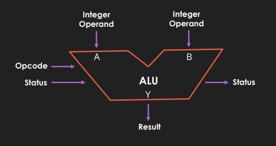
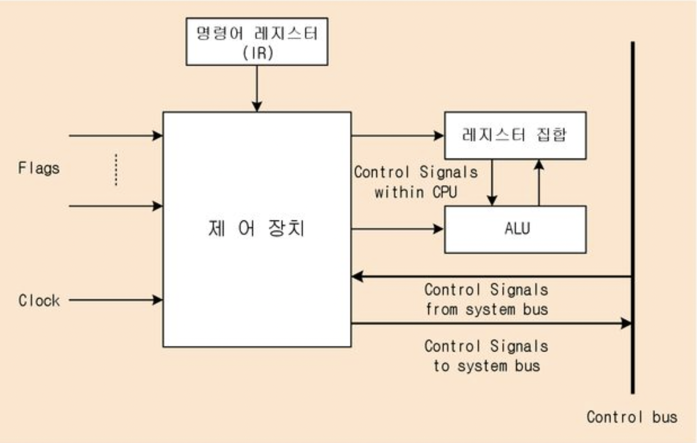
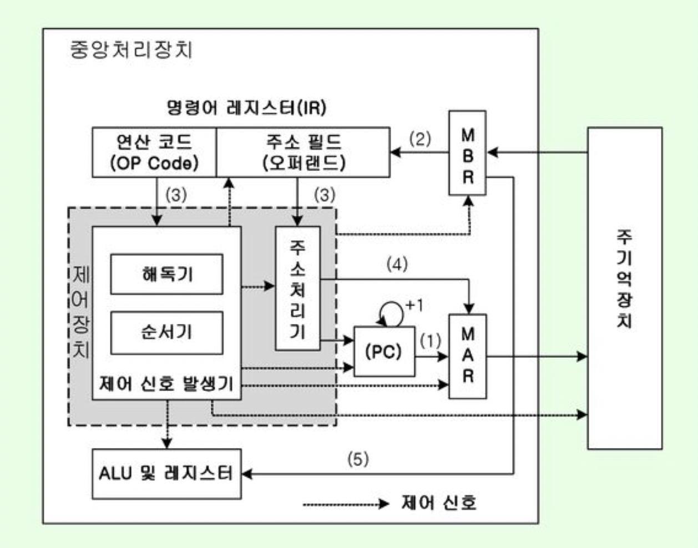

# CPU Components

## 1. ALU

### ALU actions

1. 계산을 위해 레지스터와 제어 장치로 부터 정보를 받아들인다.
    - 제어 장치로 부터 제어 신호를 받아들인다.
    - (다수의) 레지스터로 부터 피연산자를 받아들인다.

2. 받아들인 피연산자와 제어 신호로 산술 및 논리 연산을 실행한다.

3. 결과값과 플래그를 레지스터에 저장한다.
    - 플래그는 플래그 레지스터에, 결과값은 다른 레지스터에 저장한다.
    - 이때 결과값은 데이터나 주소이다.
    - CPU가 메모리에 접근하는 속도가 느리므로, 결과를 재사용하기 위해 레지스터에 저장한다.

## 2. 제어 장치

### 제어 장치 actions

제어 장치가 명령어 레지스터, 플래그 레지스터 및 제어 버스로 부터 명령어와 플래그, 제어 신호등을 받아들인다.
1. (제어 장치가) 클럭(clock) 신호를 받아들인다.
2. 명령어 레지스터로 부터 해석할 명령어를 받아들인다.
3. 플래그 레지스터로 부터 플래그 값을 받아들인다.
4. 시스템 버스의 제어 버스로 전달된 신호를 받아들인다.

제어 장치는 CPU 내부와 외부에 제어 신호를 전달한다.
- CPU 내부 : 레지스터나 ALU에 제어 신호를 전달한다.
- CPU 외부 : 제어 버스를 통해 메모리나 입출력 장치에 제어 신호를 전달한다.

## 3. 레지스터

### 레지스터의 종류

#### 프로그램 카운터 (PC; Program Counter)
메모리를 읽어들일 명령어의 주소를 저장하는 레지스터
- IP; Instruction Pointer 라고도 한다.
- 프로그램이 처음 실행될 때 프로그램 카운터에 가져올 명령어의 주소가 저장된다.
- 프로그램 카운터는 실행 사이클을 거칠 때 마다 증가해, 프로그램을 순차적으로 읽고 실행할 수 있게 한다.
    - 단, 실행 흐름 제어를 통해 프로그램 카운터가 급격히 바뀌면 순차적으로 진행되지 않는다.
    - 또한 인터럽트에 의해서도 순차적인 실행 흐름이 끊길 수 있다.

#### 메모리 주소 레지스터 (MAR; Memory Address Register)
메모리의 주소를 저장하는 레지스터
- ex. (address) program counter -> MAR -> address bus -> memory 
- 이때 메모리에는 제어장치의 제어 신호가 같이 전달된다. 

#### 메모리 버퍼 레지스터 (MBR; Memory Buffer Register)
메모리와 주고 받을 데이터와 명령어를 저장하는 레지스터
- CPU가 데이터 버스(data bus)와 주고 받는 값이 거치는 레지스터이다.
- ex. (data, address) memory -> data bus -> MBR
- ex. (data, address) control unit -> MBR -> data bus -> memory

#### 명령어 레지스터 (IR; Instruction Register)
메모리에서 읽어들인 명령어를 저장하는 레지스터
- ex. (instruction) MBR -> IR -> control unit

#### 범용 레지스터 (general purpose register)
메모리에 있는 데이터와 주소를 모두 저장할 수 있는 레지스터
- 현대의 대다수 CPU가 범용 레지스터를 가지고 있다.
- arm 에서는 R0, R1, R2 등으로, intel x86 에서는 EAX, EBX, ECX 등으로 명칭한다.

#### 플래그 레지스터 (flag register)
ALU 에서 연산한 결과에 대한 추가적인 상태 정보를 저장하는 레지스터
- 플래그는 1 또는 0 값을 가지며, 다음과 같은 플래그로 구성된다.

    - 부호 플래그 : 플래그가 활성되면 양수를, 아니면 음수를 의미한다.
    - 제로 플래그 : 플래그가 활성되면 값이 0임을, 아니면 0이 아닌 값을 의미한다.
    - 캐리 플래그 : 플래그가 활성되면 올림수나 빌림수가 발생함을 의미한다.
    - 오버플로 플래그 : 플래그가 활성되면 오버플로(overflow)가 발생함을 의미한다.
    - 인터럽트 플래그 : 플래그가 활성되면 인터럽트가 가능한 상태임을 의미한다. CPU가 인터럽트 요청을 받으면 인터럽트 플래그를 확인한다.
    - 슈퍼바이저 플래그 : 플래그가 활성되면 커널 모드로 실행 중임을, 아니면 사용자 모드로 실행 중임을 의미한다. 

#### 스택 포인터 (stack pointer)
스택 주소 지정 방식(stack addressing mode)에 사용되는 레지스터
- 스택 주소 지정 방식이란 스택 포인터에 인출하고자 하는 스택 영역의 주소를 지정하는 방식이다. 스택 영역은 메모리 안에 스택처럼 사용하도록 약속된 지점이다.
- 스택 포인터는 스택의 꼭대기(최상위) 주소를 가리킨다. 스택 영역에서 데이터를 꺼내면 포인터는 기존 주소의 다음 주소를 가리키고, 데이터를 추가하면 기존 주소의 이전 주소를 가리킨다.

#### 베이스 레지스터 (base-register)
베이스 레지스터 주소 지정 방식(base-register addressing mode)에 사용되는 레지스터

### 레지스터 actions

실행할 프로그램이 순차적인 경우에 다음의 과정으로 실행된다.

1. 프로그램이 실행되면 프로그램 카운터에 참조할 주소가 저장된다.
2. 메모리 주소 레지스터가 프로그램 카운터의 주소를 입력받는다.
3. 메모리 주소 레지스터의 주소와 제어 장치의 제어 신호가 메모리로 보내진다.
4. 보내진 주소의 메모리 값이 메모리 버퍼 레지스터로 전달된다.
    - 이때 메모리 주소 레지스터는 비워진다.
    - 프로그램 카운터는 순차적인 실행 흐름의 경우 1 증가한다.
5. 메모리 버퍼 레지스터에 저장된 값은 명령어 레지스터로 전달된다.
6. 제어 장치가 명령어 레지스터의 명령어를 해석하고 제어 신호를 발생시킨다.

