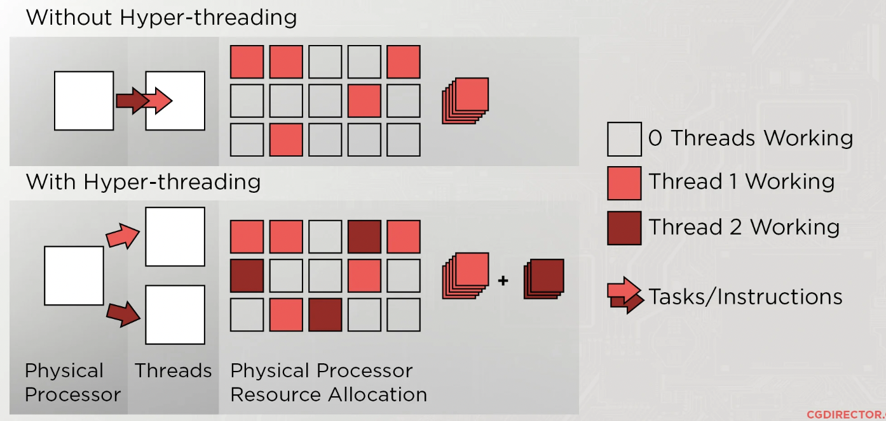
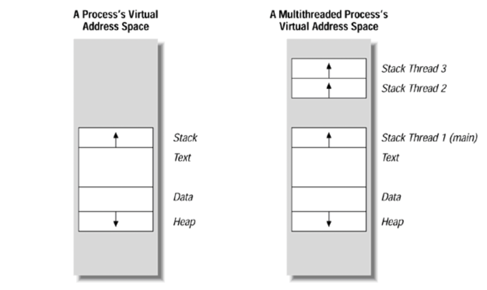
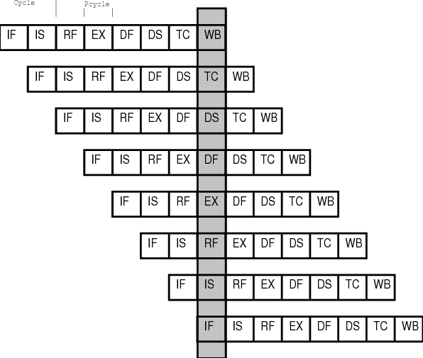
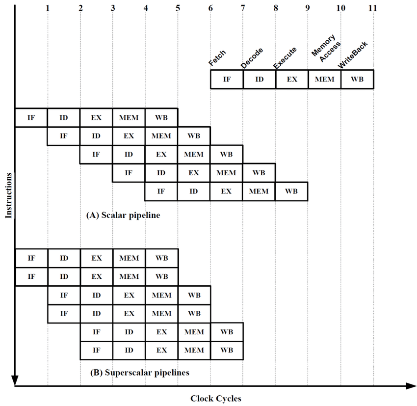
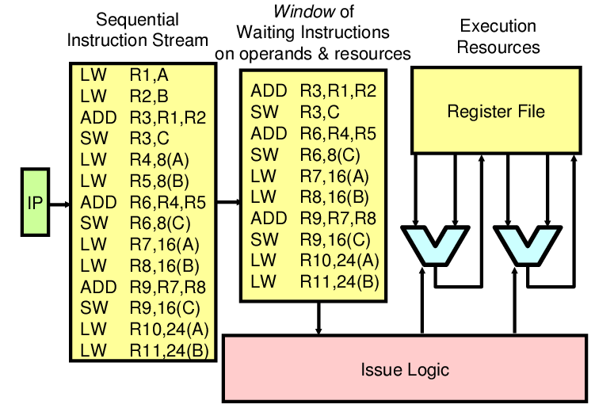

# Improving CPU Performance

## 1. Expanding clocks, cores, and threads

하드웨어 관점에서 CPU 성능을 높이는 방법을 알아본다.

### 1.1 클럭 (clock)

- 클럭 속도는 1초에 반복되는 주기의 수로 정의되는 헤르츠(Hz)로 측정한다. 이 글을 쓰고 있는 컴퓨터의 클럭 속도는 3.2GHz이므로, 1초에 클럭이 32억번 반복되는 셈이다.
- 클럭은 고정된 값이 아니며, CPU가 고성능을 요하는 순간에 클럭 속도를 높이고 그렇지 않을 때는 낮출 수 있다. 
- 일정 범위 내에서는 클럭 속도를 높여 CPU 성능을 향상시킬 수 있다. 최대 클럭 속도를 강제로 끌어올리는 것도 가능하며, 이를 오버클럭킹(overclocking)이라고 한다. 
- 오버클럭킹은 발열 문제가 있으며 클럭을 통해 CPU 성능을 향상시키는데에 한계가 있다.

### 1.2 코어 (Core)

- 코어란 CPU의 핵심 부품으로 ALU, Control Unit, register set의 세트로 생각할 수 있다. 
- 멀티 코어 CPU의 각 코어는 서로에게 독립적인 연산을 한다. 따라서 코어의 개수가 한 개에서 네 개로 늘어나면 시간 단위 CPU 연산량이 늘어날 수 있다. 
- CPU의 연산속도가 꼭 코어 수에 비례하지는 않는다. 작업량이 적은 경우에는 대체로 1 코어와 4 코어의 성능에 큰 차이가 없다. 또 작업량이 큰 경우에도 4 코어가 1 코어에 비해 언제나 성능이 우수한 것은 아닌데, 각 코어는 독립적이기 때문이다. 작업량에 관계없이 하나의 코어만 연산을 하고 있을 수도 있다. 
- 따라서 CPU 성능을 높이기 위해서는 각 코어가 처리할 연산을 적절히 **분배**하는 것이 중요하다.

### 1.3 스레드 (Thread)

스레드는 하드웨어 관점과 소프트웨어 관점에 따라 다르게 이해될 수 있다.

#### 하드웨어 스레드
- 하드웨어 관점에서 스레드는 하나의 **코어**가 처리할 수 있는 프로세스(명령어 단위)를 의미한다. 
- 논리 프로세서(logic processor)라고도 한다. 즉 하드웨어 스레드는 CPU에 물리적으로 존재하는 것이 아니며, OS의 관점에서 본 CPU의 단위로 생각할 수 있다.
- 2 코어 4 스레드 CPU는 코어마다 스레드가 2개씩 작동됨을 의미한다. 전체 스레드는 4개이다.
- Multithreading은 코어의 가용 자원을 효율적으로 이용해서 여러개의 스레드를 실행하는 기술이다. Intel의 Hyperthreading이나 AMD의 SMT; simultaneous multi-threading이 있다. 
    
    가상 코어가 스레드를 스케쥴링을 하고, 이를 통해 하나의 물리 코어가 멀티 스레드를 보다 효율적으로 실행하도록 한다.

#### (소프트웨어) 스레드
소프트웨어 관점에서 스레드는 하나의 **프로그램 내**에서 독립적으로 실행되는 단위를 의미한다. 

그림은 스택 영역에서 싱글 스레드와 멀티 스레드의 차이점을 보이고 있다. 그림처럼 프로그램이 메모리에 올라간 뒤 처음부터 끝까지 순차적으로 진행되는 것이 아니라, 여러 부분이 동시에 실행되는 것이 멀티 스레드이다.

## 2. ILP; Istruction-Level Parallelism

명령어를 병렬적으로 처리하여 CPU 성능을 향상시키는 방법을 알아본다. Instruction Scheduling이라고 부르기도 한다. 하드웨어 조건이 필요하지 않는 경우도, 필요한 경우도 있다. 

### 2.1. Instruction Pipelining

공장의 생산 라인처럼 명령어를 병렬적으로 다루는 것을 명령어 파이프라이닝이라고 한다. 하나의 코어와 스레드를 가지는 프로세서라도 명령어 처리 과정이 중복되지 않는 한에서 여러개의 명령어를 동시에 실행할 수 있다. 

위 그림에서 한 줄에 해당하는 것이 하나의 명령어 처리 과정이다. 파이프라이닝을 통해 한 클럭에 최대 8개의 명령어를 처리하고 있다. 그렇지만 여기서는 모든 명령어가 서로 의존적이지 않고, 실행할 과정의 순서와 수가 같도록 그려졌다. 

#### 파이프라인 위험 (Pipeline hazard)

파이프라인 위험이란 파이프라이닝으로 성능 향상에 실패하는 경우를 말하며, 명령어를 인출(fetch)한 후 해석(decode) 과정에서 감지된다.
- 데이터 위험 (Data hazard) : 여러 명령어에서 데이터를 의존적으로 사용하는 경우 파이프라이닝이 불가능하다.
    - scoreboarding : 각 레지스터에 비트를 할당해 데이터의 변경 가능성을 제한하는 것으로 데이터 위험을 피할 수 있다. 
- 제어 위험 (Control hazard) : 분기로 인해 프로그램 카운터가 급격히 바뀌는 경우 이미 처리중이었던 명령어들이 쓸모 없어질 수 있다.
    - branch prediction : 프로그램의 분기를 예측해서 주소를 인출해 제어 위험을 피할 수 있다.
- 구조적 위험 또는 자원 위험 (Structural hazard or Resource hazard) : 다른 명령어가 동시에 ALU나 레지스터 등을 사용하려 할 때 발생하는 위험이다. 한 번에 다른 명령어가 같은 과정을 처리하려 할 때도 구조적 위험에 속한다. 

### 2.2. Super Scalar

여러 개의 명령어 파이프라닝을 진행하는 것을 슈퍼 스칼라라고 한다.
- 클럭마다 동시에 여러 명령어를 인출하고 실행할 수 있어야 한다. 따라서 싱글 스레드 프로세서로는 구현이 불가능하다.
- 슈퍼 스칼라 구조로 명령어 처리가 가능한 CPU를 Super Scalar Processor라고 한다. 멀티스레드 프로세서가 여기에 해당한다.
- 잘 구현되면, 파이프라인 개수에 비례하여 프로그램 처리 속도를 향상시킬 수 있다.
- 파이프라인 위험은 여전히 존재한다.

### 2.3. OoOE; Out-of-Order Execution

지금까지는 명령어를 프로그램의 순서에 따라 처리해왔지만, 같은 결과를 보장하는한 명령어의 순서를 바꿀 수도 있다. 비순차적 명령어 처리(OoOE)는 명령어의 실행 순서를 바꾸어 파이프라이닝 위험을 피하는 기술이다. dynamic scheduling이라고도 한다. 

일단 프로세서가 프로그램의 모든 명령어를 순차적으로 읽어들인다. 명령어의 operand가 당장 접근할 수 있는 상태인 경우, 프로그램에서의 순서와 상관없이 실행 사이클로 명령어를 이동시킨다. 

OoOE를 구현하기 위해서는 명령어 사이의 데이터 의존성을 파악해 순서를 바꾸어도 같은 결과가 나오는 것을 보장해야 한다. WAR; write and read 또는 WAW; write and write 같은 data hazard에 유의해야 한다.

## 3. ISA; Instruction Set Architecture

명령어 집합 구조란 CPU가 이해하는 명령어 집합으로, CPU에 따라 ISA가 다를 수 있다. 즉 하나의 CPU는 서로 다른 ISA를 이해할 수 없다. 다른 ISA는 어셈블리 언어도 다르며, 제어 장치가 명령어를 해석하는 방식, 사용되는 레지스터의 종류와 개수, 메모리 관리 방법 또한 다르다. 따라서 ISA의 선택에 따라 CPU의 성능이 달라질 수 있다.

$$
\text{program} \xleftrightarrow{\text{compiler}} 
\text{ISA} \xleftrightarrow{\text{}}
\begin{aligned}
\text{assembly} \\ \text{language}  \end{aligned}
\xleftrightarrow{assembler} \text{CPU}
$$

ISA에는 CISC와 RISC가 있다.

### 3.1. CISC; Complex Instruction Set Computer

CISC는 다양한 상황에 대응하기 위해 복잡한 명령어를 다수 포함하고 있는 명령어 집합 구조다. CISC를 활용하면 프로그램의 길이가 짧아 메모리가 절약되지만, 명령어 파이프라인 구현이 어려워 CPU 성능을 제한하는 요소가 된다.

- 명령어 비규격화
    - 가변 길이 명령어를 활용한다.
    - 명령어의 종류가 많고, 명령어의 길이가 다양하다.
    - 명령어 수행 시간은 종류에 따라 여러 클럭이 소요된다.
- 메모리 절약
    - 같은 프로그램을 상대적으로 짧은 명령어로 실행한다. 
    - 프로그램의 크기가 작아 메모리가 절약된다.
- 단점
    - 명령어 파이프라인 구현이 어렵다. 
    - 복잡한 명령어 대다수는 사용 빈도가 낮다.
- ex) x-86, x86-64

### 3.2. RISC; Reduced Instruction Set Computer

RISC는 명령어 파이프라인에 최적화하기 위해 명령어를 단순하게 규격화한 명령어 집합 구조다. 메모리 접근 제한으로 인해 load-store 구조라고도 불린다.

- 명령어 규격화
    - 고정 길이 명령어를 활용한다.
    - 명령어의 종류가 적고, 명령어의 길이는 짧다.
    - 명령어 수행 시간은 1클럭 내외로 지향한다.
    - 명령어의 수는 같은 프로그램에 대해 CISC 보다 많은 편이다.
- 메모리 접근 최소화 
    - 메모리 접근 명령어는 load 와 store 두가지로 제한한다.
    - CISC에 비해 주소 지정 방식을 적게 사용한다.
- 레지스터 활용 
    - 레지스터 활용 연산이 많다.
    - CPU에 범용 레지스터 개수가 많다.
- ex) arm