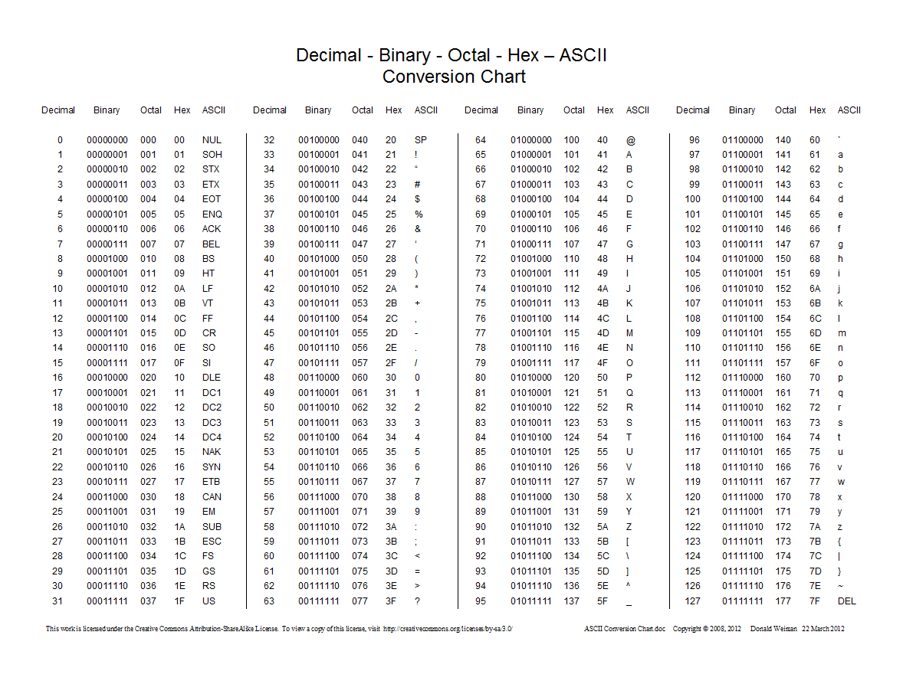

# Data

## 정보 단위 bit
컴퓨터가 연산하는 최소의 정보 단위는 비트이다. 
- 비트는 0과 1의 값만 가지므로 비트 개수 $n$ 개에 대해 $2^n$ 개의 정보를 표현할 수 있다. 
- 따라서 많은 정보를 표현하기 위해 비트의 단위는 점점 커져왔다. 

    | 단위 | 크기 | 증가 배수 |
    | --- | --- | --- |
    | 1 byte | 8 bit | $\times$ $2^3$ |
    | 1 kB | 1,000 byte | $\times$ $10^3$ |
    | 1 MB | 1,000 kB | $\times$ $10^3$|
    | 1 GB | 1,000 MB | $\times$ $10^3$|
    | 1 TB | 1,000 GB | $\times$ $10^3$|

* 워드(word)란 CPU가 한 번에 처리할 수 있는 데이터 크기를 의미한다. 현대의 CPU의 워드는 대부분 32 비트나 64 비트이다.

## 이진법(binary)과 십육진법(hexadecimal)

- 이진법은 1을 넘어가는 수를 올림하는 진법이다.
    - 1의 보수(complement of 1) : 이진수의 0과 1을 반전한 수이다. 즉 모든 자릿수가 1인 비트마스크와 XOR 연산을 해서 얻을 수 있다.
    - 2의 보수(complement of 2) : 이진수에서 음수 연산을 의미한다. 부호가 있는 수를 이진수로 표현하는 경우, $n$ 비트로 $-2^n$ ~ $2^n - 1$ 범위의 수를 표현하므로, 1의 보수에 1을 더한 값이다.
    - 파이썬에서 1의 보수와 2의 보수를 연산하는 방법은 [WIL/Python/python-bit-manipulation]()을 참고하자.

- 십육진법은 15를 넘어가는 수를 올림하는 진법이다.
    - 10진법의 수를 16진법으로 다음과 같이 표현한다.
        | 10진법 | 16진법 | 
        | --- | --- | 
        | ... | ... | 
        | 8 | 8 | 
        | 9 | 9 | 
        | 10 | A | 
        | 11 | B | 
        | 12 | C | 
        | 13 | D | 
        | 14 | E | 
        | 15 | F | 
        | 16 | 10 | 
        | 17 | 11 | 
        | ... | ... | 

    - 십육진수는 한 글자에 $16 = 2^4$ 개의 수를 표현하므로 이진수에 비해 같은 정보를 4배 짧게 표현할 수 있다.  
    - 예를 들어 십육진수 $C548_{(16)}$ 를 이진수로 표현하면 $1100010101001000_{(2)}$ 이다. 
        - 십육진수의 문자 각각을 4 비트 이진수로 변환한 다음 이어 쓴 것과 같다.

## 문자 인코딩과 디코딩
문자 또한 컴퓨터가 이해하기 위해서는 비트로 변환되어야 한다. 문자를 비트로 변환하는 과정을 인코딩(encoding), 역으로 비트를 문자로 표현하는 방법은 디코딩(decoding)이라고 한다. 변환을 위해서는 합의된 문자 집합(character set)과 인코딩 및 디코딩 방법이 필요하다.
- 인코딩 : 문자 -> 비트
- 디코딩 : 비트 -> 문자

### ASCII
아스키란 제어 문자, 공백 문자, 구두점, 숫자, 영문 알파벳을 표현하는 문자 집합이다. 1963년 초판이 발간되었다.

- 
- 7 비트로 문자를 표현하므로 $2^7$ 개의 문자만 표현한다. 
- 예를 들어 `party`의 이진법 아스키 코드(아스키 문자에 대응되는 고유한 수)는 `01010000 01100001 01110010 01110100 01111001`가 된다.

### EUC-KR
한글 완성형 인코딩 문자 집합이다. 
- 한글 인코딩에는 완성형 인코딩과 조합형 인코딩이 있다.
    - 한글 완성형 인코딩 : 한글 한 글자를 하나의 값으로 인코드하는 방식
    - 한글 조합형 인코딩 : 초성, 중성, 종성을 따로 인코드하는 방식
- EUC-KR은 한글 한 글자를 $2^{16}$ 비트로 표현하며, 전체 문자 개수는 2,350개이다. 한글의 문자는 만 개가 넘으므로 EUC-KR로는 표현할 수 없는 한글 문자가 있다.

### 유니코드(unicode)와 인코딩 방식
유니코드는 컴퓨터로 표현하고자 하는 모든 문자(예컨데 한글, 히라가나, 라틴어 문자 등)와 이모티콘 등을 일괄적이고 고정된 방식으로 인코딩하기 위해 만들어진 문자 집합이다. 
- [유니코드 문자 찾아보기](https://unicode-table.com/kr/blocks/)
- 유니코드는 글자에 부여된 값을 그대로 인코딩 값으로 삼지않고 여러 방법으로 인코딩한다. 인코딩 방식에는 utf-8, utf-16, utf-32 등이 있다.
- 많이 사용되는 utf-8은 유니코드를 8 비트로 인코딩하며, 유니코드 문자 범위에 따라 자릿수가 상이하다.
    | 코드 범위(십육진법) |	UTF-8 표현(이진법) |
    | --- | --- |
    | 000000 ~ 00007F |  0xxxxxxx	|
    | 000080 ~ 0007FF | 110xxxxx 10xxxxxx |
    | 000800 ~ 00FFFF | 1110xxxx 10xxxxxx 10xxxxxx |
    | 010000 ~ 10FFFF | 11110zzz 10zzxxxx 10xxxxxx 10xxxxxx |
- utf-8은 아스키를 기반으로 하고 있으므로, 처음 문자 범위는 아스키 문자와 인코딩이 같다. 또, 아스키 문자와 혼동되지 않도록 처음 범위 외의 문자들은 최상위 비트를 1로 인코드한다. 
- 유니코드로 대부분의 한글을 표현할 수 있다.
- 예를 들어 `안녕`의 유니코드 값은 $C548_{(16)}$ $B155_{(16)}$ 이며, utf-8로 인코딩하면 $11101100 \ 10011001 \ 10001000_{(2)}$ $11101011 \ 10000101 \ 10010101_{(2)}$ 이 된다.