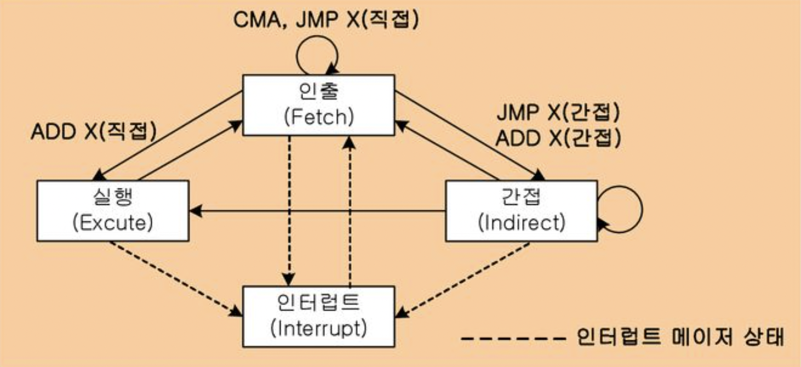

# Instruction
*명령어*

## 1. 소스 코드를 명령어로

일반적으로 컴퓨터에 명령을 내리기 위해서 사람이 소스 코드를 작성하여 실행한다. 그러나 컴퓨터는 사람이 작성하는 소스 코드를 직접 실행할 수 없으므로, 반드시 명령어로 변환하는 작업이 필요하다. 명령어는 CPU 내부에서 명령어 레지스터를 통해 제어 장치에 전달되어 실행된다. 

실제로는 고급 언어로 쓰여진 소스 코드가 저급 언어로 쓰여진 오브젝트 코드로 변환되며, 오브젝트 코드의 명령어가 링킹을 통해 실행 코드로 변형되어 실행되는 과정을 거친다.

$$
\text{source code} \xrightarrow{translator} \text{object code} \xrightarrow{} \text{instructions} \xrightarrow{linking} \text{execution code}
$$

이때 고급 언어 (high-level programming language)란 사람이 이해하는 프로그래밍 언어이고, 저급 언어 (low-level programming language)는 컴퓨터가 직접 이해하고 실행할 수 있는 언어를 의미한다. 

$$
\begin{aligned}
& \textbf{high-level language} \ \ \ \xrightarrow{\text{transform}} && \textbf{low-level language} \\
& \text{ - compile language} && \text{- machine language} \\
& \text{ - interpreter language} && \text{- assembly language}\end{aligned}
$$


### 저급 언어 (low-level programming language)

저급 언어는 컴퓨터가 이해하고 실행할 수 있는 언어이며, **명령어**로 이루어져 있다. 저급 언어에는 기계어와 어셈블리 언어가 있다.

#### 기계어 (machine code)
오직 비트로만 쓰여진 명령어로 구성된 저급 언어이다. 

#### 어셈블리 언어 (assembly language)
기계어는 사람이 읽어 이해하기 힘드므로, 기계어를 읽기 편한 형태로 번역한 언어가 어셈블리 언어이다. 어셈블리어만을 이용해 복잡한 프로그램을 만들기는 쉽지 않지만, 하드웨어와 맞닿아 있는 분야에서는 소스 코드에 어셈블리어를 사용하기도 한다.


### 고급 언어 (high-level programming language)
고급 언어가 저급 언어로 변환되는 대표적인 방법에는 컴파일 방식과 인터프리트 방식이 있다. 

#### 컴파일 언어 (compile language)
- 소스 코드 전체를 저급 언어로 변환한 후 실행하는 고급 언어이다. 
- 이 변환 과정을 컴파일(compile)이라고 하며, 컴파일을 수행하는 도구를 컴파일러(compiler)라고 한다. 
- 오류가 하나라도 있으면 컴파일에 실패한다. 따라서 디버깅이 다소 어렵다.
- 컴파일러를 통해 저급 언어로 변환된 코드를 목적 코드(object code)라고 한다.
- 대표적으로 C, C++가 컴파일 언어이다.

#### 인터프리터 언어 (interpreter language)
- 소스 코드를 한 줄 단위로 저급 언어로 변환 후 실행하는 고급 언어이다. 
- 이 변환과 실행을 하는 도구를 인터프리터(interpreter)라고 한다.
- 소스 코드에 오류가 나타나기 전까지는 실행되므로 디버깅이 비교적 쉽다.
- 대표적으로 Python, Ruby, JavaScript가 인터프리터 언어이다.

단,
- 모든 고급 언어가 컴파일 언어 또는 인터프리터 언어로 명확히 나뉘는 것은 아니다. Python도 컴파일을 하며, Java는 저급 언어가 되는 과정에서 컴파일과 인터프리트를 동시에 수행한다.
- 또 컴파일이 가능한 언어라고 해서 인터프리트가 불가능하거나 그 반대인 것도 아니다.
    


## 2. 명령어의 구조

명령어는 하나의 연산 코드(operation code)와 여러개 또는 0개의 오퍼랜드(operand)로 구성된다. 연산 코드는 연산자, 오퍼랜드는 피연산자로 이해할 수 있다. 명령어는 연산 코드가 담기는 영역인 연산 코드 필드와 오퍼랜드가 담기는 영역인 오퍼랜드 필드로 구성되며, 오퍼랜드에 주소가 담기는 경우가 많기 때문에 주소 필드라고 부르기도 한다.


### 연산 코드
연산 코드는 명령어가 수행할 연산을 의미한다. 기본적인 연산 코드 유형은 크게 네 가지이다. 

1. 데이터 전송

    제어 장치와 레지스터가 CPU 외부의 메모리와 데이터 또는 주소를 주고 받는다.
    - MOVE : 데이터를 옮긴다
    - STORE : 메모리에 저장한다
    - PUSH : 메모리 스택 영역에 데이터를 저장한다
    - POP : 메모리 스택 영역의 최상단 데이터를 가져온다

2. 산술 / 논리 연산

    다음 연산을 실행하기 위해 ALU로 제어 신호를 전송한다.
    - ADD / SUBTRACT / MULTIPLY / DIVIDE : 사칙연산을 수행한다
    - INCREMENT / DECREMENT : 오퍼랜드에 1을 더한다 / 뺀다
    - AND / OR / NOT : 논리 연산을 수행한다
    - COMPARE : 두 개의 숫자나 불 값을 비교한다

3. 제어 흐름 변경

    다음 연산 코드들은 명령어 사이클에서 중요한 역할을 담당한다.
    - JUMP : 특정 주소로 실행 순서를 옮긴다
    - CONDITIONAL JUMP : 조건에 부합할 때 특정 주소로 실행 순서를 옮긴다
    - HALT : 프로그램의 실행을 멈춘다
    - CALL : 되돌아 올 주소를 스택 영역에 백업하고 특정 주소로 실행 순서를 옮긴다
    - RETURN : CALL을 호출할 때 백업한 주소로 실행 순서를 옮긴다

4. 입출력 제어

    제어 장치가 시스템 버스를 통해 CPU 외부의 입출력 장치와 데이터 또는 제어 신호를 주고 받는다.
    - READ (INPUT) : 입출력 장치로부터 데이터를 읽어들인다
    - WRITE (OUTPUT) : 입출력 장치에 데이터를 쓴다
    - START IO : 입출력 장치를 시작한다
    - TEST IO : 입출력 장치의 상태를 확인한다


### 오퍼랜드
오퍼랜드는 연산에 사용할 데이터나 그 데이터의 위치를 의미한다.

```bash
push rbp # 1-주소 명령어
mov  rbp, rsp # 2-주소 명령어
mov  edx, DWORD PTR [rbp-4] # 2-주소 명령어
add  eax, edx # 2-주소 명령어
ret # 0-주소 명령어
```

오퍼랜드는 명령어에 하나도 없을 수도, 하나 또는 여러 개가 있을 수도 있다. 위 어셈블리 언어 예시에서 첫번째 명령어에는 오퍼랜드가 하나이고, 두번째 명령어에는 두개이며 마지막 명령어에는 오퍼랜드가 없다. 명령어를 가지고 있는 오퍼랜드 개수 n에 따라서 n-주소 명령어로 나누어 부르기도 한다.


### 주소 지정 방식 (addressing mode)
명령어의 오퍼랜드 필드에 입력할 데이터의 위치를 지정하는 다양한 방식이다. 
이때 연산하고자 하는 데이터가 저장된 위치를 유효 주소(effective address)하고 한다. 즉 주소 지정 방식은 유효 주소를 찾는 다양한 방식이다.

#### 즉시 주소 지정 방식 (immediate addressing mode)
- 오퍼랜드에 필요한 데이터 자체를 지정하는 방식이다.
- CPU에서 메모리에 접근하는 시간이 절약되므로 실행 시간이 빠르다.
- 명령어의 용량에 제한이 있기 때문에, 저장할 수 있는 데이터 길이에 한계가 있다.

#### 직접 주소 지정 방식 (direct addressing mode)
- 오퍼랜드에 필요한 데이터의 메모리 주소, 즉 유효 주소를 지정하는 방식이다.
- 메모리를 참조해야 하므로 즉시 주소 지정 방식보다 느리지만, 데이터 길이의 제한이 메모리 제한 값으로 바뀐다. 

#### 간접 주소 지정 방식 (indrect addressing mode)
- 오퍼랜드에 유효 주소의 주소를 지정하는 방식이다. 
- 간접 주소 지정 방식을 사용하면 유효 주소를 찾기위해 메모리를 다시 조회해야하므로, 인출 사이클에서 실행 사이클로 바로 넘어가지 못하고 간접 사이클을 거쳐야 한다.

#### 레지스터 주소 지정 방식 (register addressing mode)
- 오퍼랜드에 데이터를 담고있는 레지스터를 지정하는 방식이다. 
- 직접 주소 지정과 마찬가지로 CPU 내의 접근이므로 실행 시간이 빠르다.
- 단, 레지스터에 있는 주소에만 접근할 수 있다.

#### 레지스터 간접 주소 지정 방식 (register indirect addressing mode)
- 오퍼랜드에 데이터의 주소를 담고있는 레지스터를 지정하는 방식이다.
- 간접 주소 지정 방식과 비슷하게,

#### 상대 주소 지정 방식 (relative addressing mode)
- 변위 주소 지정 방식(displacement addressing mode) 중 한가지다. 즉, 오퍼랜드 필드의 값(변위)과 레지스터의 값을 더해 유효주소를 얻어내는 방식이다. 명령어는 이때 연산 코드 필드, 레지스터 필더, 그리고 오퍼랜드 필드를 갖는다.
- 프로그램 카운터의 값과 오퍼랜드의 값를 더하여 인출할 메모리의 주소를 얻는다. 즉 현재 실행 중인 명령어를 인출한 주소를 기준으로 오퍼랜드의 값만큼 이동한 주소를 인출한다.
- 예를 들어 프로그램 카운터의 값이 

#### 베이스-레지스터 주소 지정 방식 (base-register addressing mode)
- 변위 주소 지정 방식 중 한가지로, 베이스-레지스터를 사용한다.
- 베이스-레지스터에 저장된 주소에 오퍼랜드의 값을 더하여 인출할 메모리의 주소를 얻는다. 베이스-레지스터에 기준 주소를, 오퍼랜드에 기준 주소에서 이동하고자하는 거리 값을 저장한다.


## 3. 명령어 사이클

CPU는 프로그램에서 전달받은 명령어를 **하나씩** 실행한다. 이 명령어들은 정형화된 흐름을 반복하며 실행되는데, 이 흐름을 명령어 사이클(instruction cycle)이라고 한다. 즉 프로그램의 명령어들은 명령어 사이클이 반복되며 실행된다고 볼 수 있다. 


*전체 명령어 사이클. CPU가 프로그램을 실행하는 과정*

가능한 경우 인출 사이클과 실행 사이클을 오가면서 순차적으로 프로그램을 실행하고, 인출 사이클에서 실행 사이클을 갈 수 없는 경우 (간접 사이클)와 실행 사이클에서 인출 사이클로 갈 수 없는 경우 (인터럽트 사이클) 흐름이 바뀌는 것을 확인할 수 있다. 


### 명령어 사이클의 종류

명령어 사이클은 인출, 실행, 간접, 인터럽트 사이클로 구성되어 있다. 인터럽트 사이클은 다시 예외와 하드웨어 인터럽트로 나뉠 수 있다.

#### 인출 사이클 (fetch cycle)
프로그램을 실행하기 위해 먼저 명령어를 메모리에서 CPU로 가져오는 과정이다.

#### 실행 사이클 (exceution cycle)
CPU로 가져온 명령어를 실행하는 단계이다. 제어 장치가 명령어 레지스터에 담긴 값을 해석하고, 제어 신호를 발생시킨다.

#### 간접 사이클 (indirect cycle)
인출 사이클에서 실행 사이클로 진행하고자 할 때, 명령어를 실행하기 위한 조건이 만족되지 않았을 때 이를 만족하기 위해 추가되는 사이클이다. 예를 들어 명령어의 오퍼랜드에 간접 주소 지정 방식을 사용하는 경우 레지스터에 담긴 값은 유효 주소의 주소 값이므로 유효 주소를 얻기 위해 메모리를 한번 더 인출해야 한다.

**인터럽트**란 CPU의 작업을 방해하는 신호이다. 인터럽트는 크게 CPU 내부에서 발생시키는 예외와 CPU 외부에서 발생시키는 하드웨어 인터럽트로 나눌 수 있다.

#### 예외 (exception, synchronous interrupt)
- CPU에 의해 발생하는 인터럽트로, CPU가 실행하는 프로그래밍상의 오류와 같은 예외적인 상황에 마주쳤을 때 발생하는 인터럽트이다.
- [파이썬의 Exception 클래스](https://docs.python.org/3/library/exceptions.html)를 참고할 수 있다.

#### 하드웨어 인터럽트 (hardware interrupt, asynchronous interrupt)
- 입출력장치에 의해 발생하는 인터럽트를 하드웨어 인터럽트라 한다. 비동기 인터럽트는 주로 입출력장치에 의해 발생하지만, CPU에 의해 발생하지 않는 모든 인터럽트를 포함한다. (예를 들면 전원 차단 등)
- CPU는 하드웨어 인터럽트를 명령어를 효율적으로 처리하는데에 사용할 수 있다. 예를 들어 CPU가 입출력 작업의 결과값이 필요한 경우, 입출력 작업이 끝나기 전까지 직접 입출력 장치에 접근하는 대신 입출력 장치에서 처리가 완료된 경우에 인터럽트를 받도록 할 수 있다.

### 하드웨어 인터럽트 처리 순서

1. 입출력 장치는 CPU에 **인터럽트 요청 신호** 를 보낸다.
2. CPU는 실행 사이클이 끝나고 명령어를 인출(fetch)하기 전 항상 인터럽트 여부를 확인한다.
3. CPU가 인터럽트 요청을 확인하고 **인터럽트 플래그** 를 통해 현재 인터럽트를 받아들일 수 있는지 확인한다.
    - 인터럽트 플래그는 플래그 레지스터에 있는 비트 정보다.
    - 만약 플래그가 비활성되어 있으면 인터럽트를 무시할 수 있다.
    - 그렇지만 하드웨어 인터럽트 중에는 막을 수 없는 인터럽트(non-maskable interrupt)도 있는데, 이런 인터럽트는 플래그에 관계없이 무시할 수 없다. 예를 들어 전원 차단이나 하드웨어 고장의 경우 플래그와 관계없이 프로그램이 중단될 수 있다.
4. 인터럽트를 받아들일 수 있으면, CPU는 지금까지의 작업을 메모리의 스택 영역에 백업한다.
5. CPU는 **인터럽트 벡터** 를 참조해 **인터럽트 서비스 루틴(ISR or iterrupt handler)** 을 실행한다.
    - 인터럽트 벡터는 CPU가 요청 신호를 보낸 대상에게 받는 정보로, ISR의 시작 주소를 담고있다.
    - ISR은 인터럽트 발생시에 처리하거나 작동할 정보를 담은 프로그램이다. 즉 메모리 영역에 있다.
6. 인터럽트 서비스 루틴 실행이 끝나면 4번 과정에서 백업했던 작업을 복구해 실행을 재개한다.

