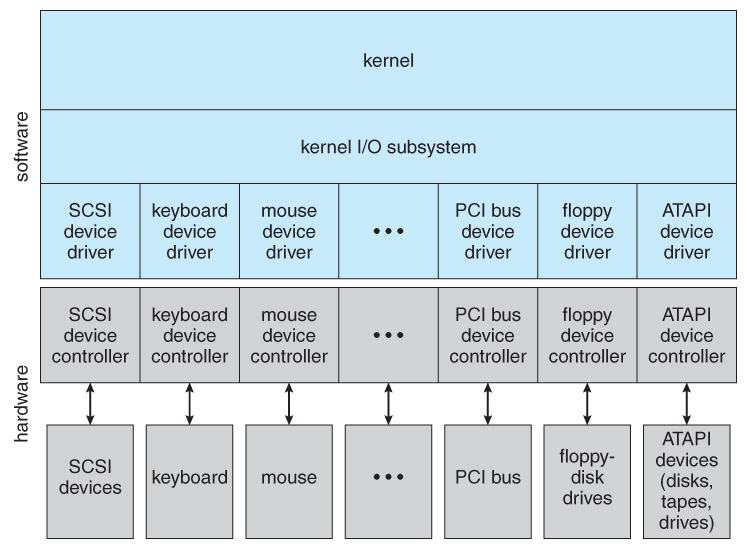
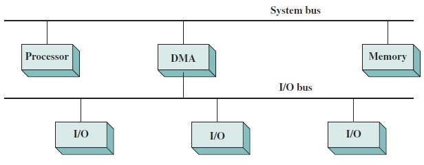

# I/O Device

## Device Controller & Device Driver

### Device Controller
입출력 장치는 컴퓨터에 직접 연결되지 않고, 각자의 장치 컨트롤러(device controller)라는 **하드웨어**를 통해 컴퓨터에 연결된다. 장치 컨트롤러는 I/O controller 또는 I/O module로 불리기도 한다. 

입출력 장치가 컴퓨터에 직접 연결될 수 없는 이유는 다음과 같다.
- 입출력 장치는 종류가 너무 다양해서 정보를 주고받는 방식을 규격화하기 어렵다.
    - 입출력 장치에는 키보드, 모니터, USB 메모리, CD-ROM, 마우스, 프린터, 스피커, 마이크 등이 모두 포함된다.
    - 입출력 장치는 데이터 전송 형식이 제각각이다.
- 입출력 장치의 전송률은 CPU와 메모리의 전송률에 비해 낮다.
    - 전송률(transfer rate)이란 단위 시간당 교환할 수 있는 데이터의 수이다.
    - 입출력 장치는 데이터 전송 속도가 제각각이다.

#### 장치 컨트롤러의 역할

- CPU와 입출력 장치 간의 통신 중개
- 오류 검출
- 데이터 버퍼링(Data Buffering)

    데이터 버퍼링이란 버퍼(buffer)라는 임시 저장 공간을 활용해 전송률이 높은 장치와 낮은 장치 사이의 전송률을 비슷하게 맞추는 방법이다. 즉,
    - 전송률이 낮은 장치에서 받은 데이터를 버퍼에 모았다가 한꺼번에 내보내거나,
    - 전송률이 높은 장치에서 데이터를 한 번에 많이 받아 조금씩 내보낸다.

#### 장치 컨트롤러의 구성

$$
\text{CPU} 
\xleftrightarrow[\begin{cases}
        \text{data register} \\
        \text{status register} \\
        \text{control register}
    \end{cases}]{\text{device controller}} 
\text{I/O device}
$$

- 데이터 레지스터 
    - CPU와 입출력 장치 사이에 주고 받을 데이터를 저장한다.
    - 데이터 버퍼링을 수행한다.
- 상태 레지스터
    - 입출력 장치가 입출력 작업을 할 준비가 되었는지, 
    - 입출력 작업이 완료되었는지, 
    - 입출력 장치의 오류가 없는지 등의 상태 정보를 저장한다.
- 제어 레지스터 
    - 입출력 장치가 수행할 내용에 대한 제어 정보와 
    - 입출력 장치가 수행할 명령을 저장한다.

이 레지스터의 값들은 버스를 통해 CPU나 다른 입출력 장치로 전달되거나, 장치 컨트롤러에 연결된 입출력 장치로 전달된다.

### Device Driver

입출력 장치가 컴퓨터(OS)와 상호작용하기 위해서는 장치 컨트로러의 동작을 감지하고 제어하는 **프로그램**이 필요하다. 이를 장치 드라이버(device driver)라고 한다. 즉 OS가 장치 드라이버를 인식하면, 장치는 장치 컨트롤러에서 변환된 정보를 장치 드라이버를 통해 CPU로 보내 상호작용 할 수 있다. 

## I/O Methods
CPU가 장치 컨트롤러와 정보를 주고받는 방식에는 세가지가 있다.

### Programmed I/O

프로그램 입출력은 **프로그램 속 명령어**로 입출력장치를 제어하는 방법이다. 즉 CPU가 프로그램에 있는 입출력 명령어를 만나면 해당 장치 컨트롤러와 상호작용해서 입출력 작업을 수행한다.

$$
\text{CPU} \xrightleftharpoons[\text{status}]{\text{I/O instruction}} \text{device controller} \xrightleftharpoons[\text{}]{\text{}} \text{device}
$$

메모리에 저장된 정보를 하드 디스크에 백업하는 경우 다음의 과정을 거친다.
- CPU $\rightarrow$ HDD controller (제어 레지스터) : 쓰기 명령을 보낸다.
- HDD controller는 하드 디스크의 상태를 상태 레지스터에 표시한다.
- CPU $\leftrightarrow$ HDD controller (상태 레지스터, 데이터 레지스터) :
    - CPU는 주기적으로 상태 레지스터를 읽는다.
    - 상태 레지스터가 활성화 상태이면, 백업할 메모리의 정보를 데이터 레지스터에 쓴다.
    - 백업이 끝날 때 까지 반복한다.

입출력 장치의 주소 할당 방식에는 두가지가 있다. 

#### memory-mapped I/O
메모리 맵 입출력(memory-mapped I/O)은 컴퓨터의 주소 공간에 메모리를 위한 주소 공간 외에 입출력 장치를 위한 주소 공간을 할당하는 방법이다. 
- CPU가 메모리에 접근할 때와 입출력 장치에 접근할 때 사용하는 명령어가 같다.

대신,
- 메모리의 주소 공간이 축소된다. 

#### isolated I/O
고립형 입출력(isolated I/O)은 메모리를 위한 주소 공간과 입출력 장치를 위한 주소 공간을 분리하는 방법이다. 
- CPU는 입출력 전용 명령어를 사용한다.

따라서 CPU는 입출력 명령어를 실행할 때는 입출력 장치의 주소에 접근하고, 메모리 명령어를 실행할 때는 메모리의 주소에 접근한다.
- 메모리의 주소 공간은 축소되지 않는다.

### Interrupt-Driven I/O

장치 컨트롤러가 발생하는 하드웨어 인터럽트를 기반으로 하는 입출력을 인터럽트 기반 입출력(Interrupt-Driven I/O)이라고 한다. 

$$
\text{CPU} \xrightleftharpoons[\text{Interrupt request}]{\text{I/O instruction}} \text{device controller} \xrightleftharpoons[\text{}]{\text{}} \text{device}
$$

CPU는 장치 컨트롤러에 입출력 명령을 내리고, 입출력 장치가 입출력 작업을 끝내면 장치 컨트롤러는 CPU에게 인터럽트 요청 신호를 보낸다. CPU는 인터럽트를 받으면 하던 일을 백업하고 ISR을 실행한다.

#### polling
polling은 입출력 장치의 상태와 데이터를 주기적으로 확인하는 방식이다. CPU가 주기적으로 하던 일을 멈추고 장치 컨트롤러에 접근해야 하므로 인터럽트 방식보다 CPU의 부담이 크다.

#### PIC; Programmable Interrupt Controller

여러 입출력 장치의 인터럽트가 동시에 발생하는 경우, 인터럽트의 우선순위를 처리해야 한다. PIC는 여러개의 장치 컨트롤러에 연결되어 인터럽트 요청의 우선순위를 판별해 CPU에 우선순위가 가장 높은 인터럽트를 전달하는 **하드웨어**이다.  

PIC를 이용한 다중 인터럽트 처리 과정은 다음과 같다.
- device controller $\rightarrow$ PIC : 인터럽트 요청 신호(들)을 받아들인다.
- PIC $\rightarrow$ CPU : 인터럽트 우선순위를 판단해 CPU에 인터럽트 요청 신호를 보낸다.
- PIC $\leftarrow$ CPU : 인터럽트 확인 신호를 보낸다.
- PIC $\rightarrow$ CPU : 인터럽트 벡터를 보낸다.
- CPU는 인터럽트 벡터의 정보를 받아 해당 입출력 장치의 ISR를 실행한다.

일반적으로 여러 장치의 인터럽트를 관리하기 위해 PIC를 계층적으로 구성한다. 또한 PIC는 NMI; Non-Maskable Interrupt의 우선순위는 판별하지 않고, MI; Maskable Interrupt의 우선순위만 판단한다.

### DMA I/O; Direct Memory Access I/O

DMA는 Programmed I/O, Interrupt-Driven I/O와 달리 입출력 장치와 메모리가 CPU를 거치지 않고 상호작용하도록 고안된 입출력 방식이다. DMA 입출력을 위해서는 시스템 버스에 연결된 DMA controller 라는 하드웨어가 필요하다. 

$$
\text{CPU} \xrightleftharpoons[\text{Interrupt request}]{\text{I/O instruction}} \text{DMA controller} \leftrightarrow \begin{cases} \text{memory} \\ \text{device controller} \leftrightarrow \text{device} \end{cases}
$$

DMA controller로 하드웨어 디스크 백업하는 과정은 다음과 같다.
- CPU $\rightarrow$ DMA controller : HDD 주소, 수행할 연산, 백업할 메모리의 주소, 입출력 명령어를 전달한다.
- memory $\rightarrow$ DMA controller : 시스템 버스를 통해 백업할 정보를 읽어온다. 
- DMA controller $\rightarrow$ HDD controller : 메모리에서 읽은 정보를 시스템 버스(또는 입출력 버스)를 통해 전달한다.
- DMA controller $\rightarrow$ CPU : 백업이 끝나면 CPU에게 인터럽트 요청을 보낸다.

따라서 메모리에 저장된 데이터는 CPU를 거치지 않는다. CPU는 입출력이 시작된 시점과 끝나는 시점에만 DMA controller와 상호작용한다. 

#### cycle stealing
DMA 입출력 방식은 시스템 버스를 활용한다. 이때 시스템 버스는 공용 자원으로, CPU와 DMA controller가 동시에 사용할 수 없다. DMA controller는 버스를 이용할 때 CPU에게 버스를 이용하지 않도록 하며, 이런 DMA 방식으로 인해 CPU에게 걸리는 시스템 버스 사용 제한을 cycle stealing이라고 한다.

#### I/O bus
cycle stealing을 해결하는 방법은 시스템 버스와 별도로 DMA controller와 device controller들을 연결하는 입출력 버스(I/O bus)를 만드는 것이다. 

모든 device controller는 시스템 버스가 아닌 입출력 버스에 연결된다. 입출력 버스에는 PCI bus; Peripheral Component Interconnect bus와 PCI Express bus등 여러 종류가 있다. 오늘날 사용하는 대부분의 입출력 장치들은 입출력 버스와 연결되는 통로를 거쳐 시스템 버스를 타고 CPU와 상호작용한다.