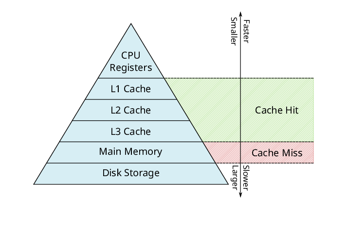

# Memory and Cache

## RAM

전원이 공급되지 않으면 저장하고 있던 정보가 휘발되는 저장장치를 휘발성 저장 장치(volatile memory), 전원이 꺼져도 저장된 정보가 유지되는 저장 장치를 비휘발성 저장 장치(non-volatile memory)라고 한다. RAM(메모리)는 대표적인 휘발성 저장 장치이며, HDD와 SSD, USB 메모리 등의 보조기억장치는 대표적인 비휘발성 저장 장치이다. 

CPU는 보조기억장치에 직접 접근할 수 없고 RAM은 휘발성 저장 장치이므로, 보조기억장치에 저장된 프로그램을 실행하고 싶을 때마다 가지고와야 한다. 
- 따라서 RAM의 용량이 클 수록 멀티태스킹(multitasking)에 유리하다. 
    
    여러개의 프로그램을 동시에 실행할 경우,
    - RAM의 용량이 작으면 CPU가 요청할 때마다 보조기억장치에서 프로그램을 가져와 RAM의 값을 업데이트해야 한다. 
    - RAM의 용량이 크면 CPU가 요청한 프로그램을 보조기억장치에서 복사해 업데이트 없이 CPU의 요구에 대응할 수 있다.

### RAM의 종류

RAM은 크게 DRAM과 SRAM으로 나눌 수 있다.

#### DRAM; Dynamic RAM
- DRAM은 시간이 지남에 따라 데이터가 점차 사라진다. 따라서 주기적으로 데이터를 재활성화해야 한다. 
- 소비 전력이 낮고, 가격이 저렴하며, 직접도가 높아 대용량 설계가 용이하다.
- 대용량 설계의 용이성 때문에 RAM(메모리)에 주로 사용된다.

#### SRAM; Static RAM
- SRAM은 시간이 지나도 저장된 데이터가 사라지지 않는다. 데이터를 재활성화할 필요가 없다.
- 비교적 소비 전력이 높고, 가격이 비싸며, 직접도가 낮아 대용량 설계에 용이하지 않다.
- 주로 캐시 메모리에 사용된다.

메모리에 사용되는 DRAM은 점차 발전되어 왔다.

#### SDRAM; Synchronous Dynamic RAM
- SDRAM은 CPU의 클럭 신호와 동기화(synchronous)된 발전된 형태의 DRAM이다. 즉 클럭마다 CPU와 정보를 주고 받을 수 있다.

#### DDR SDRAM; Double Data Rate SDRAM
- SDR SDRAM; Single Data Rate SDRAM 에 비해 두배의 대역폭을 가지는 SDRAM으로, 한 클럭당 두번씩 CPU와 데이터를 주고 받을 수 있다.
- DDR2 SDRAM 은 DDR SDRAM에 비해 대역폭이 두 배이며,
- DDR3 SDRAM 은 DDR2 SDRAM에 비해 대역폭이 두 배이다.
- DDR4 SDRAM 은 DDR3 SDRAM에 비해 대역폭이 두 배이며, SDR SDRAM에 비해 대역폭이 $2^4$ 배이다. 

## 메모리 주소 공간

$$
\text{address} \ \ 
\begin{cases}
    & \text{physical address}  \\ 
    & \text{logical address}
\end{cases}
$$

주소에는 물리 주소(physical address)와 논리 주소(logical address)가 있다. 
- physical address : 정보가 저장된 메모리 상의 주소
- logical address : 프로그램마다 부여되는 CPU가 이해하는 주소
    - 0 부터 시작한다.

CPU는 현재 실행중인 프로그램의 메모리 주소와 데이터를 모른다. CPU에서 메모리에서 가져온 값의 물리 주소를 기억한다고 해도, 메모리에 있는 특정 주소의 값은 지속적으로 바뀐다.
- 메모리에는 새롭게 실행되는 프로그램이 적재된다.
- 메모리에서 실행이 끝난 프로그램은 삭제된다.
- 같은 프로그램이 실행될 때 마다 메모리 상의 주소는 바뀐다.

따라서 CPU는 논리 주소를 사용하며, CPU와 메모리가 상호작용하기 위해 논리 주소를 물리 주소로 변환하는 과정이 필요하다.

### 메모리 주소 변환

$$
\text{CPU} \xrightarrow{\begin{aligned} \text{logical} \\ \text{address} \end{aligned}} \text{MMU} \xrightarrow{\begin{aligned} \text{physical} \\ \text{address} \end{aligned}} \text{address bus} \xrightarrow{} \text{Memory}
$$

MMU; Memory Management Unit는 CPU와 주소 버스 사이에 작용하는 하드웨어로, CPU가 발생시킨 논리 주소에 베이스 레지스터 값을 더해 논리 주소를 물리 주소로 변환한다.

$$
\text{logical address} + \text{base register value} = \text{physical address}
$$

따라서 
- base register의 값은 프로그램의 처음 물리 주소이다. 
- logical address는 프로그램의 처음 물리 주소로 부터 떨어진 거리를 반영한다.

### 메모리 보호

논리 주소는 각 프로그램에 따라 할당되므로, 물리 주소로 변환하고 난 후 해당 프로그램의 물리 주소 범위를 넘어서면 실행중인 다른 프로그램에 영향을 끼치게 된다. 이런 상황을 피하기 위해 논리 주소에 한계값을 두며, 이를 한계 레지스터에 저장한다.

$$
\text{base register value} + \text{limit register value} = \text{last physical address of a program}
$$

한계 레지스터에 저장된 값은 논리 주소의 최대 크기이다. 즉 (베이스 레지스터 값 + 한계 레지스터 값)이 프로그램의 마지막 물리 주소이다. 

만약 CPU가 한계 레지스터보다 높은 논리 주소에 접근하려 하면 인터럽트(트랩)를 발생시켜 실행을 중단한다.

## Cache Memory

### Memory Hierarchy

메모리 계층 구조란 CPU와의 거리를 기준으로 저장 장치를 계층적으로 나타낸 것이다. 

저장 장치는 일반적으로 다음 법칙을 따른다:
- CPU와 가까운 저장 장치는 빠르고, 먼 저장 장치는 느리다.
- 속도가 빠른 저장 장치는 저장 용량이 작고, 가격은 비싸다.

### Cache memory

$$
\text{CPU 연산 속도} >> \text{CPU의 메모리 접근 속도}
$$

캐시 메모리는 CPU와 메모리 사이에서 (CPU의 연산속도와 CPU의 메모리 접근 속도) 차를 보완하기 위해 사용되는 저장 장치이다. 
- 캐시 메모리는 SRAM을 기반으로한다.
- 캐시 메모리는 레지스터에 비해 용량이 크고, CPU 접근 속도는 느리다.
- 캐시 메모리는 메모리에 비해 용량이 작고, CPU 접근 속도는 빠르다.

CPU에는 여러개의 캐시 메모리가 있고, CPU에 가까운 순서대로 계층을 구성한다. 
- 코어와 가장 가까운 캐시 메모리를 L1(level 1) 캐시, 
- 그 다음 가까운 캐시 메모리를 L2 캐시, 
- 그 다음 가까운 캐시 메모리를 L3 캐시라고 한다.
- 일반적으로 멀티 코어 프로세서에서 L1 캐시와 L2 캐시는 코어 내의 고유한 캐시로 할당되고, L3 캐시는 코어 밖에 위치해 여러 코어가 공유한다.

#### Split cache
접근 속도 향상을 위해, L1 캐시를 명령어를 저장하는 L1l 캐시와 데이터를 저장하는 L2D 캐시로 분리하는 것을 분리형 캐시라고 한다.

### Cache Performance

캐시는 CPU가 사용할만한 데이터를 예측하여 저장한다. 
- CPU가 실제로 캐시의 데이터를 활용하는 경우를 cache hit,
- CPU가 캐시의 데이터를 활용하지 않고 메모리에 직접 접근하는 경우를 cache miss라고 한다. 

종합해서 cache가 hit하는 비율을 cache hit ratio라고 한다.

$$
\text{cache hit ratio} = \frac{\text{Number of cache hits}}{\text{Number of cache hits} + \text{Number of cache misses}}
$$

cache hit ratio는 캐시의 성능으로 볼 수 있으며, 90%를 넘어가면 캐시의 성능이 좋다고 하며, 80% 이상 90% 미만이면 캐시의 성능이 나쁘다고 볼 수 있다. 

#### Locality of Reference (Principle of locality)
캐시가 메모리로 부터 가져올 데이터를 결정하는 원칙이 있는데, 이는 CPU의 메모리 접근 경향을 기반으로 한다. 이 원칙을 참조 지역성 원칙(locality of reference)라고 한다.

1. temporal locality
    - CPU는 최근에 접근했던 메모리 공간에 다시 접근하는 경향이 있다.
    - 캐시의 크기가 크면 캐시의 성능이 좋아지는 것은 이 때문이다. 즉 캐시의 크기가 크면 이전에 참조한 데이터가 캐시에 남아있어 cache hit 확률이 높아진다.
2. spatial locality
    - CPU는 이미 접근했던 메모리 공간 근처를 접근하는 경향이 있다.
