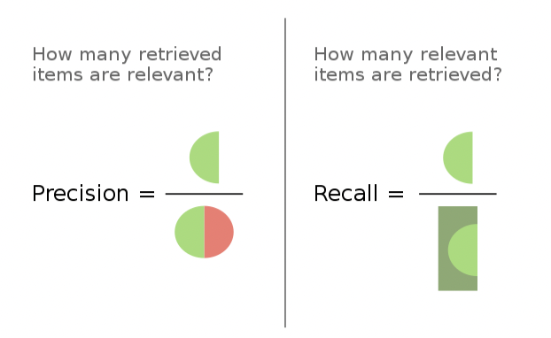

# Evaluating Machine Translation Using N-gram

기계 번역과 사람의 번역을 N-gram으로 비교하여 기계번역의 성능을 측정하는 방법에 대해 알아본다.

여기서는 {BLEU, ROUGE-N, F1} 점수를 소개한다. 
- 세 점수는 후보(Candidate) 번역과 기준(Reference) 번역의 중복되는 N-gram 수를 세는 방식으로 계산하며, 
    - 따라서 언어에 관계없이 적용 가능하다.
- 단, 세 평가 지표는 문장의 의미 정보나 문법적 순서를 고려하지 않는다는 점에 유의하자.


## 0. Precision and Recall

마지막에 살펴볼 F1 점수는 두개의 클래스가 존재하는 경우 분류 테스트의 정확도(accuracy)를 계산하는 지표이며, Precision과 Recall로 계산된다.


*https://en.wikipedia.org/wiki/F-score*

$$
\begin{aligned}
\text{Precision} &= \frac{\text{True Positives}}{\text{Retrived Elements}} \\
\text{Recall} &= \frac{\text{True Positives}}{\text{Relevant Elements}} 
\end{aligned}
$$

- 즉 Precision은 테스트 결과 중 참으로 판단했고 실제로도 참인 sample의 개수이므로 테스트의 
- Recall은 실제로 참인 sample 중에서 테스트 결과 중 참으로 판단된 sample의 개수이다.
    - Precision은 Positive Predictive Value, Recall은 Sensitivity라고도 부른다.


## 1. BLEU Score

> Papineni et al., 2001, [BLEU: a Method for Automatic Evaluation of Machine Translation](https://aclanthology.org/P02-1040.pdf)

- BLEU는 BiLingual Evaluation Understudy의 약자이며, 후보 번역과 여러 기준 번역 사이의 N-gram Precision으로 이해할 수 있다.
- BLEU Score는 0과 1 사이의 값이며, 1에 가까울 수록 높은 성능을 나타낸다.

#### Unigram Precision
가장 간단한 Unigram Precision은 다음과 같이 정의된다.

$$
\begin{aligned}
\text{Unigram Precision} &= \frac{\text{\# of unigrams in } cand \cup (\cap_i ref_i)}{\text{\# of unigrams in } cand} \\
&= \frac{\sum_{\text{unigram} \in cand} Count_{clip}(\text{unigram})}{\sum_{\text{unigram} \in cand} Count(\text{unigram})}
\end{aligned}
$$

예를 들어 다음과 같은 후보 번역과 기준 번역이 있다고 하자.
- Cand 1 : "It might be **better** to **reschedule** **the** **program**"
- Cand 2 : "It will be good for us to **reschedule** **the** **program**"
- Ref 1 : "We **better** **reschedule** **the** **program**"
- Ref 2 : "We **better** schedule **the** **program** again"

이때 각 후보 번역의 Ref 1, 2 에 대한 Unigram Precision은;
- Unigram precision of Cand 1 : $4/8 = 0.5$ 
- Unigram precision of Cand 2 : $3/10 = 0.3$ 
이다.

이 논리대로면 후보 번역은 1️⃣ 최대한 gram 수가 적고 2️⃣ 최대한 기준 번역에 나올 만한 단어를 포함했을 때 높은 점수를 받는다. 
- 극단적인 예로 "the the the ... the" 같은 엉터리 번역의 (Vanilla) Unigram Precision은 $1.0$이다.  


#### Modified Unigram Precision
2️⃣를 해결하기 위해 한번 기준 번역에 등장했던 unigram은 포함하지 않도록 소거(exhaust)하여 수를 셀 수 있다. 이 방법을 Modified Unigram Precision이라고 한다.

$$
\text{Modified Unigram Precision }(p_1) = \frac{\sum_{\text{unigram} \in cand} Count_{clip}(\text{unigram})}{\sum_{\text{unigram} \in cand} Count(\text{unigram})}
$$

- 이때 $Count_{clip} = min(\text{Count}, \text{Maximum Reference Count})$이다. 
    - 즉, 기준 번역에서 특정 unigram이 나타나는 최대 횟수로 clip된 값이다.
- 이제 "the "가 10번 반복되는 문장의 Unigram precision은 $1/10$이다.

#### Modified N-gram Precision

N-gram에 대한 Precision은 unigram을 N-gram으로 대체해 같은 방법으로 계산한다. 보다 정확한 이해를 위해 구현을 해보자.

```python
from collections import Counter

# Return a dictionary where:
# key is N-gram and value is the number of the N-grams in the tokens
def count_ngram(n: int, tokens: list) -> dict:
    # if n is inappropriate, return empty dictionary.
    if n < 1 or n > len(tokens):
        return dict()
    # Get N-grams from the tokens.
    ngram = [tokens[i: i+n] for i in range(0, len(tokens)-n+1)]
    return Counter(ngram)

# Return a dictionary where:
# key is N-gram and value is clipped Counts.
def count_clip(n: int, cand: list, ref_list: list) -> dict:
    cnt_cand = count_ngram(n, cand)
    max_ref_cnt = dict()

    # Count by all references
    for ref in ref_list:
        cnt_ref = count_ngram(n, ref)

        # Count the maximum reference values
        for ngram in cnt_ref:
            if ngram in max_ref_cnt:
                max_ref_cnt[ngram] = max(max_ref_cnt[ngram], cnt_ref[ngram])
            else:
                max_ref_cnt[ngram] = cnt_ref[ngram]

    # return the clipped values
    return {
        ngram: min(cnt_cand.get(ngram, 0),
                   max_ref_cnt.get(ngram, 0)) for ngram in cnt_cand
    }

# Calculate Modified N-gram Precision
def p_n(n: int, cand: list, ref_list: list) -> float:
    # Clip Count the number of N-grams in the candidate
    cnt_clip = count_clip(n, cand, ref_list)
    sum_cnt_clip = sum(cnt_clip.values())

    # Count total number of N-grams in the candidate
    cnt_cand = count_ngram(n, cand)
    sum_cnt = sum(cnt_cand.values())

    # If there is no N-gram, raise ZeroDivisionError.
    if sum_cnt_clip == 0:
        raise ZeroDivisionError('No N-grams in the candidate translation!')
    # Round the result by 10
    return round(sum_cnt_clip / sum_cnt, 10)
```

#### BLEU Score
마지막으로 BLEU는 N에 대해 이보다 작은 gram들의 Modified Precision ($p_n$)을 모두 고려하여 계산한다. 논문의 정의는 다음과 같다:

$$
\text{BLEU} = BP \times \exp (\sum_{n=1}^{N} w_n \text{log }p_n)
$$

- 우선 $p_n$을 exponential 로그합으로 계산한다.
    - (Modified) N-gram Precision은 N이 증가할 때 기하급수적으로 감소(decay)한다. 따라서 위의 방법처럼 계산하여 decay를 적절히 반영할 수 있다.
- 가중치 $w_n$은 균일(uniform)한 값으로, 이를 통해 $p_n$의 기하 평균을 구하는 것이 된다.
    - F1 점수에서 사용했던 조화 평균보다 기하 평균이 outlier를 조금 더 잘 반영한다는 점을 고려하자.
- $BP$는 Brevity Penalty로, 앞서 보았던 1️⃣ 문장 길이가 짧을 수록 유리해지는 문제를 완화하기 위해 곱하는 값이다. 
    $$
    BP = \begin{cases}
    & 1  & \text{if c > r} \\
    & e^{1 - r/c} & \text{if c} \leq \text{r}
    \end{cases}
    $$
    - c는 후보 번역의 길이, r은 기준 번역의 길이를 의미한다.
    - 후보 번역 길이가 기준 번역 길이보다 짧은 경우, BLEU 점수를 적당히 증가시킨다.

> nltk의 BLEU 구현은 [여기](https://www.nltk.org/_modules/nltk/translate/bleu_score.html)를 참조하자.

사실상 1️⃣ 문제는 recall의 부재로 인한 것이지만, 논문에서 저자는:
1. BLEU는 다수의 기준 번역에 대한 평가이므로 recall을 계산하기 곤란하다고 판단했다. (또는 모든 기준 번역에 대해 계산해야 한다)
2. 좋은 번역은 하나의 기준 번역을 따르기보다 다수의 기준 번역을 따를 것이라고 가정했다.


## 2. ROUGE-N Score
> Lin, Chin-Yew, 2004, [ROUGE: A Package for Automatic Evaluation of Summaries](https://aclanthology.org/W04-1013.pdf)

- ROUGE는 Recall-Oriented Understudy for Gisting Evaluation의 약자로, 본래 기계 번역을 평가하는 지표로 고안되었다.
- ROUGE에는 다양한 버전이 있는데, ROUGE-N 점수는 후보 번역과 기준 번역 사이의 N-gram Recall로 이해할 수 있다.

하나의 기준 번역 ref 에 대한 ROUGE-N 점수는 다음과 같이 계산한다.

$$
\text{ROUGE-N} = \frac{\sum_{gram_N \in ref} Count_{match}(gram_N)}{\sum_{gram_N \in ref} Count(gram_N)}
$$

ROUGE-N 점수는 다수 기준 번역에 대해서도 계산할 수 있다. 기준 번역 모두를 하나의 집합으로 고려했던 BLEU 방식과 달리, 기준 번역 $ref_i$에 대해 {$ref_i$, $cand$} **쌍**으로 계산한 ROUGE-N 점수의 최대값을 취한다.

$$
\text{ROUGE-N}_{\text{multiple refs}} = argmax_{i} \text{ROUGE-N}(ref_i, cand)
$$

> [PyTorch ROUGE 구현 보기](https://torchmetrics.readthedocs.io/en/stable/text/rouge_score.html)


## 3. F1 Score

앞서 F1 점수는 Precision과 Recall의 조화 평균으로 계산된다고 하였다. 일반적인 F1 점수는 다음과 같이 정의된다.

$$
\begin{aligned}
\text{F1 Score} &= \frac{2}{\text{Precision}^{-1} + \text{Recall}^{-1}} \\
&= 2 \times \frac{\text{Precison} \times \text{Recall}}{\text{Precison} + \text{Recall}}
\end{aligned}
$$

- F1 점수는 Precision과 Recall의 역수의 산술 평균의 역수로, 두 지표를 포괄하되 너무 크거나 작은 값을 완화하는 지표이다.
- F1 점수는 조화 평균이므로 0과 1 사이의 값을 가지며, 1에 가까울 수록 테스트의 정확도가 높은 것을 의미한다. 
    - F1 점수가 1이면 Precision과 Recall이 모두 1이고,
    - F1 점수가 0이면 Precision과 Recall 중 하나가 0이어야 한다. (모두 0인 경우 분모가 0이므로 이런 경우는 고려하지 않는다.)
- 보다 일반적인 $F_{\beta}$ 점수는 Precision에 가중치 $\beta$를 곱해서 계산한다.

앞에서 N-gram Precision인 BLEU와 N-gram Recall인 ROUGE-N을 알았으므로, 이 둘을 통해 N-gram에 기반하여 다수 기준 번역에 대한 기계 번역 모델을 평가하는 F1 Score를 도출할 수 있다.

$$
\text{F1 Score}_{\text{N-gram}} = 2 \times \frac{\text{BLEU} \times \text{ROUGE-N}}{\text{BLEU} + \text{ROUGE-N}}
$$

N-gram에 기반한 F1 점수는 각각 BLEU와 ROUGE-N에서 Recall과 Precision의 부재로 인해 놓쳤던 평가 지점들을 반영한다.


### 참고 자료
- DeepLearning.AI, NLP Specialization, Course 4, Week 1
- F Score, Wikipedia, https://en.wikipedia.org/wiki/F-score
- BLEU Score, Wikipedia, https://en.wikipedia.org/wiki/BLEU
- ROUGE, Wikipedia, https://en.wikipedia.org/wiki/ROUGE_(metric)
- https://wikidocs.net/31695
