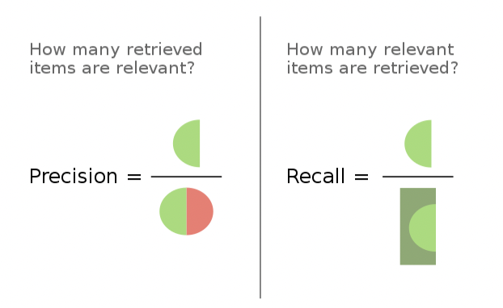

# Evaluating Machine Translation

기계 번역과 사람의 번역을 비교하여 기계번역의 성능을 측정하는 방법에 대해 알아본다.

여기서는 F1, BLEU, ROUGE 점수를 소개한다. 
- 세 점수는 후보(Candidate) 번역과 기준(Reference) 번역의 중복되는 N-gram 수를 세는 방식으로 계산하며, 
    - 따라서 언어에 관계없이 적용 가능하다.
- 단, 문장의 의미 정보나 어순을 고려하지 않는다는 점에 유의하자.

## 1. F1 Score
F1 점수는 두개의 클래스가 존재하는 경우 분류 테스트의 정확도(accuracy)를 계산하는 지표이며, Precision과 Recall로 계산된다.

*https://en.wikipedia.org/wiki/F-score*

$$
\begin{aligned}
\text{Precision} &= \frac{\text{True Positives}}{\text{Retrived Elements}} \\
\text{Recall} &= \frac{\text{True Positives}}{\text{Relevant Elements}} 
\end{aligned}
$$

- 즉 Precision은 테스트 결과 중 참으로 판단했고 실제로도 참인 sample의 개수이고,
- Recall은 실제로 참인 sample 중에서 테스트 결과 중 참으로 판단된 sample의 개수이다.
    - Precision은 Positive Predictive Value, Recall은 Sensitivity라고도 부른다.

이에 기반해 F1 점수는 Precision과 Recall의 조화 평균으로 계산된다. 

$$
\text{F1 Score} = 2 \times \frac{\text{Precison} \times \text{Recall}}{\text{Precison} + \text{Recall}}
$$

- Precision Recall
- 보다 일반적인 $F_{\beta}$ 점수는 Precision과 Recall에 가중치를 곱해서 계산한다.

## 2. BLEU Score
> Papineni et al., 2001, [BLEU: a Method for Automatic Evaluation of Machine Translation](https://aclanthology.org/P02-1040.pdf)

- BLEU는 BiLingual Evaluation Understudy의 약자이며, N-gram에 기반하여 측정한다.
- BLEU Score는 0과 1 사이의 값이며, 1에 가까울 수록 높은 성능을 나타낸다.

### 2.1 Unigram Precision
$$
\text{Unigram Precision} = \frac{\text{Number of Unigrams in both the Candidate and the Reference}}{\text{Number of Unigrams in the candidate}}
$$

### 2.2 Modified Unigram Precision
$$
\text{Modified Unigram Precision} = \frac{\text{Number of Unigrams in both the Candidate and the Reference}}{\text{Number of Unigrams in the candidate}}
$$

## 3. ROUGE-N Score
> Lin, Chin-Yew, 2004, [ROUGE: A Package for Automatic Evaluation of Summaries](https://aclanthology.org/W04-1013.pdf)
- ROUGE는 Recall-Oriented Understudy for Gisting Evaluation의 약자이다.
- ROUGE는 기계 요약을 평가하기 위해 고안되었지만 기계 번역을 평가하는 지표로도 사용되고 있다. 
- ROUGE cares about how much of the human created references appear in the candidate translation. 
- ROUGE에는 다양한 버전이 있는데, ROUGE-N 점수는 후보 문장과 기준 문장의 n-gram 중복을 계산한다. 
- Formally, ROUGE-N is an n-gram recall between a
candidate summary and a set of reference summaries. R
$$
\text{ROUGE-N Score} = \frac{\text{}}{}
$$

### 참고 자료
- DeepLearning.AI, NLP Specialization, Course 4, Week 1
- BLEU Score, Wikipedia, https://en.wikipedia.org/wiki/BLEU
- ROUGE, Wikipedia, https://en.wikipedia.org/wiki/ROUGE_(metric)
- https://wikidocs.net/31695
