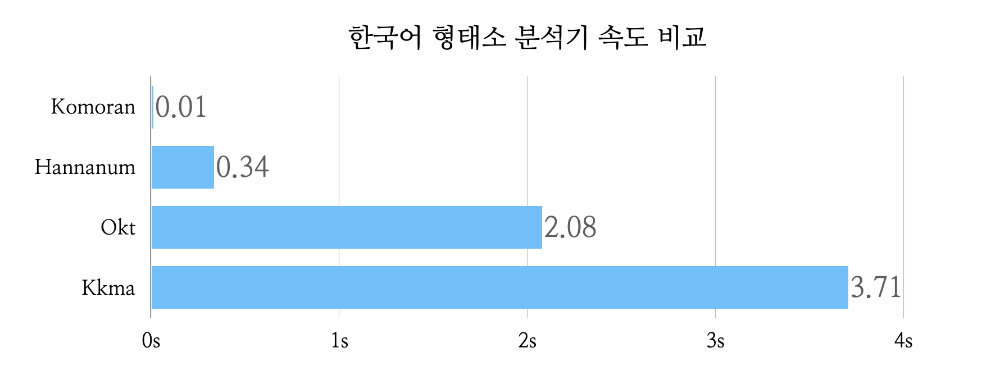

# Korean Tokenization

한국어 토큰화(또는 형태소 분석)를 파이썬 패키지 [KoNLPy](https://konlpy.org/ko/latest/
)를 이용하여 수행한다. 


## 0. Need 
- 한국어는 토크나이징이 어려운 언어이다.
    - 한국어는 영어와 달리 명사와 조사를 띄어쓰지 않는다.
    - 한국어는 어순이 아니라 조사 또는 조사의 유무에 따라 문법적 기능이 정해진다.
    - 한국어는 띄어쓰기 규칙이 모호하다.
    - 한국어는 주어를 생략할 수 있고, 평서문과 의문문에 문법적 차이가 없다.
        - ex. '집에 갔어.', '집에 갔어?'
- 따라서 최소의 의미 단위인 형태소를 분석하는 도구(Morphological Analyzer)가 필요하다.
    - 형태소 분석기는 문장에서 형태소, 어근, 접두사, 접미사, 품사 등을 파악한다.
    - 대부분의 경우, 문장에서 형태소를 추출하면서 뜻과 문맥을 고려해 품사 태깅(POS) 기능을 지원한다.
- `konlpy.tag` 에 여러형태소 분석기가 통합되어 있다. 
    - 2022-09-17 기준으로 Hannanum, Kkma, Komoran, Mecab, Okt 형태소 분석 API를 지원하고 있다.

Python으로 한국어 자연어 처리를 진행하기 위해 KoNLPy를 통해 여러 형태소 분석기를 테스트해보자. 


## 1. Hannanum 한나눔

- Hannanum은 KAIST Semantic Web Research Center에서 Java로 개발한 형태소 분석기이다. 
- [Hannanum 품사 태그](https://www.sketchengine.eu/wp-content/uploads/Original-HanNanum-manual.pdf) (링크 17p)는 최소 9개에서 최대 69개이다.
- Hannanum은 유니코드 문자를 한국어로 인코딩하여 분석한다.
- Hannanum은 다른 분석기와 달리 Unknown에 해당하는 태그가 없으며, 사전에 없는 문자는 띄어쓰기로 구분하여 명사로 태깅한다.


한나눔은 매개변수를 가진다.
- `Hannanum(jvmpath=None, max_heap_size=1024)`
    - jvmpath로 JVM 경로를 명시하거나
    - max_heap_size로 메가바이트 단위 메모리 제한을 할 수 있다.

한나눔에는 네개의 메서드가 있다.
- `analyze(phrase)` : 구문에 대해 가능한 형태소 분석을 리스트로 반환한다. 이때 품사 태그 종류는 69개이다.
- `morphs(phrase)` : 형태소 리스트를 반환한다.
- `nouns(phrase)` : 명사 리스트를 반환한다.
- `pos(phrase, ntags=9, flatten=True, join=False)` : 형태소와 품사 태그 쌍을 원소로하는 리스트를 반환한다. 
    - 이때 품사 태그 종류는 9 또는 22이다.

```python
from konlpy.tag import Hannanum

text = "1905년 9월 27일 알베르트 아인슈타인이 질량-에너지 동등성에 대한 논문을 발표했다."

# 한마음 객체 생성
hannanum = Hannanum()

# [[[('1905', 'nnc'), ('년', 'nbu')]], [[('9', 'nnc'), ('월', 'nbu')]],
# [[('27', 'nnc'), ('일', 'nbu')],
# [('27', 'nnc'), ('일', 'nnc')],
# [('27', 'nnc'), ('이', 'jp'), ('ㄹ', 'etm')]],
# [[('알베르트', 'ncn')],
# [('알베르트', 'nqq')]],
# [[('아인슈타인', 'ncn'), ('이', 'jcc')],
# [('아인슈타인', 'ncn'), ('이', 'jcs')],
# [('아인슈타인이', 'ncn')],
# [('아인슈타인', 'nqq'), ('이', 'jcc')],
# [('아인슈타인', 'nqq'), ('이', 'jcs')],
# [('아인슈타인이', 'nqq')]],
# [[('질량', 'ncn'), ('-', 'sd'), ('에너지', 'ncn')]],
# [[('동등', 'ncps'), ('성에', 'ncn')],
# [('동등', 'ncps'), ('성', 'ncn'), ('에', 'jca')],
# [('동등', 'ncps'), ('성', 'xsns'), ('에', 'jca')]],
# [[('대하', 'pvg'), ('ㄴ', 'etm')],
# [('대한', 'nq')]],
# [[('논문', 'ncn'), ('을', 'jco')]], [[('발표', 'ncpa'), ('하', 'xsva'),
# ('었', 'ep'), ('다', 'ef')]],
# [[('.', 'sf')],
# [('.', 'sy')]]]
print(hannanum.analyze(text))

# ['1905년', '9월', '27일', '알베르트', '아인슈타인', '이', '질량', '-', '에너지',
# '동등성', '에', '대하', 'ㄴ', '논문', '을', '발표', '하', '었다', '.']
print(hannanum.morphs(text))

# ['1905년', '9월', '27일', '알베르트', '아인슈타인', '질량', '에너지', '동등성', '논문', '발표']
print(hannanum.nouns(text))

# [('1905년', 'N'), ('9월', 'N'), ('27일', 'N'), ('알베르트', 'N'),
# ('아인슈타인', 'N'), ('이', 'J'), ('질량', 'N'), ('-', 'S'), ('에너지', 'N'),
# ('동등성', 'N'), ('에', 'J'), ('대하', 'P'), ('ㄴ', 'E'), ('논문', 'N'),
# ('을', 'J'), ('발표', 'N'), ('하', 'X'), ('었다', 'E'), ('.', 'S')]
print(hannanum.pos(text))
```
- 날짜 인식
    - `pos` 메서드에서는 날짜를 '1905년', '9월', '27일'로 구분하고 모두 명사(N)로 태깅하였다.
- 고유명사 인식
    - 고유명사 '알베르트'와 '아인슈타인'을 명사(N)로 태깅했다.
- 동사의 형태소 분석
    - '했다'를 접사(X) '하'와 어미(E) '었다'로 구분했다.


## 2. [Kkma 꼬꼬마](http://kkma.snu.ac.kr/)


- Kkma는 서울대학교 IDS 연구실에서 한국어 자연어 처리를 위해 개발한 Java 라이브러리이다. 
    - 실제 Kkma는 형태소 분석기 뿐 아니라 말뭉치 활용 시스템을 포함하고 있다.
- Kkma는 [품사 태그](http://kkma.snu.ac.kr/documents/index.jsp?doc=postag) 종류가 많아 상세한 형태소 분석을 할 수 있다.
- [홈페이지](http://kkma.snu.ac.kr/documents/index.jsp?doc=testsets)에 따르면, Edit Distance를 사용하였을 때 70~80 % 토큰화 정확도를 보여준다. 
- 그러나 다른 형태소 분석기에 비해 속도가 느리다.
- 사전에 없는 새로운 단어에 대해 문법 형태소를 과하게 분석하는 경향이 있다.
- Kkma는 UTF-8 인코딩을 지원하지만 이모지를 포함하는 UTF-8 MB4는 지원하지 않는다.

Kkma도 매개변수를 가진다.
- `Kkma(jvmpath=None, max_heap_size=1024)`
   
꼬꼬마에는 4개의 메서드가 있다.
- `morphs(phrase)` : 형태소 리스트를 반환한다.
- `nouns(phrase)` : 명사 리스트를 반환한다.
- `pos(phrase, flatten=True)` : : 형태소와 품사 태그 쌍을 원소로하는 리스트를 반환한다.
- `sentences(phrase)` : 문장 리스트를 반환한다.

```python
from konlpy.tag import Kkma

text = u"1905년 9월 27일 알베르트 아인슈타인이 질량-에너지 동등성에 대한 논문을 발표했다."

# 꼬꼬마 객체 생성
kkma = Kkma()

# ['1905', '년', '9', '월', '27', '일', '알', 'ㄹ', '베르트', '아인슈타인', '이',
# '질량', '-', '에너지', '동등', '성', '에', '대하', 'ㄴ', '논문', '을', '발표',
# '하', '었', '다', '.']
print(kkma.morphs(text))

# [('1905', 'NR'), ('년', 'NNM'), ('9', 'NR'), ('월', 'NNM'), ('27', 'NR'),
# ('일', 'NNM'), ('알', 'VV'), ('ㄹ', 'ETD'), ('베르트', 'NNG'), ('아인슈타인', 'NNM'),
# ('이', 'JKS'), ('질량', 'NNG'), ('-', 'SW'), ('에너지', 'NNG'), ('동등', 'NNG'),
# ('성', 'XSN'), ('에', 'JKM'), ('대하', 'VV'), ('ㄴ', 'ETD'), ('논문', 'NNG'),
# ('을', 'JKO'), ('발표', 'NNG'), ('하', 'XSV'), ('었', 'EPT'), ('다', 'EFN'),
# ('.', 'SF')]
print(kkma.pos(text))

# ['1905', '1905년', '년', '9', '9월', '월', '27', '27일', '일', '베르트', '아인슈타인',
# '질량', '에너지', '동등', '논문', '발표']
print(kkma.nouns(text))

sentences = u"하나 신한 카드 둘 다 안되네 돌아버리겠다ㅠ 몇번을 넣다 빼도 카드회사에 문의하라고 하고..."

# ['하나 신한 카드 둘 다 안되네', '돌아 버리겠다 ㅠ 몇 번을 넣다 빼도 카드회사에 문의 하라고 하고...']
print(kkma.sentences(sentences))
```

- 날짜 인식
    - 날짜를 나타내는 '1950년'을 형태소로는 '1950'을 수사(NR), '년'을 단위 의존 명사(NNM)로 인식하였다.
    - 단, 명사를 출력할 때는 '1905', '1905년', '년' 으로 가능한 분류를 모두 반환했다.
- 고유명사 인식
    - 고유명사 '알베르트'를 '알'을 동사(VV), 'ㄹ'을 관형형 전성 어미(ETD), '베르트'를 보통 명사(NNG)로 인식했다. 
    - 또한 고유명사 '아인슈타인'을 단위 의존 명사(NNM)로 인식했다.
- 동사의 형태소 분석
    - '했다'를 동사 파생 접미사(XSV) '하', 시제 선어말 어미(EPT) '었', 평서형 종결어미(EFN) '다'로 나누었다.


## 3. [Komoran 코모란](https://github.com/shineware/KOMORAN)

- KOrean MORphological ANalyzer의 약자로, Shineware에서 Java로 개발한 한국어 형태소 분석기이다.
- [Komoran 품사 태그](https://docs.komoran.kr/firststep/postypes.html)
- 코모란은 속도가 빨라 대규모 자연어 처리에 유용하다.
- 공백이 포함된 형태소 단위 분석이 가능하다.
- 코모란은 UTF-8 인코딩을 지원하지만 이모지를 포함하는 UTF-8 MB4는 지원하지 않는다.

Komoran은 4개 매개변수를 가진다.
- `Komoran(jvmpath=None, userdic=None, modelpath=None, max_heap_size=1024)`
    - userdic으로 사용자 정의 POS 태깅 딕셔너리 경로를 전달할 수 있다.
        - 이때 파일은 `단어 <tab> POS태그` 형태여야 하며 POS 태그를 전달하지 않은 경우 NNP로 태깅된다.
    - modelpath로 코모란 HMM 모델 경로를 전달할 수 있다.

코모란에는 세개의 메서드가 있다.
- `morphs(phrase)` : 형태소 리스트를 반환한다.
- `nouns(phrase)` : 명사 리스트를 반환한다.
- `pos(phrase, flatten=True)` : 형태소와 품사 태그 쌍을 원소로하는 리스트를 반환한다.


```python
from konlpy.tag import Komoran

text = u"1905년 9월 27일 알베르트 아인슈타인이 질량-에너지 동등성에 대한 논문을 발표하였다."

komoran = Komoran()

# ['1905', '년', '9월 27일', '알베르트 아인슈타인', '이', '질량', '-', '에너지', '동등', '성',
# '에', '대하', 'ㄴ', '논문', '을', '발표', '하', '았', '다', '.']
print(komoran.morphs(text))

# ['년', '9월 27일', '알베르트 아인슈타인', '질량', '에너지', '동등', '논문', '발표']
print(komoran.nouns(text))

# [('1905', 'SN'), ('년', 'NNB'), ('9월 27일', 'NNP'), ('알베르트 아인슈타인', 'NNP'),
# ('이', 'JKS'), ('질량', 'NNP'), ('-', 'SS'), ('에너지', 'NNP'), ('동등', 'NNG'),
# ('성', 'XSN'), ('에', 'JKB'), ('대하', 'VV'), ('ㄴ', 'ETM'), ('논문', 'NNG'),
# ('을', 'JKO'), ('발표', 'NNG'), ('하', 'XSV'), ('았', 'EP'), ('다', 'EF'),
# ('.', 'SF')]
print(komoran.pos(text))
```

- 날짜 인식
    - '1905'는 숫자(SN)로, '년'은 의존 명사(NNB)로, '9월 27일'은 고유명사로 인식했다.
- 고유 명사 인식 
    - '알베르트 아인슈타인'을 하나의 고유명사로 인식했다.
- 동사의 형태소 분석
    - 다른 형태소 분류기와 마찬가지로 '했다'를 '하', '았', '다'로 구분하였다.


## 4. [Okt](https://openkoreantext.org/)

- Open Korean Text의 약자로, Twitter 한국어 처리기에서 파생되었으며 Scalar로 쓰여진 오픈소스 한국어 처리기이다.
- 조사는 구분하나, 동사는 형태소로 분석하지 않는다.
- 문장을 정규화하는 기능(norm), 어간을 추출하는 기능(stem), 구문을 추출하는 기능을 제공한다.
- Okt는 UTF-8 MB4를 지원한다.

Okt는 매개변수를 가진다.
- `Okt(jvmpath=None, max_heap_size=1024)`

Okt는 5개의 메서드를 가진다.
- `morphs(phrase, norm=False, stem=False)` : 형태소 리스트를 반환한다.
- `nouns(phrase)` : 명사 리스트를 반환한다.
- `pos(phrase, norm=False, stem=False, join=False)` : 형태소와 품사 태그 쌍을 원소로하는 리스트를 반환한다. 
- `normalize(phrase)` : 정규화된 문자열을 반환한다.
- `phrases(phrase)` : 구문 리스트를 반환한다.

```python
from konlpy.tag import Okt

text = u"1905년 9월 27일 알베르트 아인슈타인이 질량-에너지 동등성에 대한 논문을 발표하였다."

# okt 객체 생성
okt = Okt()

# ['1905년', '9월', '27일', '알베르트', '아인슈타인', '이', '질량', '-', '에너지', '동등', '성', 
# '에', '대한', '논문', '을', '발표', '했다', '.']
print(okt.morphs(text))

# ['알베르트', '아인슈타인', '질량', '에너지', '동등', '대한', '논문', '발표']
print(okt.nouns(text))

# [('1905년', 'Number'), ('9월', 'Number'), ('27일', 'Number'), ('알베르트', 'Noun'), 
# ('아인슈타인', 'Noun'), ('이', 'Josa'), ('질량', 'Noun'), ('-', 'Punctuation'), 
# ('에너지', 'Noun'), ('동등', 'Noun'), ('성', 'Suffix'), ('에', 'Josa'), 
# ('대한', 'Noun'), ('논문', 'Noun'), ('을', 'Josa'), ('발표', 'Noun'), 
# ('했다', 'Verb'), ('.', 'Punctuation')]
print(okt.pos(text))

# 1905년 9월 27일 알베르트 아인슈타인이 질량-에너지 동등성에 대한 논문을 발표하였다.
print(okt.normalize(text))

# ['1905년', '1905년 9월', '1905년 9월 27일', '1905년 9월 27일 알베르트',
# '1905년 9월 27일 알베르트 아인슈타인', '질량', '에너지', '에너지 동등성', '대한', '대한 논문',
# '발표', '9월', '27일', '알베르트', '아인슈타인', '동등성', '논문']
print(okt.phrases(text))
```

- 날짜 인식
    - '1905년', '9월', '27일' 을 일관되게 숫자(Numbers)로 분류하였다.
- 고유명사 인식
    - '알베르트'와 '아인슈타인'을 각각의 명사로 인식하였다.
- 동사 형태소 분석
    - '했다'를 그대로 한덩어리의 동사로 인식하였다. 
    - 따라서 비슷한 의미의 단어들을 각각 다른 단어로 인식한다. 
        - ex. '했다', '하였다', '했고', '했으며', '한'
        - 이 문제는 구문을 정규화한 다음 형태소 분석을 하는 것으로 해결할 수 있으나, 상세한 문법적 의미는 소실될 수 있다.


## 5. 예시로 비교하기

어떤 형태소 분석기가 자신의 프로젝트에 적합한지 알기 위해서는 데이터에 대한 이해가 필요하다. 

여기서는 몇가지 **예시**에 대해 형태소 분석기들의 분석 결과를 비교해보자. 
- 단, 형태소 분석기는 **문맥에 따라 다른 분석 결과**를 도출함에 유의하자.


#### 띄어쓰기가 안된 글
```python
text = "아버지가방에들어가신다"
```

결과는 한나눔, 꼬꼬마, 코모란, Okt 순이다.

```
['아버지가방에들어가', '이', '시ㄴ다']
['아버지', '가방', '에', '들어가', '시', 'ㄴ다']
['아버지', '가방', '에', '들어가', '시', 'ㄴ다']
['아버지', '가방', '에', '들어가신다']
```
- 꼬꼬마, 코모란, Okt는 띄어쓰기가 있을 때와 거의 비슷한 결과를 도출했다.
- 단, 의미적으로 "아버지 가방에 들어가신다" 보다 그럴듯한 "아버지가 방에 들어가신다" 구분은 할 수 없었다.


#### 고유명사
```python
name = "아놀드 슈왈츠 제네거"
```

결과는 한나눔, 꼬꼬마, 코모란, Okt 순이다.

```
['아놀드', '슈왈츠', '제네거']
['아', '아', '놀드', '슈', '왈츠', '저', '의', '네', '거']
['아놀드', '슈', '왈츠', '제', '네', '거']
['아놀드', '슈', '왈츠', '제', '네', '거']
```
- 띄어쓰기만 반영한 한나눔을 빼고 완벽한 분석은 없었다.

```python
name = "오노레 드 발자크"
```

결과는 한나눔, 꼬꼬마, 코모란, Okt 순이다.

```
['오노레', '드', '발자크']
['오노', '레', '들', '발자크']
['오노레 드 발자크']
['오노', '레', '드', '발자크']
```
- 코모란만 이름을 제대로 인식했다.

```python
name = "여현정"
```

결과는 한나눔, 꼬꼬마, 코모란, Okt 순이다.

```
['여현정']
['여현', '정']
['여', '현정']
['여', '현정']
```
- 코모란과 Okt에서 이름을 제대로 인식했다.


#### 숫자로 표현된 단위
```python
dist = "십일만키로미터 11만키로미터 110,000키로미터"
```

결과는 한나눔, 꼬꼬마, 코모란, Okt 순이다.

```
['십일만키로미터', '11만키로미터', '110,000키로미터']
['십', '일', '만', '키', '로', '미터', '11', '만', '키로', '미터', '110,000', '키로', '미터']
['십', '일만', '키로', '미터', '11', '만', '키로', '미터', '110', ',', '000', '키로', '미터']
['십일만', '키로', '미터', '11만', '키로미터', '110,000', '키', '로', '미터']
```
- '키로미터'를 일관적으로 분류한 분석기는 코모란 밖에 없었다.
- 꼬꼬마와 Okt는 숫자 사이 `,`를 연속된 숫자로 인식했다.


#### 속도 비교

마지막으로 분석기의 속도를 비교하기 위해 다음 [기사](https://www.sciencetimes.co.kr/news/%ec%9d%b8%eb%a5%98-%ec%b2%ab-%ec%a7%80%ea%b5%ac%eb%b0%a9%ec%96%b4-%ec%8b%a4%ed%97%981%ec%b2%9c100%eb%a7%8c%e3%8e%9e%eb%b0%96%ec%84%9c-160%ef%bd%8d-%ed%81%ac%ea%b8%b0-%ec%86%8c%ed%96%89/) 일부를 분석한다. 

```python
text = "지구 충돌 코스의 소행성에 우주선을 충돌시켜 궤도를 바꾸는 인류 최초의 소행성 방어 실험을 위해 발사된 미국 우주선이 27일(이하 한국시간) 10개월여의 비행 끝에 지구에서 약 1천100만㎞ 떨어진 심우주에서 목표 소행성 ‘다이모르포스'(Dimorphos)와 정확히 충돌했다. 미국항공우주국(NASA)은 ‘쌍(雙) 소행성 궤도수정 실험'(DART) 우주선이 이날 오전 8시14분 ‘운동 충격체'(kinetic impactor)가 돼 시속 2만2천㎞(초속 6.1㎞)로 다이모르포스에 충돌하는 데 성공했다고 밝혔다."
```

결과는 다음과 같았다.



- 코모란이 다른 분석기에 비해 월등히 빨랐다.


### 참고 자료
- https://wikidocs.net/92961
- 처음 배우는 딥러닝 챗봇, 조경래 지음