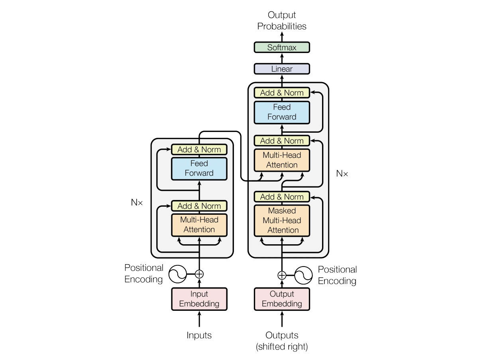
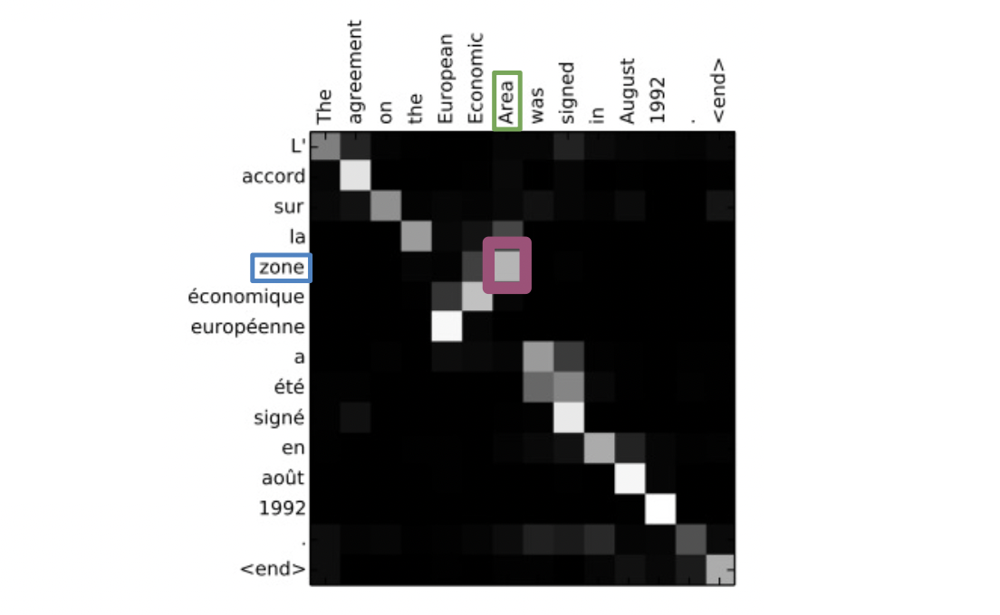
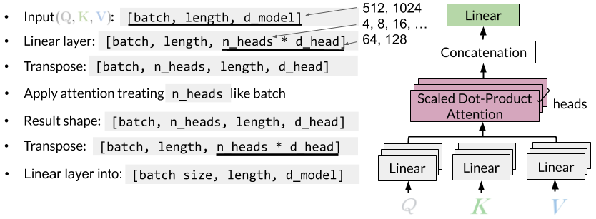
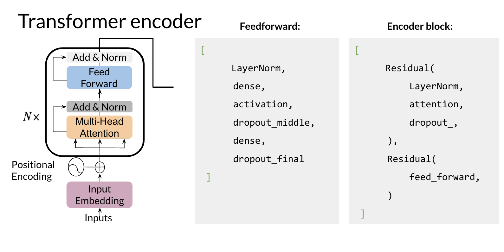
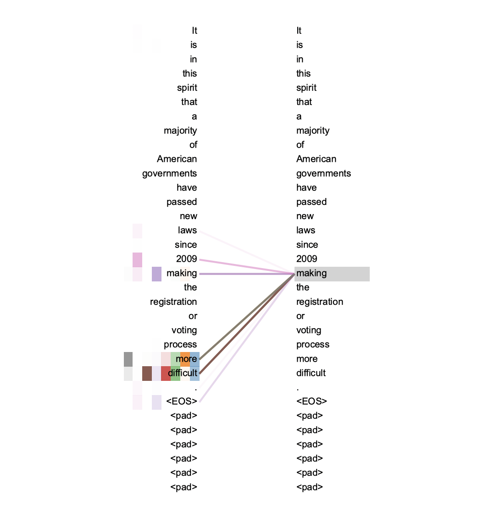
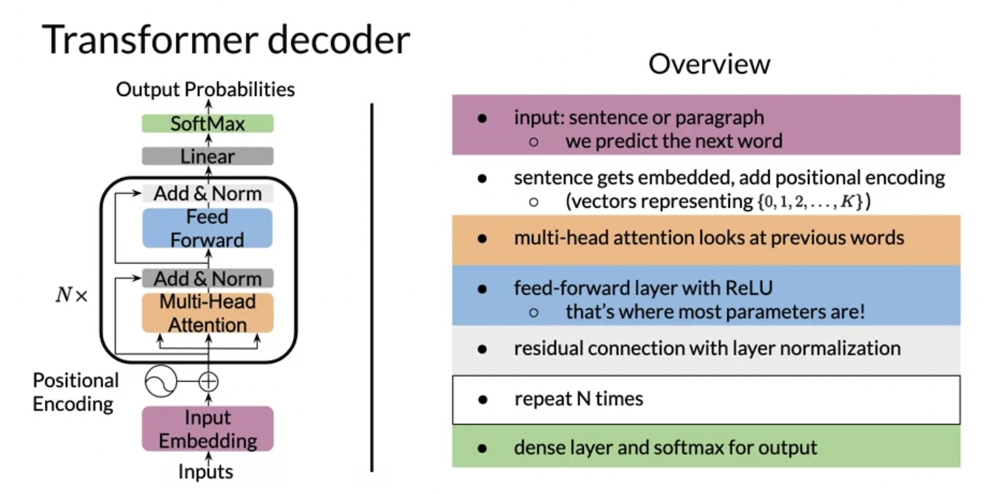

원 논문:
> Vaswani et al., 2017, "Attention is all you need" ([Link to arxiv](https://arxiv.org/abs/1706.03762))

## 0. Transformer

 트랜스포머는 Seq2Seq 모델과 비슷한 인코더-디코더 구조를 갖고 있지만, 보다 긴 시퀀스를 효율적으로 다룰수 있는 모델로 환영받았다. 트랜스포머는 새로운 어텐션을 도입했다. 2014년에 등장한 어텐션(Bahdanau et al., 2014)이 RNN 네트워크의 성능을 향상시키는 활용된 것과 달리, 2017년의 어텐션은 신경망을 이용하지 않고 행렬 곱으로 이루어진 방식을 제안하면서 자연어 처리에 있어 획기적인 성능 향상을 불러왔다. 


<center>
트랜스포머 모델의 구조, Vaswani et al., 2017
</center>

</br>

트랜스포머 모델은 크게 봐서 왼쪽의 인코더와 오른쪽의 디코더를 가지는 구조이다. RNN 모델에서와 마찬가지로 인코더의 결과값을 디코더의 입력값과 결합해서 연산을 거쳐 결과값을 도출한다. 다만 RNN과의 차이점은 시퀀스를 **동시에** 처리한다는 점이다. 즉 시퀀스 모델처럼 시퀀스 데이터에 순서대로 접근해서 하나씩 처리하는 것이 아니라 전체 시퀀스를 한 번에 연산한다. 따라서 분산 연산이 용이하며 RNN 모델에서 발생하는 vanishing gradient 현상에 효과적으로 대처해서 보다 긴 시퀀스를 다룰 수 있게 되었다.

트랜스포머 네트워크에 사용되는 어텐션은 행렬곱을 이용한 순차적이지 않은 (따라서 병렬 연산이 가능한) 어텐션이며, 이 어텐션을 Scaled-Dot product 어텐션이라고 한다.  

### 🔔 Scaled-Dot prooduct Attention

Scaled-Dot prooduct 어텐션에는 세개의 행렬 $Q$, $K$, $V$ 입력이 필요하다:

- $Q$, Queries : 비교하고자 하는 시퀀스로, 키 K와 유사도를 측정한다.
- $K$, Keys : 비교 대상이 되는 시퀀스로, 쿼리 Q와 유사도를 측정한다.
- $V$, Values : $QK$의 가중치가 곱해지는 행렬이다.

어텐션이란 행렬 $Q$와 $K$-$V$ 쌍을 결과값에 매핑하는 함수로, 결과값은 $V$의 가중치 합으로 계산되고, 각각의 값 $v$에 할당된 가중치는 $q$와 그에 대응하는 $k$로부터 계산된다. 이 어텐션이 이름 붙은 이유는 어텐션을 연산하는 방법에 있다.

$$
Attention(Q, K, V) = softmax(\frac{Q \cdot K^T}{\sqrt{d_k}}) \cdot V
$$

첫 번째 행렬 곱(dot product)은 쿼리 Q와 키 K의 유사도를 분석하고, 두번째 곱은 softmax 함수값으로 얻어진 가중치를 발류 $V$에 할당한다. $Q$와 $K$의 곱은 $K$의 차원 $d_k$의 루트로 조정(scaled) 하는데, 이 스케일링은 reguralization효과를 가진다. 그 다음 softmax 함수를 거쳐 $Q$와 $K$의 유사도를 가중치로 변환해 마지막으로 그 값을 행렬 $V$에 반영해 모든 쿼리의 어텐션을 얻을 수 있다. 


<center>
어텐션, Badnau et al., 2015
</center>

</br>

어텐션은 쿼리와 키의 heatmap을 생성하는 것과 같다. 전체 시퀀스를 한 번에 단어 쌍 단위 $(q, k)$로 살펴보기 때문에, 단어가 문장에서 등장하는 순서에 관계없이 유사도를 계산할 수 있다. 위의 예처럼 어순이 다른 영어와 프랑스어 문장에서도 단어의 대응 관계를 제대로 파악할 수 있다.

### 🔔 Multi-Head Attention


<center>
Multi-Head Attention, from deeplearning.ai
</center>

</br>

트랜스포머의 어텐션의 또다른 특징은 어텐션이 머리(heads)를 여러개 가진다는 것이다. 입력값에 대해 어텐션을 여러번 수행한 후 결과를 결합(concatenate)해서 최종적으로 하나의 행렬을 만드는 것을 뜻한다. $d_{model}$ 차원의 $Q$, $K$, $V$에 대해 일회 어텐션을 적용하는 대신 $Q$, $K$, $V$를 `n_heads`번 선형 투사(linear projection)해서 서로다른 학습된 선형 투사들에 대해 어텐션을 적용한다. 각 선형 투사를 $Q$에 대해 $W^Q$, $K$에 대해 $W^K$, $V$에 대해 $W^V$라고 하며 각각 $(n_{seq}, d_k)$, $(n_{seq}, d_k)$, $(n_{seq}, d_v)$ 차원을 가진다. 어텐션을 적용하면 한개의 결과값에 대해 $(n_{seq}, d_v)$ 차원을 가지므로 `n_heads`개의 결과값을 결합한 행렬 다시 선형 투사해서 어텐션 결과값을 얻는다. 매번 학습할 때마다 다른 가중치를 가지므로 여러번 어텐션을 적용함으로서 시퀀스 데이터 사이의 다양한 관계를 학습할 수 있다. 이때 여러번의 어텐션을 순서대로 실행해야 할 필요가 없으므로 병렬 연산을 하기 용이한 구조다. 

📂 다음 코드는 Trax `SplitIntoHeads`와 `MergeHeads` 메서드로, Multi-Head 어텐션의 일부분을 구현한다. 

```python
def SplitIntoHeads(n_heads, merged_batch_and_head=True):
  """Returns a layer that reshapes an array for multi-head computation."""
  def f(x):
    batch_size, seq_len, d_feature = x.shape
    if d_feature % n_heads != 0:
      raise ValueError(
          f'Feature embedding dimensionality ({d_feature}) is not a multiple'
          f' of the requested number of attention heads ({n_heads}).')

    d_head = d_feature // n_heads

    # (b_size, seq_len, d_feature) --> (b_size*n_heads, seq_len, d_head)
    x = x.reshape((batch_size, seq_len, n_heads, d_head))
    x = x.transpose((0, 2, 1, 3))
    if merged_batch_and_head:
      x = x.reshape((batch_size * n_heads, seq_len, d_head))
    return x
  return Fn('SplitIntoHeads', f)
```

`SplitIntoHeads`는 `d_feature`(그림에서는 `d_model`)가 Head의 개수 `n_heads`의 정수배일 것을 강제한다. 위의 그림처럼 `(batch, seq_len, d_feature)`을 입력받아 `(b_size*n_heads, seq_len, d_head)`차원을 출력하고 있다. 그 다음 `PureAttention`처럼 1개 Head에 대한 어텐션을 `n_heads`만큼 수행한 후, 여러 Head를 `MergeHeads`로 결합한다.

```python
def MergeHeads(n_heads, merged_batch_and_head=True):
  """Returns a layer that rejoins heads, after multi-head computation."""
  def f(x):
    if merged_batch_and_head:
      dim_0, seq_len, d_head = x.shape
      if dim_0 % n_heads != 0:
        raise ValueError(
            f"Array's leading dimension ({dim_0}) is not a multiple of the"
            f" number of attention heads ({n_heads}).")

      batch_size = dim_0 // n_heads
      x = x.reshape((batch_size, n_heads, seq_len, d_head))
    else:
      batch_size, _, seq_len, d_head = x.shape

    # (b_size, n_heads, seq_len, d_head) --> (b_size, seq_len, d_feature)
    x = x.transpose((0, 2, 1, 3))
    x = x.reshape((batch_size, seq_len, n_heads * d_head))
    return x
  return Fn('MergeHeads', f)
```

함수 `f`는 `(batch_size, n_heads, seq_len, d_head)` 차원의 입력값을 어텐션 블럭의 입력값 차원 `(b_size, seq_len, d_feature)`로 변형해서 반환한다. 


## 1. Encoder

널리 쓰이는 트랜스포머 사전훈련 모델인 BERT의 경우 인코더만 (`bert-large`의  경우) 24개 쌓은 네트워크다. LSTM을 생각해 보면 인코더의 구조는 상대적으로 단순해 보이지만, 인코더만으로도 많은 작업을 수행할 수 있음을 알 수 있다.


<center>
인코더 구조, from deeplearning.ai
</center>

</br>

인코더는 크게 **두개의 레이어**로 구성된다. Multi-Head Attention과 FeedForward이다. FeedForward는 일련의 훈련 가능한 신경망으로 구성된 블럭이다. 0️⃣ 입력값을 Embedding하고 Positional Encoding을 적용한 후에, 한 개의 **인코더 블럭**은 1️⃣ Residual을 적용한 Multi-Head Attention을 실행하고 2️⃣ 다시 Residual을 적용한 FeedForward 레이어를 실행한다. 모델을 깊게 만들기 위해 이 인코더 블럭을 여러번 실행한다.

Residual 레이어는 함수 $Fn(x_1, x_2, ...)$에 대해 다음을 뜻한다.

$$
Residual(Fn)(x_1, x_2, ...) = Fn(x_1, x_2, ...) + x_1
$$

즉 입력값의 첫번째 값을 함수의 결과값에 더하는 기능을 한다. Residual 레이어를 적용하는 이유는 shortcut 연결 기능을 하기 때문이다. 특히 깊은 네트워크를 학습할 때 Residual이 효과적임이 검증되었다.

> Further study - Residual 네트워크를 사용하는 이유 : [He et al., 2015](https://arxiv.org/pdf/1512.03385.pdf)

📂 다음 코드는 Trax 라이브러리의 `TransformerEncoder` 모델이다.

```python
def TransformerEncoder(vocab_size,
                       n_classes=10,
                       d_model=D_MODEL,
                       d_ff=D_FF,
                       n_layers=N_LAYERS,
                       n_heads=N_HEADS,
                       max_len=MAX_SEQUENCE_LENGTH,
                       dropout=DROPOUT_RATE,
                       dropout_shared_axes=DROPOUT_SHARED_AXES,
                       mode=MODE,
                       ff_activation=FF_ACTIVATION_TYPE):
    
  def _Dropout():
    return tl.Dropout(rate=dropout, shared_axes=dropout_shared_axes, mode=mode)

  def _EncBlock():
    return _EncoderBlock(d_model, d_ff, n_heads, dropout, dropout_shared_axes,
                         mode, ff_activation)

  return tl.Serial(
      tl.Branch([], tl.PaddingMask()),  # Creates masks from copy of the tokens.
      tl.Embedding(vocab_size, d_model),
      _Dropout(),
      tl.PositionalEncoding(max_len=max_len),
      [_EncBlock() for _ in range(n_layers)],
      tl.Select([0], n_in=2),  # Drops the masks.
      tl.LayerNorm(),
      tl.Mean(axis=1),
      tl.Dense(n_classes),
  )
```

`TransformerEncoder`는 토큰화된 텍스트를 `n_classes`개로 분류한다. 함수 반환값의 첫줄에 등장하는 `tl.Branch`는 입력값을 받아서 각각의 함수를 병렬적으로 실행한다. 즉 입력값을 리스트`[]`로 만든 값과 패딩마스크 `tl.PaddingMask()` 값 두개를 반환할 것이다. 두 값 모두 임베딩과 positional encoding을 거쳐 인코더 블럭에 입력된다. 인코더 블럭의 코드에서 데이터와 마스크 쌍 `(activations, mask)`을 입력받는 것을 확인할 수 있다.

```python
def _EncoderBlock(d_model,
                  d_ff,
                  n_heads,
                  dropout,
                  dropout_shared_axes,
                  mode,
                  ff_activation):
  """Returns a list of layers that implements a Transformer encoder block.
  The input to the block is a pair (activations, mask) where the mask was
  created from the original source tokens to prevent attending to the padding
  part of the input. The block's outputs are the same type/shape as its inputs,
  so that multiple blocks can be chained together.
  """
  def _Attention():
    return tl.Attention(d_model, n_heads=n_heads, dropout=dropout, mode=mode)

  # ...

  return [
      tl.Residual(
          tl.LayerNorm(),
          _Attention(),
          _Dropout(),
      ),
      tl.Residual(
          tl.LayerNorm(),
          _FFBlock(),
          _Dropout(),
      ),
  ]
```

여기서 `tl.Attention`은 `n_heads`개의 머리를 가지는 multi-head 셀프-어텐션이며, Attention 레이어와 FeedForward 블럭이 Residual을 거치는 것을 확인할 수 있다. 어텐션 블럭을 지난 후에는 마스크가 필요 없으므로 `tl.Select()`로 `(activations, mask)`쌍에서 앞의 값만 취하고 `tl.LayerNorm()`과 같은 쿼리에 해당하는 열에 대한 덧셈 `tl.Mean(axis=1)`, 그리고 `n_classes`개의 `tl.Dense()` 층을 거쳐 마무리한다.

### 🔆 Dimensionality Setting

Residual 레이어를 적용하기 위해서는 어텐션의 입력값과 결과값의 차원이 같아야한다. 앞의 Multi-Head Attention 그림을 참고하여 배치 크기를 `batch`, 입력 시퀀스 길이를 `length`, 그리고 어텐션의 차원을 `d_model`로 설정하자. Q, K, V가 $(batch, length, d_{model})$ 차원을 가지며, $W^Q$, $W^K$, $W^V$는 각각 $(batch, length, d_k)$, $(batch, length, d_k)$, $(batch, length, d_v)$ 차원이라고 하자. 위의 설정에서 $d_k = d_v$로 두며, 그림에서는 이 값이 $d_{head}$로 나타나 있다. 어텐션을 수행하고 난 후 i번 째 어텐션은 $Z_i \in (batch, length, d_v)$ 차원이 되는데, $n_{heads}$개의 어텐션을 결합하고 난 후 처음 입력값과 같은 차원을 얻기 위해 $ n_{heads} = d_{model} / d_v$로 설정한다. 요약하면:

$$
d_k = d_v = d_{model} / n_{heads}
$$


### 🔆 Positional Encoding

인코딩에 앞서, 단순히 단어 임베딩을 통해 $QK^T$ 2차원 행렬을 계산하면 시퀀스 모델과 달리 단어의 문장 내 위치 정보를 반영할 수 없다. 그러나 어순은 맥락을 파악하는데에 중요한 단서가 된다. 예를 들어 문장 내에서 같은 단어가 등장해도 각 단어는 다른 의미를 가리킬 수 있고, 언어마다 문법 구조에 따라 어순이 다르며, 같은 단어를 사용해도 어순에 따라 다른 의미를 내포할 수 있다.

따라서 위치 정보를 반영하기 위해 위치에 따른 임의의 값을 설정해 Q, K와 V의 임베딩에 **더하는**데, 이 것을 positional encoding이라고 한다. Trax에서는 여러가지 positional encoding 방법을 지원하고 있는데 ([link](https://trax-ml.readthedocs.io/en/latest/trax.layers.html?highlight=positional%20encoding#module-trax.layers.research.position_encodings)), 원 논문에서는 차원 `i`와 위치 `pos`에 대한 sine 곡선으로 표현했다.

$$
\begin{aligned}
PE_{(pos,2i)} &= sin(pos/10000^{2i/d_{model}}) \\
PE_{(pos,2i+1)} &= cos(pos/10000^{2i/d_{model}})
\end{aligned}
$$

즉 positional encoding의 각 차원은 사인 곡선에 대응한다. PE는 $2\pi$에서 부터 $10000 \cdot 2\pi$까지의 기하학적 형태를 나타낸다. 이렇게 함으로서 상수 $k$에 대해 상대적인 위치인 $PE(pos+k)$를 $PE(pos)$의 선형 함수로 나타낼 수 있다. trax.layers.Attention에서 정의하고 있는 `PositionalEncoding` 도 같은 방법을 적용했다.

📂 다음 코드는 Trax 라이브러리의 `PositionalEncoding` 레이어다.

```python
class PositionalEncoding(base.Layer):
  
  # ...

  def forward(self, inputs):
    """Returns the input activations, with added positional information."""
    weights = self.weights

    # ...

    emb = fastmath.dynamic_slice_in_dim(
        weights, self.state, inputs.shape[1], axis=1)
    self.state += inputs.shape[1]
    return inputs + emb

  def init_weights_and_state(self, input_signature):
    """Randomly initializes the positional encoding vectors.
    """
    d_feature = input_signature.shape[-1]
    if self._d_feature is not None:
      d_feature = self._d_feature
    pe = np.zeros((self._max_len, d_feature), dtype=np.float32)
    position = np.arange(0, self._max_len)[:, np.newaxis]
    div_term = np.exp(
        np.arange(0, d_feature, 2) * -(np.log(10000.0) / d_feature))
    pe[:, 0::2] = np.sin(position * div_term)
    pe[:, 1::2] = np.cos(position * div_term)  # [self._max_len, d_feature]
    if self._use_bfloat16:
      pe = pe.astype(jnp.bfloat16)
    w = jnp.array(pe)  # Trainable parameters, initialized above.
    # ...
```

`init_weights_and_state` 함수는 `ShapeDtype` 객체를 입력받아서 임베딩 크기 `(max_len, d_feature)` 크기의 벡터 `pe`를 초기화 한다. `pe` 벡터의 짝수 행에는 `positon * div_term`의 sine 값을 할당하고 홀수 행에는 cosine 값을 할당한다. 이 값을 `weights`로 전달해 함수`forward`에서 `emb` 값으로 입력값에 더해 전달하고 있다. 즉 사인과 코사인 값으로 위치정보를 인코딩해 입력값에 더하는 방식으로 positional encoding을 수행한다.

### 📣 Encoder Self-Attention 

인코더는 셀프-어텐션 레이어를 활용한다. 셀프-어텐션은 주어진 데이터의 부분값과 다른 부분들의 관계를 파악하는 방법이다. 즉 문장 데이터에서 셀프-어텐션은 문장 내의 단어 문맥을 파악한다. 앞서 $Q$, $K$, $V$의 값은 어텐션에 따라 다르다고 했는데, 셀프-어텐션 레이어에서는 모든 $Q$, $K$, $V$가 같은 시퀀스, 즉 인코더의 이전 레이어의 결과값에서 온다. 주어진 문장이 있을 때, 임의의 단어 $w$에 대응하는 임베딩에 대한 가중치를 학습할 수 있다. 임베딩에 가중치를 곱해 얻은 쿼리 $q$에 대해 모든 $k \in K$와 dot product로 비교해서 유사도 점수를 얻을 수 있다. 그 다음 softmax 함수를 통해 모든 가중치를 더해서 1이 되는 양수값으로 변환한다. 그 후 두번째 dot product로 단어 $w$에 대응하는 다른 단어들의 $v$값들을 구해 다시 학습한 가중치 행렬을 곱함으로서 모든 가중치 합을 구한다. 이것이 단어 $w$에 대한 어텐션이다.


<center>
셀프-어텐션, Vaswani et al., 2017
</center>

</br>

위 그림은 _"making"_ 단어에 대한 어텐션을 표현하고 있다. 위 어텐션의 $Q$, $K$, $V$는 모두 한 문장 _"It is in this spirit that a majority of American governments have passed new laws since 2009 making the registration or voting process more difficult. <EOS> <pad> ..."_에서 얻어진다. 다른 색깔은 다른 head를 나타내며 색이 선명할수록 관계도가 높다. _"making"_과 연관된 head는 _"making ... more difficult"_ 구문을 완성한다.

물론 효율을 위해 우리는 행렬 단위로 어텐션을 연산한다. 주어진 문장의 단어 임베딩이 임베딩 차원 emb에 대해 $(n_{seq}, emb)$ 차원이라고 하자. 우리는 $(emb, d_{model})$차원의 가중치 행렬 $W^Q$, $W^K$, 그리고 $W^V$을 학습한다. 단어에 대해 했던 것과 마찬가지로 임베딩 행렬에 가중치 행렬을 곱해서 각각 $(n_{seq}, d_{model})$ 차원의 행렬 $Q$, $K$, 그리고 $V$를 도출할 수 있다. 이후의 어텐션 연산은 scaled-dot product 어텐션에서 살펴본 것과 같다. Multi-head 셀프-어텐션을 실행한다면, $i \in n_{heads}$에 대해 $W^Q_i$, $W^K_i$, $W^V_i$를 훈련하고 $Q_i$, $K_i$, $V_i$로 어텐션을 연산한 후, 어텐션 결과값 $Z_i$를 결합한 $Z$에 학습한 $(n_{seq}, d_v)$ 차원의 가중치 $W^O$ 행렬을 곱해 최종적으로 multi-head 어텐션을 만들 수 있다.

📂 다음 코드는 Trax 라이브러리의 `Attention` 모델로, Multi-Head 셀프-어텐션을 수행한다.

```python
def Attention(d_feature, n_heads=1, dropout=0.0, mode='train'):
  """Returns a layer that maps `(vectors, mask)` to `(new_vectors, mask)`.
  This layer type represents one pass of multi-head self-attention, from vector
  set to vector set, using masks to represent out-of-bound (e.g., padding)
  positions. ...
  """
  return cb.Serial(
      cb.Select([0, 0, 0]),
      AttentionQKV(d_feature, n_heads=n_heads, dropout=dropout, mode=mode),
  )
```

디코더에서 살펴보겠지만, `AttentionQKV`는 $Q$, $K$, $V$를 다른 입력에서 가져올 수 있다. 따라서 셀프-어텐션을 구현하기 위해 `Attention`은 `Select`로 첫번째 입력값을 3개로 복제한 값을 `AttentionQKV`에 전달한다.

또 인코더의 셀프-어텐션은 **Padding Mask**를 활용한다. 

```python
def PaddingMask(pad=0):
  """Returns a layer that maps integer sequences to padding masks.
  The layer expects as input a batch of integer sequences. The layer output is
  an N-D array that marks for each sequence position whether the integer (e.g.,
  a token ID) in that position represents padding -- value ``pad`` -- versus
  text/content -- all other values. The padding mask shape is
  (batch_size, 1, 1, encoder_sequence_length), such that axis 1 will broadcast
  to cover any number of attention heads and axis 2 will broadcast to cover
  decoder sequence positions. ...
  """
  def f(x):
    if len(x.shape) != 2:
      raise ValueError(
          f'Input to PaddingMask must be a 2-D array with shape '
          f'(batch_size, sequence_length); instead got shape {x.shape}.')
    batch_size = x.shape[0]
    sequence_length = x.shape[1]
    content_positions = (x != pad)
    return content_positions.reshape((batch_size, 1, 1, sequence_length))
  return Fn(f'PaddingMask({pad})', f)
```

즉 패딩 토큰 `pad`로 설정된 값과 같은 부분을 $0$으로 바꾼다. 출력 차원은 `(batch_size, 1, 1, sequence_length)`으로, 어텐션과 차원을 맞추기 위해 1번과 2번 축을 추가한다.


## 2. Decoder

트랜스포머의 디코더는 두 가지 어텐션을 거친다. 첫 번째 어텐션은 인코더에서와 같은 셀프-어텐션이고, 두번째는 인코더-디코더 어텐션이다. 인코더만 사용해 모델을 만들 수 있었던 것처럼, 디코더만 사용해서 모델을 형성할 수도 있다. 디코더만 사용할 때에는 Multi-Head 셀프-어텐션만 사용할 수 있다.


<center>
디코더 구조, from deeplearning.ai
</center>

</br>

인코더에서와 마찬가지로 디코더에서도 입력값 $Q$, $K$, $V$를 임베드하고 Positional Encoding 처리를 한 후에 Residual을 포함한 1️⃣ Multi-Head Attention과 2️⃣ FeedForward 레이어를 거친다. 디코더 블럭을 여러번 거친 후에 훈련 가능한 Linear 레이어와 Softmax 함수를 거치는데, 이 부분은 수행하고자 하는 과제에 따라 변경할 수 있다.

📂 다음 코드는 Trax 라이브러리의 `TransformerLM`로, 디코더만 구현된 함수이다.

```python
def TransformerLM(vocab_size,
                  d_model=D_MODEL,
                  d_ff=D_FF,
                  n_layers=N_LAYERS,
                  n_heads=N_HEADS,
                  max_len=MAX_SEQUENCE_LENGTH,
                  dropout=DROPOUT_RATE,
                  dropout_shared_axes=DROPOUT_SHARED_AXES,
                  mode=MODE,
                  ff_activation=FF_ACTIVATION_TYPE):

  # ...

  def _DecBlock():
    return _DecoderBlock(d_model, d_ff, n_heads, dropout, dropout_shared_axes,
                         mode, ff_activation)

  return tl.Serial(
      tl.ShiftRight(mode=mode),  # Teacher Forcing
      tl.Embedding(vocab_size, d_model),
      _Dropout(),
      tl.PositionalEncoding(max_len=max_len, mode=mode),
      [_DecBlock() for _ in range(n_layers)],
      tl.LayerNorm(),
      tl.Dense(vocab_size),
  )
```

`_DecoderBlock`은 다음과 같다.

```python
def _DecoderBlock(d_model,
                  d_ff,
                  n_heads,
                  dropout,
                  dropout_shared_axes,
                  mode,
                  ff_activation):
  # ...

  return [
      tl.Residual(
          tl.LayerNorm(),
          _CausalAttention(),
          _Dropout(),
      ),
      tl.Residual(
          tl.LayerNorm(),
          _FFBlock(),
          _Dropout(),
      ),
  ]
```

`TransformerLM` 함수는 Teacher Forcing을 거쳐 임베딩, positional encoding 처리 후 `n_layers`만큼의 디코더 블럭을 거쳐 `tl.LayerNorm()`과 `vocab_size`만큼의 `tl.Dense()` 레이어을 통과하는 구조를 가지고 있다. 결과적으로 사전에 주어진 단어들을 통해 다음에 올 단어를 vocabulary 내의 토큰으로 예측하는 언어 모델(language model)을 수행한다.


### 🔆 Teacher Forcing
디코더 블럭에 들어가기에 앞서, Teacher Forcing 기법을 활용해 모델의 훈련 속도를 높일 수 있다. RNN 모델인 Seq2Seq 모델은 바로 전 레이어의 예측 값을 다음 레이어의 입력값으로 사용한다. 때문에 모델 훈련 초기의 (덜 훈련된) 나쁜 예측 값이 계속해서 모델 훈련에 영향을 줄 가능성이 크다. 이런 문제를 완화하기 위해 이전 레이어의 예측값이 아닌 실제 타켓 값을 다음 레이어의 입력값으로 사용하는 것을 Teacher Forcing이라고 한다. 마치 선생님이 직접 이렇게 하라고 지도해주는 것과 같다. 훈련 초기에 타겟 값에 수렴하는 것을 돕기 때문에, 이 방법으로 모델 훈련 속도를 획기적으로 높일 수 있다.

위의 코드에서 나타난 `ShiftRight` 레이어가 teacher forcing 역할을 한다. 즉 (한 시점 미래 값인) 바로 오른 쪽 값을 가져오는 것으로 학습하는 모델을 교정할 수 있다. 위의 코드에서 `mode`가 인자로 들어간 이유도, 학습 외에 예측을 수행할 때는 teacher forcing을 적용하지 않기 때문이다.

그렇지만 Teacher Forcing은 모델을 훈련하는 과정에서 실제 타겟값을 노출하기 때문에 모델의 안정성, 즉 보다 일반적인 예에 대한 예측 능력이 떨어질 수 있다. 이렇게 훈련 중에 Label에 노출되는 경우를 **Exposure Bias**가 있다고 한다. 이 때문에 curriculum learning 방법에서는 FeedForward의 학습 초기에만 이전 레이어의 예측값을 타겟 값으로 대체하고 학습 후기에는 대체 하지 않는다.

### 📣 Causal Self-Attention

디코더의 입력값에 대한 어텐션을 실행할 때도 어텐션에서와 마찬가지로 문맥을 위해 셀프-어텐션을 실행할 수 있다. 단, 디코더의 셀프-어텐션은 **Causal Mask**가 필요하다. 앞에서와 같이 기계 번역 과제를 고려해보자. RNN은 디코더의 입력값에 순차적으로 접근해 매번 인코더의 결과값과 해당 시점의 디코더 입력값을 비교할 것이다. 그렇지만 어텐션은 모든 시점의 데이터를 한번에 볼 수 있으므로 특정 시점에서 모델의 타깃인 오른쪽 값에 대한 접근(attend)을 방지해야 한다.

📂 다음 코드는 Trax의 `_causal_mask`로, 인자로 받은 `length` 길이 정방 행렬의 lower triangular 행렬을 반환한다.  

```python
def _causal_mask(length):
  # Not all backends define jnp.tril. However, using np.tril is inefficient
  # in that it creates a large global constant. TODO(kitaev): try to find an
  # alternative that works across all backends.
  if fastmath.is_backend(fastmath.Backend.JAX):
    return jnp.tril(jnp.ones((1, length, length), dtype=np.bool_), k=0)
  else:
    return np.tril(np.ones((1, length, length), dtype=np.bool_), k=0)
```

`DotProductCausalAttention` 어텐션은 1개 Head 어텐션을 구현하는 함수로 `CausalAttention`으로 구현될 수 있다. 주목해서 볼 점은 모델이 예측을 수행하지 않을 때만 Causal Mask를 활용하는 점이다.

```python
class DotProductCausalAttention(base.Layer):
  """Layer that computes attention strengths by masking out the "future".
  Causal attention uses masking to prevent a given sequence position from
  attending to positions greater than / following it. This is used, for
  example, when training autoregressive sequence models, or when decoding a
  sequence symbol by symbol.
  This layer performs the core per-head attention calculation. The layer
  assumes that any splitting into attention heads precedes it, and that any
  merging of attention heads will follow it.
  """
  # ...

  def forward(self, inputs):
    """Returns attention-computed activations.
    Args:
      inputs: A (queries, keys, values) tuple.
    """
    q, k, v = inputs

    # ...

    if self._mode == 'predict':
      self.state, mask = _fast_inference_update_state(
          inputs, self.state,
          mask_for_predict=mask_for_predict)
      # ...
    else:
      sequence_length = q.shape[-2]
      mask = _causal_mask(sequence_length)

    activations, attn_strengths = _per_head_attention(
        q, k, v, mask, dropout=self._dropout, mode=self._mode, rng=self.rng)
    #...
    return activations

    # ...
```


### 📣 Encoder-Decoder Attention

이제 디코더의 입력값과 인코더의 입력값을 분석하는 과제가 남았다. 인코더-디코더 블럭의 입력값은 `(vec_d, mask, vec_e)`로 패딩 마스크 `mask`를 이용해 패딩된 값에 대해서는 어텐션을 수행하지 않는다. 

📂 다음 코드는 Trax 라이브러리의 `AttentionQKV` 함수로, `Attention`이 셀프-어텐션만 수행하는 것과 달리 $Q$와 $K-V$를 다른 데이터에서 가져오는 것을 허용한다. 

```python
def AttentionQKV(d_feature, n_heads=1, dropout=0.0, mode='train',
                 cache_KV_in_predict=False, q_sparsity=None,
                 result_sparsity=None):
  # ...

  return cb.Serial(
      cb.Parallel(_SparsifiableDense(q_sparsity),
                  _CacheableDense(),
                  _CacheableDense()),
      _PureAttention(),
      _SparsifiableDense(result_sparsity),
  )
```

`cb.Parallel`은 $Q$에 해당하는 입력을 밀도 `q_sparsity`를 가지는 행렬로, 그리고 $K$와 $V$에 해당하는 입력을 `d_feature`만큼의 `Dense` 레이어로 두고, `_PureAttention`과 일종의 훈련가능한 `Dense` 레이어를 통과한다.

최종적으로 Trax 라이브러리의 `_EncoderDecoderBlock` 함수를 보자.

```python
def _EncoderDecoderBlock(d_model,
                         d_ff,
                         n_heads,
                         dropout,
                         dropout_shared_axes,
                         mode,
                         ff_activation):

  def _Dropout():
    return tl.Dropout(rate=dropout, shared_axes=dropout_shared_axes, mode=mode)

  def _AttentionQKV():
    return tl.AttentionQKV(d_model, n_heads=n_heads, dropout=dropout,
                           mode=mode, cache_KV_in_predict=True)

  def _CausalAttention():
    return tl.CausalAttention(d_model, n_heads=n_heads, mode=mode)

  def _FFBlock():
    return _FeedForwardBlock(d_model, d_ff, dropout, dropout_shared_axes, mode,
                             ff_activation)

  return [                             # vec_d masks vec_e
      tl.Residual(
          tl.LayerNorm(),
          _CausalAttention(),
          _Dropout(),
      ),
      tl.Residual(
          tl.LayerNorm(),
          tl.Select([0, 2, 2, 1, 2]),  # vec_d vec_e vec_e masks vec_e
          _AttentionQKV(),             # vec_d masks vec_e
          _Dropout(),
      ),
      tl.Residual(
          tl.LayerNorm(),
          _FFBlock(),
          _Dropout(),
      ),
  ]
```

`_EncoderDecoderBlock`은 디코더 벡터, 마스크, 인코더 벡터 쌍인 `(vec_d, masks, vec_e)`를 입력받는다. 여기서 디코더의 두가지 어텐션을 모두 실행하고 있음에 유의한다. 첫째로 `_CausalAttention`을 적용한 후 `(vec_d, vec_e, vec_e, masks, vec_e)`로 데이터를 정렬한다. 앞에서 부터 세 개 입력이 `_AttentionQKV()`레이어를 거쳐서 입력값과 같은 차원인 `(vec_d, masks, vec_e)`를 얻어 FeedForward 블럭을 거친다. 즉 인코더-디코더 어텐션에서는 디코더 벡터를 $Q$로, 인코더 벡터를 $K$와 $V$로 입력받는 것을 확인할 수 있다.


## 4. Overall

다음은 인코딩과 디코딩을 직관적으로 보여주는그림으로, 영어 문장을 프랑스어 문장으로 번역하는 예시를 보이고있다.

 
*Cool gif from [Google AI blog](https://ai.googleblog.com/2017/08/transformer-novel-neural-network.html)*

Transformer 모델은 인코더나 디코더만으로도 쓰임이 있지만, 기계 번역과 같은 시퀀스-투-시퀀스 과제에는 인코더와 디코더를 모두 활용해야 한다. 아래의 `Transformer` 모델은 앞서 살펴 본 인코더와 디코더 블럭을 활용해 전체 트랜스포머 모델을 반환한다.

📂 다음 코드는 Trax 라이브러리의 `Transformer` 모델이다.

```python
def Transformer(input_vocab_size,
                output_vocab_size=None,
                d_model=D_MODEL,
                d_ff=D_FF,
                n_encoder_layers=N_LAYERS,
                n_decoder_layers=N_LAYERS,
                n_heads=N_HEADS,
                max_len=MAX_SEQUENCE_LENGTH,
                dropout=DROPOUT_RATE,
                dropout_shared_axes=DROPOUT_SHARED_AXES,
                mode=MODE,
                ff_activation=FF_ACTIVATION_TYPE):
  """Returns a full Transformer model.
  This model is an encoder-decoder that performs tokenized string-to-string
  ("source"-to-"target") transduction:
  """

  # ...

  def _Dropout():
    return tl.Dropout(rate=dropout, shared_axes=dropout_shared_axes, mode=mode)

  def _EncBlock():
    return _EncoderBlock(d_model, d_ff, n_heads, dropout, dropout_shared_axes,
                         mode, ff_activation)

  def _Encoder():
    encoder = tl.Serial(
        in_embedder,
        _Dropout(),
        tl.PositionalEncoding(max_len=max_len, mode=encoder_mode),
        [_EncBlock() for _ in range(n_encoder_layers)],
        tl.LayerNorm(),
    )
    return tl.Cache(encoder) if mode == 'predict' else encoder

  def _EncDecBlock():
    return _EncoderDecoderBlock(d_model, d_ff, n_heads, dropout,
                                dropout_shared_axes, mode, ff_activation)

  # Input to model is encoder-side tokens and decoder-side tokens: tok_d, tok_e
  # Model output is decoder-side vectors and decoder-side tokens: vec_d  tok_d
  return tl.Serial(
      tl.Select([0, 1, 1]),  # Copies decoder tokens for use in loss.

      # Encode.
      tl.Branch([], tl.PaddingMask()),  # tok_e masks tok_d tok_d
      _Encoder(),

      # Decode.
      tl.Select([2, 1, 0]),  # Re-orders inputs: tok_d masks vec_e .....
      tl.ShiftRight(mode=mode),
      out_embedder,
      _Dropout(),
      tl.PositionalEncoding(max_len=max_len, mode=mode),
      tl.Branch([], tl.EncoderDecoderMask()),  # vec_d masks ..... .....
      [_EncDecBlock() for _ in range(n_decoder_layers)],
      tl.LayerNorm(),
      tl.Select([0], n_in=3),  # Drops masks and encoding vectors.

      # Map vectors to match output vocab size.
      tl.Dense(output_vocab_size),
  )
```

`Transformer` 는 인코더에 입력되는 토큰과 디코더에 입력되는 토큰 쌍 `(tok_d, tok_e)`를 입력받아 디코더 벡터와 디코더 토큰 쌍 `(vec_d, tok_d)`를 반환한다. `tl.Branch`로 입력값과 패딩마스크를 생성한 후 `_Encoder()`로 인코딩을 실행한다. `_Encoder`는 `n_encoder_layers`개의 인코더 블럭 `_EncoderDecoderBlock`을 포함하도록 정의되어 있다. 인코딩을 거치면 데이터는 `(vec_e, masks, tok_d)`가 되며 `tl.Select`로 순서를 뒤집어 teacher forcing과 positional encoding을 실행한다. 두번째 `tl.Branch`로 `(tok_d, masks)`를 인코더-디코더 블럭에 입력하며, 이 외의 값들은 이후 `tl.Select`로 제외시키는 것을 알 수 있다. `_EncoderDecoderBlock`은 앞에서 살펴본 대로다. 이로써 `Transformer`함수를 불러오는 것만으로  트랜스포머를 구현할 수 있다.


## 참고 자료
1. Natural Language Processing with Attention Models, deeplearning.ai, Coursera, https://www.coursera.org/specializations/natural-language-processing
2. Trax Library for Machine Learning, Github, https://github.com/google/trax
3. Transformers, Google AI blog, https://ai.googleblog.com/2017/08/transformer-novel-neural-network.html
4. Vaswani et al, 2017, https://arxiv.org/abs/1706.03762
5. Jay Alammar on Github page, https://jalammar.github.io/illustrated-transformer/
