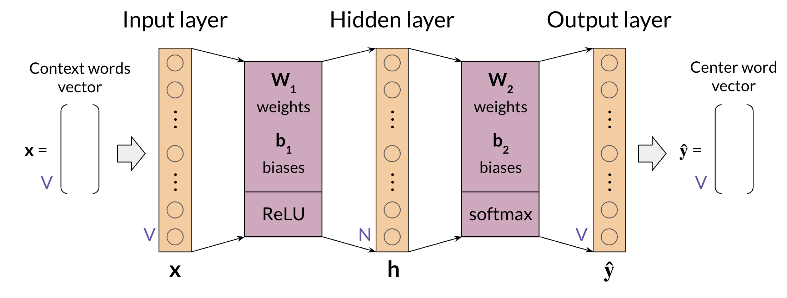
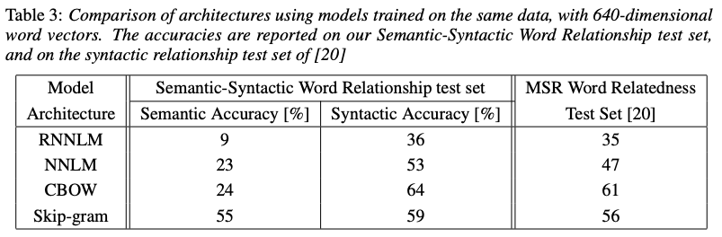

`word2vec`은 2013년 구글에서 고안한 자연어 처리 아이디어로, 이에 기반한 모델은 `Continuous Bag-of-Words(CBOW)`와 `Skip-gram` 두가지가 있다. 이 글은 그 중에서 `CBOW` 모델을 원 논문과 deeplearning.ai 수업을 참고하여 정리한 글이다. 

**원 논문**:
- Mikolov et. al., 2013, Efficient Estimation of Word Representations in Vector Space ([arxiv](https://arxiv.org/pdf/1301.3781.pdf))
- Mikolov et. al., 2013, Distributed Representations of Words and Phrases and their Compositionality ([arxiv](https://proceedings.neurips.cc/paper/2013/file/9aa42b31882ec039965f3c4923ce901b-Paper.pdf))


## 0. CBOW란
CBOW(Continuous Bag-of-Words, 연속되는 단어 주머니)는:
- 텍스트 데이터를 벡터 공간에 표현하는 `단어 임베딩(word embedding)` 모델이자,  
- `얕은 신경망(neural network)` 모델이며, 
- 스스로 훈련 데이터를 생성하는 `자기 지도 훈련(self-supervised learning)` 모델이다. 

CBOW 모델이 처음 소개될 때는 50-100 차원의 원 핫 벡터로 몇 백만개의 단어를 훈련시켰다. 


### 📖 Skip-gram과의 차이점
CBOW 모델은 여러개의 단어 데이터를 입력하면 그에 상응하는 한개의 단어를 출력하는 `Many to One` (여러개 데이터를 입력받아 한개의 데이터를 출력하는 모델 구조) 모델이다. 반면 Skip-gram은 한개의 단어를 입력했을 때 그에 대응하는 여러개의 단어를 출력하는 `One to Many` 모델이다. 즉 두 모델의 구조는 `반전`되어있고, 입력값과 출력값이 서로 반대된다. 

## 1. 모델의 구조
CBOW는 얕은 신경망 모델로, 이 글에서는 한 개의 은닉층(hidden layer)를 가지는 신경망 모델을 고려한다.


*image by DeepLearning.AI*

모델의 흐름은 다음과 같다.
1. 텍스트 데이터를 원 핫 벡터로 변환한다.
2. 첫번째 은닉층(hidden layer)을 거친다.
    - 활성화 함수 : ReLU
3. 두번째 결과층(output layer)을 거친다.
    - 활성화 함수 : Softmax
4. 결과 벡터의 값 중 가장 큰 값으로 예측한다.

모델을 이해하고 실제로 구현하기 위해서는 각 층의 차원을 정확히 알아야 한다.
### 📖 벡터의 차원
변수를 다음과 같이 정의할 때,
- $V$ : 단어 사전의 크기,  혹은 원-핫 벡터의 크기.
- $N$ : 임베딩 크기. 모델의 하이퍼파라미터이다.
- $m$ : 배치 크기. 한번에 훈련할 데이터의 개수이다.

입력값 $X$의 차원
$$
X \in M(V, m)
$$
에 대해 각 층에 대한 벡터의 차원을 다음과 같이 정리할 수 있다.
<center>

|은닉층 벡터|차원|결과층 벡터|차원|
|---|---|---|---|
|$W_1$|$(N, V)$|$W_2$|$(V, N)$|
|$B_1$|$(N, m)$|$B_2$|$(V, m)$|
|$z_1$|$(N, m)$|$z_2$|$(V, m)$|
|$relu(z_1)$|$(N, m)$|$softmax(z_2)$|$(V, m)$|
</center>

$softmax(z_2) \equiv \hat{Y}$ 이므로 예측값이 입력값과 같은 차원을 가지는 것을 알 수 있다. 즉 모델이 반환하는 벡터의 열 벡터는 입력 열 벡터와 순서가 같은 원 핫 벡터이다.

## 2. 모델의 전처리

CBOW 모델로 문장의 빈칸을 주위 단어에 기반해 예측하는 과제를 수행해보자. 다음 문장의 빈칸에 뭐가 들어갈까?

"npm은 Node.js의 ____ 관리를 위한 패키지 매니저이다."

CBOW 모델을 구현하기 위해서는 텍스트 데이터를 토큰화 한 후, 데이터를 모델에 입력하는 형태로 변환하는 다음 작업이 필요하다.

### 📖  중심어(center word)와 맥락 단어들(context words)
자기 지도 학습은 사람이 라벨링을 할 필요가 없다는 장점이 있다. 그러기 위해서는 가공되지 않은 텍스트 데이터에서 훈련 데이터($X$, 입력 데이터)와 훈련 타겟($Y$, 참값)을 구분해서 자료화할 필요가 있다. 

CBOW 모델에서 예측할 대상(target)인 문장의 빈칸을 `중심어`로, 이 단어와 문장 내에서 인접한 단어를 `맥락 단어`로 이름지을 수 있다. `맥락 단어`는 중심어로 부터 거리 $C$ 만큼 떨어져 있는 인접한 단어들로 정의하며, $C$를 `맥락의 절반 크기(context half-size)`라고 하자. $C$는 모델의 성능을 좌우하는 하이퍼파라미터 중 하나이다. 왼쪽 맥락 단어 리스트와 중심어, 오른쪽 맥락 리스트의 크기를 모두 더한 값을 `윈도우`라고 일컫는다. 

예를 들면, 문장 한개로 구성된 데이터에 대해 다음과 같이 이해할 수 있다. 
```python
# given tokenized data and context half-size, 
# returns center word and list of context words 
def center_and_context_word(data, C):
    for i in range(C, len(data)-C):
        center_word = data[i]
        context_words = []
        for j in range(i-C, i+C+1):
            if j != i:
                context_words.append(data[j])
        yield center_word, context_words

C = 2 # context half-size
data = ["npm은", "Node.js의", "패키지", "관리를", "위한", "패키지", "매니저이다", "."]

center_word, context_word = next(center_and_context_word(data, C))

print(center_word) # "패키지"
print(context_word) # ["npm은", "Node.js의", "관리를", "위한"]
print(len(context_word + center_word)) # 5, window
``` 
모델의 입력값은 `맥락 단어 벡터들의 평균값`을 취한다. 사실 CBOW 모델 이름에 Bag이 들어가는 이유는 $C$의 범위 내에 있는 맥락 단어들이 문장에서의 순서에 관계없이 여겨지기 때문이고, 이 특징은 이후에 등장하는 Sequential 모델과 구분되는 차이점이다.


## 3. 모델 훈련하기

CBOW 모델은 신경망 모델이므로 일반적인 forward propagation, backward propagation, gradient descent 과정을 거친다. 세가지 과정을 `keras` 라이브러리에서 `Layer` 객체로 비교적 간단하게 구현할 수 있다.


### 📂 Keras로 CBOW 구현하기
```python
from tf.keras import layers

# Input size: (batch_size, vocab_size)
cbow_model = tf.keras.Sequential{
    # 원 핫 벡터의 배치를 임베드한다
    input_layer = layers.Embedding(input_dim=vocab_size, output_dim=embed_dim), 
    # relu 은닉층으로 비용이 음수값을 가지지 않게 한다
    hidden_layer = layers.Dense(units=embed_dim,activation='relu'), 
    # 원 핫 벡터의 배치를 확률로 출력한다
    output_layer = layers.Dense(input_dim=vocab_size, activation='softmax')
}

batch_size = 256
epochs = 10

cbow_model.compile(
    optimizer='Adam', 
    loss=tf.keras.losses.CategoricalCrossentropy()
)

cbow_model.fit(
    train_data, train_target, 
    batch_size=batch_size, epochs=epochs
)
```

## 4. 단어 임베딩 추출하기

단어 임베딩은 원 핫 벡터에 비해 `밀도가 높은(Dense) 벡터`로, 단어 임베딩에는 여러가지 이점이 있다. 첫째로 단어 임베딩 벡터간의 거리를 비교해서 의미론적(semantic)이고 문법론적인(syntactic) 정보를 얻을 수 있다. 둘째로 차원을 작게 만드는 것, 즉 `차원 축소(Dimensionality Reduction)`를 통해 계산 횟수를 획기적으로 줄일 수 있다. 벡터의 밀도가 높다는 것은 같은 데이터를 상대적으로 작은 차원으로 표현하는 것을 뜻한다. 반면에 벡터의 차원이 증가함에 따라 벡터를 계산하는 횟수는 기하급수적으로 늘어나게 되는데, 이 현상을 `차원의 저주(the curse of dimensionality)`라고 한다. 그 중에서 2차원이나 3차원 벡터는 시각화가 가능하므로 직관적인 이해에 도움이 된다.

단어 임베딩은 CBOW 모델의 부산물이라고 할 수 있는데, 단어 임베딩은 훈련이 끝난 후 그 결과인 가중치 벡터로 부터 얻을 수 있다.

단어 임베딩으로 선택할 수 있는 `옵션`은 다음과 같다.
- 첫번째 가중치 벡터 $W_1$ 의 열(column) 벡터
- 두번째 가중치 벡터 $W_2$ 의 행(row) 벡터
- 두 가중치 벡터의 평균 $1/2 *(W_1 + W_2^{T})$ 의 열 벡터

마지막 경우는 $1/2 * (W_1^{T} + W_2)$의 행 벡터와 같다. 위의 모든 경우에 대해 `한개의 단어 임베딩 벡터의 크기`는 임베딩 크기 $N$에 대해 $(N,1)$ 또는 $(1, N)$인 것을 알 수 있다.

## 5. 모델 평가하기
모델을 평가하는 방법에는 크게 두가지가 있다.

### 📖  내재적 평가와 외재적 평가
내재적 평가(Intrinsic Evaluation)는 임베딩된 단어들의 의미론적이고 문법론적인 관계를 평가하는 방법이다. 유의어(Analogies) 평가나 클러스터링 알고리즘, 또는 PCA 같은 시각화 기법들이 내재적 평가에 포함된다. 반면 외재적 평가(Extrinsic Evaluation)는 모델의 전체적인 성능을 파악하는데에 사용되는 방법이다. 전체 모델을 평가할 수 있지만, 평가 시간이 오래 걸리며 개선 방법에 대한 직관을 얻기 어렵다는 단점이 있다.

### 📂  테스트 셋에 대해 (내재적으로) 평가하기


*table from Mikolov et al., 2013, Efficient Estimation of Word Representations in Vector Space*

위의 표는 4개의 모델을 두가지 훈련 데이터에 대해 평가한 결과이다. 첫번째 훈련 데이터는 `의미론적(semantic)`이고 `문법론적(syntactic)` 관계 정확도인데, CBOW가 의미론적 정확도는 Skip-gram보다 두배 이상 떨어지지만 문법적 정확도에서는 조금 더 나은 것을 알 수 있다. 그렇지만 의미론적 정확도에 비해 문법론적 정확도에서 평가 모델들의 편차가 더 적었다. 두번째 데이터 셋에 대해서는 CBOW가 Skip-gram보다 단어 관계 평가가 조금 더 나은 것을 볼 수 있다.

_참고 : 논문에서는 1억개가 넘어가지 않는 vocab에 대해 CBOW 모델을 훈련했으며, $C=4$ 설정에서 log-linear 분류로 최적의 결과를 얻었다고 한다._


## 출처
1. Mikolov et al., 2013, Efficient Estimation of Word Representations in Vector Space
2. Coursera, deeplearning.ai, NLP Specialization, Course 2, Natural Language Processing with Probabilistic Models