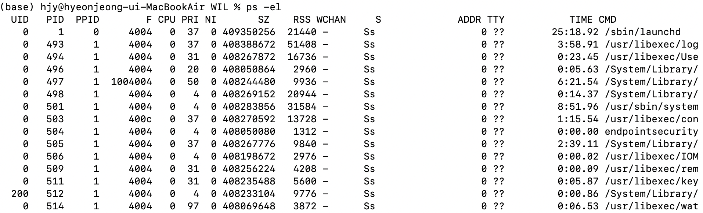

# CPU Scheduling

## CPU Scheduling
CPU 스케줄링이란 각각의 프로세스가 CPU를 사용할 시간과 우선순위를 정하는 것이다.

### Process Priority
- OS는 PCB에 우선순위를 명시하고, 이를 기준으로 우선순위가 높은 프로세스를 더 빨리 실행할 수 있다. 

실행 과제에 따라서
- 입출력 장치의 실행속도는 CPU 연산 속도보다 느리기 때문에, 대기 상태에 있는 시간이 실행 상태에 있는 시간보다 긴 I/O bound process를 먼저 실행할 수 있다.
- 반대로 CPU bound process는 CPU 점유 시간이 길기 때문에 I/O bound process보다 이후에 실행할 수 있다.
- 그 밖에도 실시간 프로세스나 일부 백그라운드 프로세스는 우선순위가 높다.

PRI는 프로세스의 우선순위를 나타낸다. 여기서는 PRI가 가장 큰 `usr/libexec/wat`이 가장 우선 순위가 높고, PRI가 가장 낮은 프로세스들의 우선순위가 가장 낮다.

### Scheduling queue
- PCB를 모두 탐색하는데에 많은 시간이 걸리는 데다가, 스케줄링이 필요한 자원이 CPU에 국한되지 않는다.
- 따라서 CPU, 메모리, I/O 장치, 보조기억 장치 각각에 대한 스케줄링 큐를 구현해, 대기 중인 프로세스의 PCB를 큐에 입력받는다.
    - ready queue는 CPU를 할당받으려는 프로세스를,
    - waiting queue는 특정 I/O 장치를 할당받으려는 프로세스를 저장한다.
- 단 스케줄링 큐는 프로세스를 큐에 삽입한 순서대로 실행하되, 우선순위가 높은 프로세스를 먼저 실행한다.

### Preemptive and Non-preemptive scheduling
- 선점형 스케줄링은 하나의 프로세스가 자원을 독점할 수 없는 스케줄링 방식이다.
    - 프로세스들에 자원을 보다 일괄적으로 배분할 수 있지만,
    - context switching이 빈번하게 일어나여 오버헤드의 우려가 있다.
- 비선점형 스케줄링은 하나의 프로세스가 자원을 독점하는 스케줄링 방식이다.
    - 예를 들어 프로세스가 CPU를 사용 중이면, 그 프로세스가 대기 상태나 종료 상태가 되기 전까지 다른 프로세스가 자원을 사용할 수 없다. 
    - 선점형 스케줄링에 비해 context switching으로 인한 오버헤드는 적지만, 자원 배분은 더 불균등하게 이루어진다.

## CPU Scheduling Algorithm

### 1. FCFS; First come first serve
- FCFS는 요청된 순서대로 프로세스를 처리하는 방법이다.
- 대기 시간이 실행 시간보다 훨씬 긴 convoy effect가 나타날 가능성이 있다.

### 2. SJF ; Shortest Job First scheduling
- CPU 사용 시간이 짧은 순서대로 프로세스를 실행한다.
- convoy effect를 해결한다.

### 3. Round robin scheduling
- FCFS 처럼 요청된 순서대로 프로세스를 처리하되, time slicing을 정의해 CPU 사용 시간이 이 시간 단위를 넘으면 프로세스를 멈추고 준비 상태로 전환하는 방법이다. 

### 4. SRT; Shortest Remaining time scheduling
- 정해진 time slice 만큼 CPU를 사용하되, 다음 프로세스는 남은 작업 시간이 가장 적은 프로세스를 선택한다.

### 5. Priority scheduling
- 우선순위에 따라 프로세스를 처리하는 방식으로, 우선 순위가 같은 프로세스는 FCFS로 스케줄링한다.
- 우선순위가 낮은 경우 실행 순서가 계속 밀리는 starvation이 발생할 우려가 있다.
- 이를 방지하기 위해 오래 대기한 프로세스의 우선순위를 단계적으로 높이는 것을 aging이라고 한다.

### 6. Multilevel queue scheduling
- 우선순위 별로 준비 큐를 여러개 사용하는 스케줄링 방식으로, 우선순위가 높은 준비 큐가 비어있으면 그 다음 우선순위 준비 큐를 조회해 상단의 프로세스를 실행한다.
- 프로세스 유형별로 우선순위를 구분하여 실행하기 용이하다.
- 큐마다 타임 슬라이스와 스케줄링 알고리즘을 다르게 적용할 수 있다.
- 우선순위 스케줄링과 같이 starvation 문제가 발생할 수 있다.

### 7. Multilevel feedback queue scheduling
- multilevel queue scehduling과 같으나, 우선순위 큐 간에 프로세스들이 이동할 수 있다는 점이 다르다.
- 타임 슬라이스 동안 완료되지 못한 프로세스는 우선순위를 낮추어 준비 큐에 삽입하고,
- 우선순위가 낮은 프로세스가 일정 기간동안 실행되지 못하고 있는 경우 우선순위를 높여 준비 큐에 삽입한다.
- 따라서 CPU 이용 기간이 길수록 낮은 우선순위 큐로, 오래 기다릴 수록 높은 우선순위 큐로 이동시킨다.