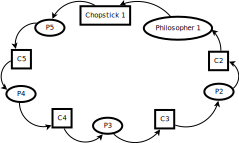
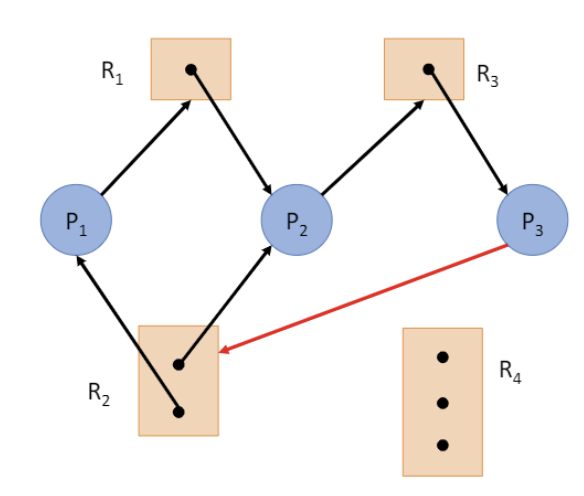
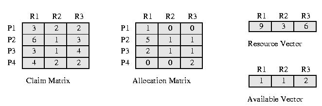

# Deadlock

## Deadlock 표현과 조건

### Dining philosopher's problem

철학자는 자신의 왼쪽과 오른쪽에 있는 젓가락을 모두 들어야 식사를 할 수 있다. 젓가락을 한번에 한명만 사용할 수 있고(mutual exclusion), 다른 철학자가 들고 있는 젓가락을 뺏을 수 없으며(no preemption), 한 젓가락을 들면 다른 젓가락을 들 수 있을 때까지 기다린다(hold and wait)고 하자. 

n명의 철학자가 둘러 앉아 있을때, 만약 모든 철학자의 전략이 왼쪽 젓가락을 들고 오른쪽 젓가락을 드는 것이라면 위의 그림처럼 모두 왼쪽 젓가락을 든 채 오른쪽 젓가락을 기다리는 상황이 되고(direct cycle) 결국 아무도 식사를 할 수 없는 상태로 영원히 기다리게 된다(deadlock).

철학자를 프로세스 또는 스레드, 젓가락을 자원으로 바꾸어 생각하면 이 문제는 자원 할당 문제의 데드락을 마주치는 상황으로 이해할 수 있다.

### Resource-allocation graph

*resource-allocation graph*

자원할당 그래프는 프로세스(또는 스레드)가 점유하고 있는 자원과 대기중인 자원을 나타내는 그래프이다.
- 프로세스(또는 스레드)는 원으로, 자원은 사각형으로 표현한다.
- 사용 가능한 자원의 개수를 사각형 내의 점으로 표현한다.
- 프로세스가 자원을 점유중인 것은 자원에서 프로세스로 향하는 화살표로 표현한다.
- 프로세스가 자원을 기다리는 것을 프로세스에서 자원으로 향하는 화살표로 표현한다.

### Necessary conditions

데드락은 네가지 조건을 만족시킬 때 발생한다.
- Mutual exclusion : 자원을 배타적으로 사용한다.
- Hold and wait : 자원을 점유하고 필요한 자원이 가능할때까지 대기한다.
- Non-preemptive : 자원을 선점하지 않는다. 즉 실행중인 자원을 뺏을 수 없다.
- Circular wait : 자원 할당 그래프에 사이클이 존재한다.

## Deadlock 대처 방안

### Deadlock Prevention
데드락의 필요 조건 중 하나가 충족되지 않는다면 데드락을 예방할 수 있다. 
- 상호 배제 조건의 제외는 원칙적으로 불가능하다.
- 점유와 대기 조건을 충족하지 않으려면 OS는 특정 프로세스가 요구하는 자원을 동시에 사용할 수 있도록 해야한다. 따라서 할당되어도 사용되지 않는 자원이 생길 것이며 많은 자원을 사용하는 프로세스는 대기 시간이 무한정 길어질 수 있다.
- 비선점 조건을 충족하지 않으려면 자원을 사용하는 도중에 가로챌 수 있어야 한다. CPU의 경우 time slice 등으로 비선점 조건을 충족할 수 있지만, 입출력 장치 중 많은 경우는 선점이 불가능하다.
- 원형 대기 조건을 충족하지 않기위해 모든 자원에 번호를 매겨 오름차순으로 자원을 할당할 수 있다. 그렇지만 번호를 매기는 순서에 따라 자원의 활용율이 달라지는 문제가 발생한다.

### Deadlock Avoidance
데드락을 피하기 위해 안전 상태를 유지하도록 자원을 할당할 수 있다.
- 안전 상태(safe state)란 모든 프로세스가 자원을 할당받고 실행 된 후 데드락 없이 종료될 수 있는 상태이다.
- 안전 순서열(safe sequence)은 데드락이 발생하지 않도록 자원을 할당하는 프로세스 순서이다.
- 불안전 상태(unsafe state)는 안전 순서열이 없는 상황이다. 시스템이 불안전 상태에 있으면 데드락이 발생할 위험이 있다. 

- Claim Matrix에서 프로세스 P1, P2, P3, P4가 자원 R1, R2, R3를 요구하고 있고, Allocation Matrix는 현재 할당된 상태를 의미한다.
- Resource Vector가 할당이 가능한 자원의 전체 수를 의미하고, Available Vector는 Allocation Matrix에 할당하고 남은 가용 자원을 의미한다.
- 이때 (P2 - P3 - P4 - P1)는 안전 순서열이다. 
    - P2에 R1 하나와 R3 두개를 할당하면 P2를 종료할 수 있고, 반환된 자원(R1: 6, R2: 2, R3: 3)을 P3에 할당해 마찬가지로 P3를 종료할 수 있다. 같은 과정으로 P4와 P1을 종료할 수 있다.
- 반면, P1에 R1과 R3를 하나씩 할당하면 가용 자원은 R2와 R3 하나씩이 남게된다. 이때 R2와 R3를 하나씩 할당해서 완료할 수 있는 프로세스가 없으므로 시스템은 불안전 상태에 놓이게 된다.

### Deadlock Recovery
데드락을 예방하거나 회피하지 않고 데드락이 발생한 상황을 사후적으로 감지하고 대처하는 방식으로 대응할 수 있다.
- 첫번째 방법은 데드락이 해결될 때까지 선점을 통해 특정 프로세스에 자원을 몰아주는 것이다. 선점이 가능한 자원에 대해서만 실행이 가능하며 데드락을 확인하는데에 오버헤드가 발생할 수 있다.
- 두번째 방법은 프로세스를 강제 종료하는 것이다. 모든 프로세스를 강제 종료하면 확실하게 데드락을 해소할 수 있지만 모든 작업 내역을 잃을 것이고, 데드락이 해소될 때까지 프로세스를 하나씩 강제 종료한다면 작업 내역을 잃는 것은 줄일 수 있지만 데드락을 확인하는데에 오버헤드의 가능성이 생긴다.

### Ignoring deadlock
앞서 다룬 방법들이 오버헤드를 야기할 가능성이 큰데 비해 데드락이 발생할 가능성이 적다고 해보자. 그렇다면 데드락에 대처하는 것보다 데드락의 가능성을 무시하는 것이 더 시스템 효율적이다.
- 문제에 대처하는 비용이 문제를 마주치는 비용보다 클 경우, 문제가 일어나지 않을 것이라고 가정하는 전략을 Ostrich alorithm이라고 한다.
