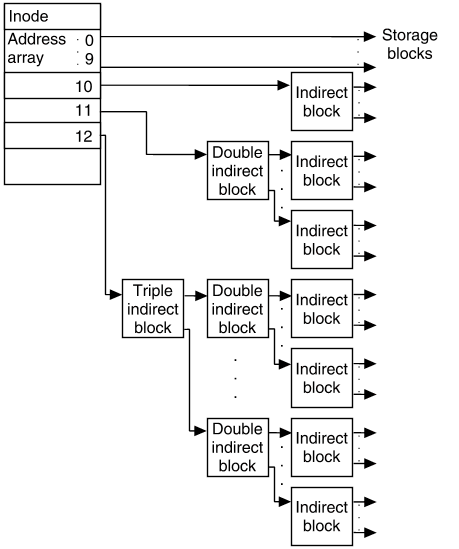

# File System

## 1. File and Directory

### File
- 파일은 보조기억 장치에 저장된 정보의 집합으로, 관련있는 정보를 모은 논리적 단위이다.
- 파일의 부가 정보를 File Attribute 또는 File Metadata라고 부른다.
- File Attribute에는 다음 항목들이 포함된다.
    - 유형 : OS가 인지하는 파일의 종류로, Extension(확장자)로 나타내기도 한다.
    - 크기 : 파일의 현재 크기와 파일에 허용된 최대 크기
    - 보호 : 사용자에 따른 파일 읽기, 쓰기, 실행 권한
    - 생성 날짜
    - 마지막 접근 날짜
    - 마지막 수정 날짜
    - 생성자 : 파일을 생성한 사용자 정보
    - 소유자 : 파일을 소유한 사용자 정보
    - 위치 : 보조 기억 장치에서 파일의 현재 위치
- OS는 시스템 호출을 통해 파일 연산을 수행한다.
    - 응용 프로그램은 OS를 거치지 않고 파일 연산을 수행할 수 없다.
    - 파일 연산에는 (생성, 삭제, 열기, 닫기, 읽기, 쓰기)가 있다.

### Directory
- 디렉터리는 파일을 관리하는 단위이다.
    - 윈도우 OS에서는 Folder라고 칭한다.
- 디렉터리는 트리 구조를 이루고 있다.
    
    *https://homepages.uc.edu/~thomam/Intro_Unix_Text/File_System.html, 유닉스 파일 시스템*

    - Root Directory는 `/`로 표시하며 가장 상단에 위치한 디렉터리이다.
        - 슬래쉬 `/`는 구분자라고 하며 경로에서 디렉터리를 구분하는데에도 쓰인다.
        - 윈도우 OS에서 구분자는 `₩`이다.
    - Sub(child) Directory는 루트 디렉터리의 자식 디렉터리이다.
    - Path(경로)는 디렉터리를 이용해 파일의 위치와 이름을 특정짓는 정보이다.
        - 절대 경로 : 루트 디렉터리에서 파일까지 이르는 고유한(unique) 경로이다.
        - 상대 경로 : 현재 위치한 디렉터리에서 파일까지 이르는 경로이다.
- OS는 시스템 호출을 통해 디렉터리 연산을 수행한다.
    - 디렉터리 연산도 (생성, 삭제, 열기, 닫기, 읽기, 쓰기)가 있다.
- 많은 OS에서 디렉터리를 특별한 형태의 파일로 간주한다. 이때 디렉터리는 디렉터리 내의 파일 정보를 테이블 형태로 담고있는 파일이다.
    - 디렉터리 정보 테이블의 각 항목을 Directory Entry라고 부른다.

## 2. File System

### 2.0 Partitioning and Formatting
- **파티셔닝**은 저장 장치의 논리적인 영역을 구획하는 작업이다.
    - 저장 장치는 반드시 파티셔닝을 수행해야 사용할 수 있다.
    - 논리적으로 나누어진 영역을 Partition이라고 한다.
    - 파티션마다 다른 파일 시스템을 설정할 수 있다.
- (논리적) **포매팅**은 파일 시스템을 생성하는 작업이다.
    - 저수준 포매팅은 저장 장치를 생성할 당시 수행되는 물리적 포매팅을 일컫는다.

### 2.1 File Allocation
- 하드디스크의 가장 작은 저장 단위는 Sector이다.
- OS가 파일과 디렉터리를 읽고 쓰는 단위는 하나 이상의 Sector로 이루어진 **Block**이다.
    - Block은 윈도우 OS에서 Clustering이라고 칭한다.

따라서 파일과 디렉터리는 Block 단위로 저장 장치에 저장되며, 메모리 할당과 마찬가지로 파일의 데이터를 블럭에 어떻게 할당하는지 결정해야 한다.

$$
\text{File Allocation}
\begin{cases}
    \text{Contiguous Allocation} & \\
    \text{Non-contiguous Allocation} &
    \begin{cases}
        \text{Linked Allocation} \\
        \text{Indexed Allocation}
    \end{cases}
\end{cases}
$$

#### Contiguous Allocation
- 보조 기억 장치 내에 연속된 블럭에 파일을 할당하는 방식이다.
- 연속 할당 시에는 파일의 첫번째 블럭 주소와 블럭의 길이(또는 개수)만 알면 파일을 참조할 수 있다.
- 그렇지만 연속 메모리 할당과 같이 **외부 단편화**를 야기한다.

#### Linked Allocation
- 파일을 이루는 데이터를 Linked list로 관리하는 방식이다.
- 즉 각 블럭에 다음 파일 데이터가 저장된 블럭의 주소를 저장한다.
- Non-contiguous 할당 방식이라서 외부 단편화가 없다.
- 연속 할당과 같이 첫번째 주소와 블럭의 길이를 통해 전체 파일에 접근할 수 있다.

단, 단점은:
- Linked list의 특징으로 인해 파일의 임의의 위치에 접근하는 random access 속도가 느리다. 파일의 마지막 부분을 참조하려고 해도 무조건 첫번째 부분부터 검색해야한다.
- 하드 디스크 고장에 따라 한 블럭에 문제가 발생하면 그 이후의 블럭에 접근할 수 없는 문제가 발생한다.

#### Indexed Allocation
- 파일의 모든 주소를 Index Block이라는 단일 블럭에 저장하여 관리하는 방식이다.
- Non-contiguous 할당 방식이라서 외부 단편화가 없다.
- 리스트를 사용하므로 Linked 할당 방식과 달리 Random access가 빠르다.
- 인덱스 할당 방식에서는 Directory Entry에 (파일 이름, 인덱스 블럭 주소)를 저장한다.

### 2.2 File Systems

#### FAT File System
- Linked Allocation 방식을 기반으로 단점을 개선한 파일 시스템이다.
- 각 블럭에 포함된 다음 블럭 주소를 FAT; File Allocation Table로 관리하는 방식이다.
- 초기 윈도우 OS에서 사용한 파일 시스템이며, 현재는 외부 저장 장치에서 주로 사용되고 있다.
    - 현재 윈도우 OS에서는 NTFS 파일 시스템을 사용하고 있다.
- FAT 파일 시스템은 블럭을 표현하는 비트 수에 따라 FAT12, FAT16, FAT32가 있다.
- FAT 파일 시스템에서는 파일 속성 정보가 Directory Entry에 표현된다.
- 
    *https://minnie.tuhs.org/CompArch/Lectures/week11.html, 초기 윈도우 디스크의 두번째 파티션에 있던 FAT 파일 시스템의 파티션 도식도*

    - 예약 영역, FAT 영역, 루트 디렉터리 영역, 데이터 영역으로 이루어져 있다.

    
    - 디렉터리 엔트리는 파일 이름, 확장자와 속성, 예약 영역, 첫번째 블럭 주소와 블럭 사이즈를 포함하고 있다. 

- FAT 파일 시스템의 파일 참조:
    - 루트 디렉터리에서 시작해서, 디렉터리의 블록 주소를 참조한다.
    - 첫번째 블록 주소를 얻은 다음, 그 다음 블록 주소를 FAT 에서 찾는다.

#### Unix File System
- Indexed Allocation 방식을 기반으로 한 파일 시스템이다.
- Unix 파일 시스템의 Index Block을 **i-node**라고 부른다.
- 리눅스 OS에서 사용하는 Ext 파일 시스템은 Unix 파일 시스템을 기반으로 하고 있다.
- 
    *https://minnie.tuhs.org/CompArch/Lectures/week11.html, Unix 파일 시스템의 파티션 도식도*

    - 부트 블럭, 슈퍼 블럭, i-node 영역, 데이터 영역으로 이루어져 있다.

    
    *https://minnie.tuhs.org/CompArch/Lectures/week11.html, Unix 디렉터리 엔트리*
    - 디렉터리 엔트리는 i-node 숫자와 파일 이름으로 구성되어 있다.
- i-node에는 파일 속성 정보와 _15개_ 의 블럭 주소 공간이 있다.

    
    *http://uw714doc.sco.com/en/FS_admin/graphics/s5chain.gif*
    - Direct Block : 파일 데이터가 저장된 블럭이다.
    - Single Indirect Block : 13번째 i-node 블럭으로, 파일 데이터를 저장한 블럭 주소를 저장한 블럭이다.
    - Double Indirect Block : 14번째 i-node 블럭으로, Single Indirect Block을 저장한 블럭 주소를 저장한 블럭이다.
    - Triple Indirect Block : 15번째 i-node 블럭으로, Triple Indrect Block을 저장한 블럭 주소를 저장한 블럭이다.
    
- Unix 파일 시스템의 파일 참조:
    - Unix 파일 시스템은 루트 디렉터리의 i-node를 항상 기억하고 있어, i-node에서 시작해 파일을 참조한다.
    - i-node와 데이터 영역을 오가며 참조한다.
    - 만약 파일의 크기가 블럭 12개를 넘으면 Indirect Block을 활용한다.

#### [참고] Journaling

파일 시스템을 변경하는 작업을 수행하는 중에 강제 중단되는 것을 System Crash 이라고 한다. Journaling 이전에는 System Crash이 일어나면 부팅을 한 후 파일 시스템 내의 모든 블럭에 대해 파일 시스템을 검사했다. Journaling은 이렇게 시간이 많이 걸리는 작업을 피하고자 작업 로그를 작성하는 기법이다.:

1. 작업 직전 파티션의 로그 영역에 수행할 작업의 로그를 남긴다.
2. 작업을 수행한다.
3. 작업이 끝나면 로그를 삭제한다.

파일 시스템을 변경할 때 위와 같은 과정을 더하면 System Crash가 발생했을 때 재부팅 후 로그 영역에 남은 로그만 검사해서 수행하던 작업을 빠르게 복구할 수 있다.

#### [참고] Mount
유닉스 OS에서, 하나의 파일 시스템을 다른 파일 시스템에 편입시키는 작업을 Mount라고 한다. 예를 들어 외부 저장 장치를 연결할 때, 외부 저장 장치의 파일 시스템을 연결한 컴퓨터의 파일 시스템으로 마운트하게 된다. 

### 참고 자료
- File System : https://minnie.tuhs.org/CompArch/Lectures/week11.html
- The Unix File System : https://homepages.uc.edu/~thomam/Intro_Unix_Text/File_System.html