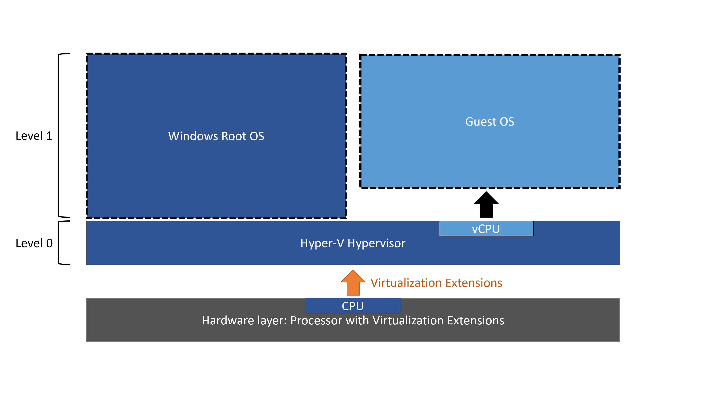

# OS; Operating System

OS란 시스템의 자원과 동작을 관리하는 소프트웨어이다.

### OS는 부팅시에 메모리의 커널 영역에 적재되어 실행된다.
- 메모리는 커널 영역(kernel space)과 사용자 영역(user space)로 나뉜다.
- 사용자 영역에는 실행할 프로그램(process)들이 적재된다.

### OS는 커널(kernel)과 UI를 제공한다.
- 커널은 OS의 핵심 서비스를 담당한다.
- UI; User Interface는 컴퓨터와 사용자가 상호작용 할 수 있게한다.
    - GUI; Graphic User Interface는 그래픽 기반 인터페이스이고,
    - CLI; Command Line Interface는 명령어 기반 인터페이스이다.

### OS는 이중 모드(dual mode)와 인터럽트로 자원 접근 권한을 제어한다.
- OS는 프로세스가 직접 자원에 접근하는 것을 막기 위해 CPU가 명령어를 실행하는 방식을 이중 모드로 구현한다.
    - 커널 모드(kernel mode)는 OS 서비스를 제공받을 수 있는 실행 모드이다.
    - 사용자 모드(user mode)는 OS 서비스를 제공받을 수 없는 실행 모드이다.
- 시스템 호출(system call)은 명령어를 통해 발생하는 소프트웨어 인터럽트로, 자원에 접근하기 위해 사용자 모드를 커널 모드로 전환하기 위한 요청이다.
- CPU가 실행중인 모드는 플래그 레지스터의 superviser flag에 기록된다.

#### [참고] VM; Virtual Machine 과 하이퍼바이저 모드(Hypervisor mode)
- VM은 소프트웨어로 구현한 가상 컴퓨터로, 새로운 OS와 프로그램을 설치하고 실행할 수 있다.
- 실행중인 VM 또한 프로세스이므로 사용자 모드로 작동하는데, VM 위에서 실행하는 프로세스가 자원을 할당받으려면 사용자 모드인 VM과 충돌하게 된다.

    

- 따라서 가상화를 지원하는 CPU는 커널 모드와 사용자 모드 외에 하이퍼바이저 모드를 둬서 VM 위의 프로세스가 하이퍼바이저 모드로 자원을 할당받도록 한다.

## OS의 핵심 서비스

### 프로세스 관리
- 프로세스(process)란 실행 중인 프로그램을 의미한다.
- OS는 메모리에서 새로운 프로세스를 생성하고, 사용하지 않는 프로세스는 삭제한다.
- CPU는 한번에 하나의 프로세스만 실행할 수 있기에, 메모리에 있는 프로세스를 전환하며 실행한다.
- OS는 여러 프로세스가 동시에 실행될 때는 프로세스를 동기화하고
- 프로세스가 더 이상 실행되지 못하는 교착상태를 해결할 수 있어야 한다.

### 자원 접근 및 할당
- OS의 CPU scheduling은 여러 프로세스들이 어떤 순서와 기간동안 CPU를 이용할지 결정하는 작업이다.
    - 일반적으로 메모리에 여러개의 프로세스가 적재되고, 하나의 CPU는 한 번에 하나의 프로세스만 실행할 수 있다.
- OS는 프로세스를 메모리에 할당한다. 즉 프로세스를 메모리의 어느 주소에 적재할지 결정한다.
- 인터럽트 서비스 루틴(ISR)은 OS의 기능으로 커널 영역에 있다. 
    - I/O device가 발생시키는 하드웨어 인터럽트도 마찬가지로 OS의 기능이다.

### 파일 시스템 관리
- OS의 중요한 역할 중 하나가 file system을 제공하는 것이다.

