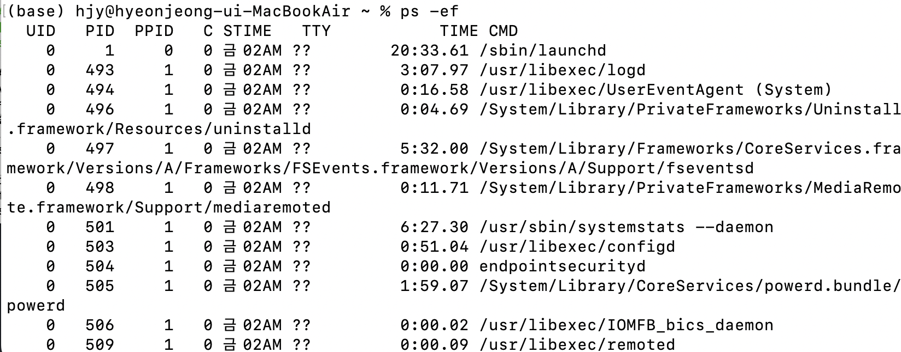
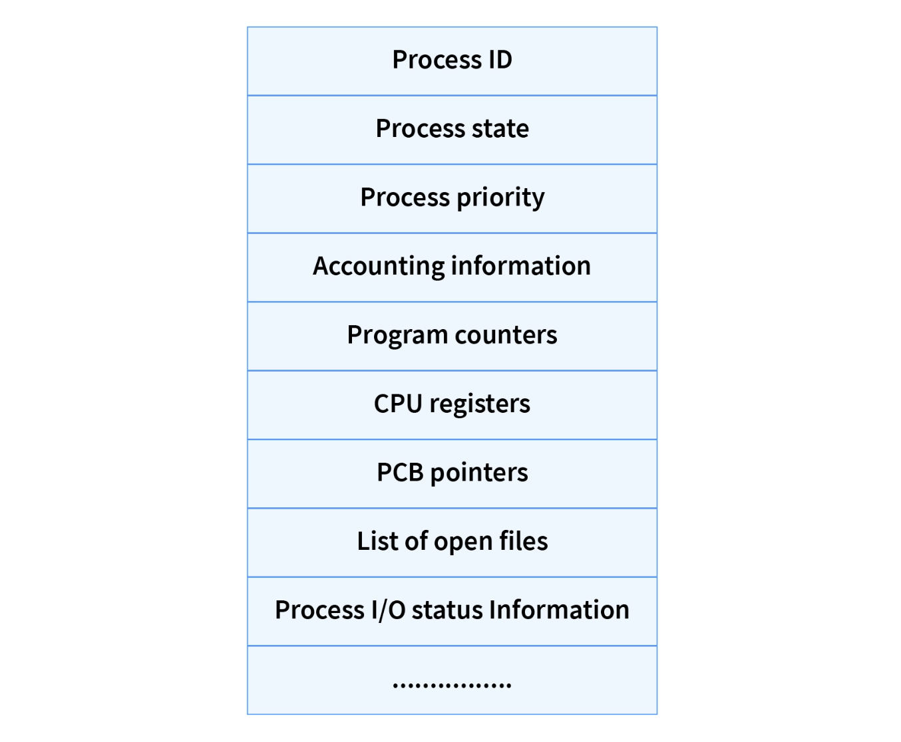
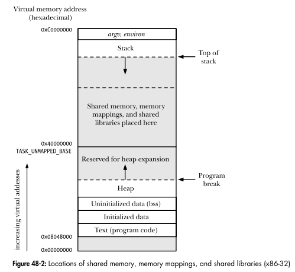
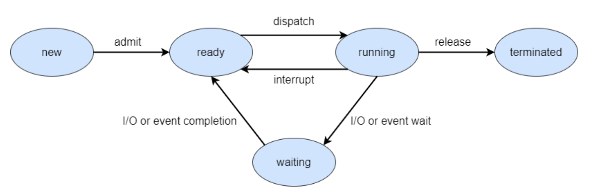
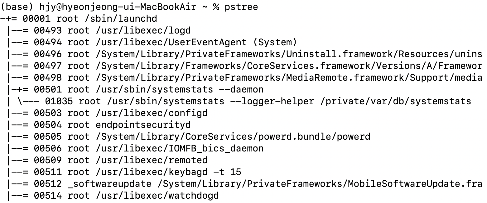
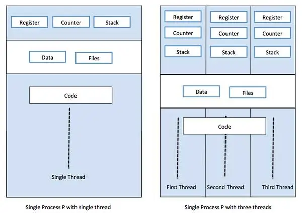
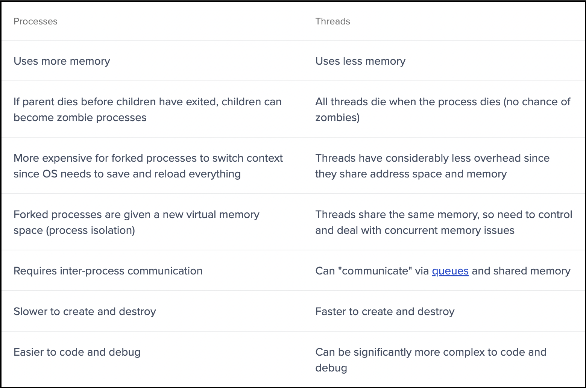

# Process and Thread

## Process



- 사용자가 보는 곳에서 실행되는 프로세스는 foreground process,
- 사용자가 보지 못하는 곳에서 실행되는 프로세스는 background process라고 한다.
    - background process 중 사용자와 상호작용하지 않는 프로세스를 daemon(유닉스 체계 OS) 또는 service(윈도우 OS)라고 부른다.


### PCB; Process Control Block
OS의 PCB란 프로세스의 실행 순서와 자원 배분을 관리하는 자료 구조이다. PCB는 커널 영역에 생성되며, 프로세스를 실행하기 위해 필요한 정보를 저장한다.



다음은 PCB에 저장되는 정보들이다.
* PID; Process ID
    - 같은 프로그램을 실행하더라도 매번 새롭게 할당되는 프로세스 식별 번호이다.
* 레지스터 값; Register Values
    - CPU가 프로세스를 다시 실행할 수 있도록 실행 상태에서 사용한 레지스터의 값을 저장한다. 
    - 프로그램 카운터와 레지스터 값이 담긴다.
* 프로세스 상태; Process State
    - 프로세스의 상태를 저장한다. 
    - 프로세스가 준비 상태인지 실행 상태인지 또는 대기 상태인지 알 수 있다.
* CPU 스케줄링 정보; Process priority
    - 프로세스가 언제, 어떤 순서로 CPU를 할당 받을지를 저장한다.
* 메모리 관리 정보
    - 프로세스가 메모리에 저장된 주소가 담긴다.
    - 베이스 레지스터, 한계 레지스터 값과 페이지 테이블 정보가 담긴다.
* List of Open Files
    - 프로세스가 실행 상태에서 사용한 파일 목록이 담긴다.
* List of I/O devices
    - 프로세스가 실행 상태에서 사용한 입출력 장치의 목록이 담긴다.


### 문맥 교환; Context Switching

- 문맥(context)은 프로세스를 실행하기 위한 정보로, PCB에 표현된다.
- 문맥 교환(context switching)은 프로세스를 전환하기 위해, 기존 프로세스의 문맥을 PCB에 백업하고 새로운 프로세스의 PCB에서 문맥을 복구하여 실행하는 것을 의미한다. 
- 문맥 교환을 통해 여러 프로세스가 빠르게 번갈아가며 실행되지만, 너무 자주 하면 overhead가 일어날 수 있다.

### 프로세스의 메모리 영역

메모리에서 프로세스는 크게 (스택 영역, 힙 영역, 데이터 영역, 코드 영역) 네가지로 구성된다. 
- 이 중에서 스택 영역과 힙 영역은 가변적이기 때문에 동적 할당 영역(dynamic allocation segment)이라고 하고, 
- 데이터 영역과 코드 영역은 정적 할당 영역(static allocation segment)이라고 한다.




- 스택 영역(stack segment) 
    - 데이터를 일시적으로 저장하는 영역
    - 매개 변수, 지역 변수, 재귀 함수의 결과값 등이 저장된다.
- 힙 영역(heap segment) 
    - 사용자가 직접 메모리를 할당할 수 있는 영역
    - 메모리를 할당 후 반환하지 않으면 memory leakage가 발생하는 곳이다.
- 데이터 영역(data segment) 
    - 프로그램이 실행되는 동안 유지할 데이터를 저장하는 영역
    - 전역 변수가 저장된다.
- 코드 영역(code or text segment) 
    - 기계어 명령어를 저장하는 영역
    - 읽기 전용 read-only 공간이다.


### 프로세스 상태; Process state



*https://medium.com/@sohailk1999/five-state-process-model-6e83d7428c8c*
*프로세스 상태 다이어그램*

* 생성 상태(new)
    - 프로세스가 메모리에 적재되어 PCB를 할당받은 상태
    - 생성 상태를 거쳐 준비 상태가 되어 CPU의 할당을 기다린다.
* 준비 상태(ready)
    - CPU를 할당받아 실행할 수 있지만, 대기하고 있는 상태
    - 준비 상태 프로세스는 차례가 되면 CPU를 할당받아 실행 상태가 된다.
    - 프로세스가 준비 상태에서 실행 상태로 전환되는 것을 dispatch라고 한다.
* 실행 상태(running)
    - CPU를 할당받아 실행 중인 상태
    - 할당된 일정 시간 동안 프로세스가 종료되지 않으면, 타이머 인터럽트가 발생해 다시 준비 상태가 된다. 
    - 실행 상태인 프로세스가 I/O device를 사용하는 경우, I/O device의 작업이 끝날 때까지 대기 상태가 된다. 
* 대기 상태(blocked)
    - 특정 이벤트가 일어나길 기다리는 상태
    - 주로 I/O device의 작업이 끝나 입출력 완료 인터럽트를 받기를 기다리는 상태이다.
    - 입출력 작업이 완료되면 프로세스는 다시 준비 상태가 된다.
* 종료 상태(terminated)
    - 프로세스가 종료된 상태
    - OS는 종료 상태인 프로세스의 메모리와 PCB를 정리한다.


### 프로세스 계층 구조; Process hierachy

실행 상태의 프로세스는 system call을 통해 다른 프로세스를 생성할 수 있다. 
- 이때 새 프로세스를 생성한 프로세스를 부모 프로세스(parent process),
- 부모 프로세스에 의해 생성된 프로세스를 자식 프로세스(child process)라고 한다.



*mac OS의 최초 프로세스는 launchd이며, PID는 1이다.*

- 부모 프로세스와 자식 프로세스는 각각의 PID를 가진다.
    - 유닉스 OS에서는 부모 프로세스의 PID인 PPID를 기록한다.
- 자식 프로세스는 다시 프로세스를 생성할 수 있으므로, 프로세스가 계층 구조를 이루게 된다.

### 프로세스 생성 방법

프로세스는 시스템 호출인 fork와 exec를 통해 자식 프로세스를 생성한다.
- fork는 프로세스의 복사본을 만드는 시스템 호출로, 부모 프로세스는 fork를 통해 자신의 복사본을 자식 프로세스로 생성한다.
- exec는 메모리 공간을 새로운 프로그램으로 덮어쓰는 시스템 호출로, 자식 프로세스는 exec를 통해 메모리 공간을 다른 프로그램의 데이터와 명령으로 교체한다.

예를 들어 bash 셸에서 ls 라는 명령어를 입력한 경우,
- 셸 프로세스는 fork를 통해 자신을 복사한 프로세스를 생성하고,
- 복사된 프로세스는 exec를 통해 ls 명령어를 실행하기 위한 프로세스로 전환된다. 
- 메모리에는 ls 명령어를 실행하는 내용이 채워진다.


## Thread

스레드란 프로세스를 구성하는 실행 단위이다. 즉 하나의 프로세스에 여러개의 스레드가 있을 수 있고, 이 프로세스를 멀티스레드 프로세스라고 한다.


*싱글 스레드 프로세스 vs. 멀티 스레드 프로세스*

스레드는 프로세스 자원을 공유하며 실행에 필요한 최소한의 정보로만 실행된다.
- 스레드는 프로세스 내에서 각각 다른 (스레드 ID, 프로그램 카운터, 레지스터 값, 스택 메모리)로 구성된다.
- 따라서 각자 다른 코드를 실행할 수 있다.
- 반면 프로세스의 (코드, 데이터, 힙 메모리) 자원을 공유한다.


#### 리눅스는 프로세스와 스레드를 구분없이 task로 일컫는다.
```
Both threads and processes are really just one thing: a "context of
execution". Trying to artificially distinguish different cases is just
self-limiting.

...

The way Linux thinks about this (and the way I want things to work) is that
there _is_ no such thing as a "process" or a "thread". There is only the
totality of the COE (called "task" by Linux). Different COE's can share parts
of their context with each other, and one _subset_ of that sharing is the
traditional "thread"/"process" setup, but that should really be seen as ONLY
a subset (it's an important subset, but that importance comes not from
design, but from standards: we obviusly want to run standards-conforming
threads programs on top of Linux too).
```
https://lkml.iu.edu/hypermail/linux/kernel/9608/0191.html by Linus Torvalds


### Multiprocess vs. MultiThread


*https://www.toptal.com/ruby/ruby-concurrency-and-parallelism-a-practical-primer*

- 같은 작업을 실행할 때, 멀티프로세스에 비해 멀티스레드는 메모리 공간을 적게 차지한다.
- 멀티프로세스는 좀비 프로세스의 가능성이 있는 반면, 멀티스레드는 프로세스가 종료되면 모든 스레드가 일괄적으로 종료된다. 
- 멀티스레드는 context switching에 드는 시간이 절약하고, overhead가 적다.
- 멀티프로세스는 자원을 공유하지 않아 각각 독립적으로 실행되는 반면, 멀티스레드는 자원을 공유하므로 서로 통신할 수 있다.
- 여러 장점에도 불구하고, 멀티스레드 환경에서 하나의 스레드에 생긴 문제가 프로세스 전체에 영향을 줄 수 있다. 따라서 멀티프로세스가 코딩과 디버깅은 더 간편하다.
