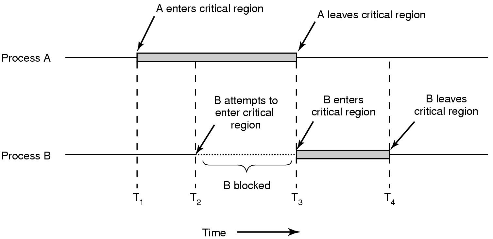
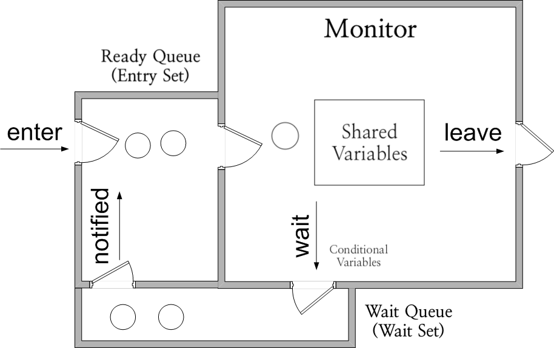

# Synchronization

## 1. Synchronization
프로세스 동기화 또는 스레드 동기화는 프로세스 또는 스레드의 실행 순서를 제어하고 특정 자원에 대한 접근을 제한해 자원의 일관성을 보장하는 것을 의미한다.

$$
\begin{aligned}
& \text{Synchronization of Process or Thread} \\
& \begin{cases}
    \text{1. Control execution order of processes or threads} \\
    \text{2. Mutual exclusion on certain resources}
\end{cases}
\end{aligned}
$$

1. 실행 순서 제어
    - 프로세스나 스레드를 실행하기 위한 순서를 지키는 것을 의미한다.
    - ex) 파일 읽기 작업을 수행하는 Reader가 파일 쓰기 작업을 수행하는 Writer 보다 먼저 실행되면, 읽어들일 파일이 없어 예외가 발생한다.
    
2. 상호 배제 (Mutual Exclusion)
    - 상호 배제는 특정 자원에 접근하는 프로세스나 스레드를 제한하는 것을 의미한다. 
    - ex) 읽기 작업을 수행한 후 값을 변경해 쓰기 작업을 수행하는 Add는 값을 읽어 1을 더하고, Mult는 값을 읽어 2를 곱한다. 초기값은 0이다.
        - Add와 Mult를 순차적으로 실행해도 Add가 값을 읽어들인 후 쓰기 작업을 수행하기 전에 Mult가 값을 읽어들이면 Add와 Mult는 모두 초기 값 0을 읽어들여 각각 1과 5를 쓴다. 최종값은 1 또는 5가 된다.
        - 반면 Add가 쓰기 작업을 끝낸 후 Mult를 실행하면 Mult는 Add의 결과값 1을 읽어들여 최종값은 6이 된다.


### Producer-Consumer Problem

상호 배제의 중요성은 Producer-Consumer 문제에서 부각된다. 

Producer와 Consumer가 변수 total를 공유할 때, Producer는 값을 1 늘리고 Consumer는 값을 1 줄인다고 하자.

#### Producer

```cpp
void produce() {
    for(int i = 0; i < 100000; i++) {
        total++;
    }
}
```

#### Consumer

```cpp
void consume() {
    for(int i = 0; i < 100000; i++) {
        total--;
    }
}
```

다음 코드의 결과를 예측해보자.

```cpp
#include <iostream>
#include <thread>

void produce();
void consume();

int total = 0;

int main(){
    std::cout << "초기 합계: " <<  total << std::endl;
    std::thread producer(produce);
    std::thread consumer(consume);

    producer.join();
    consumer.join();

    std::cout << "producer, consumer 스레드 실행 이후 합계: " <<  total << std::endl;
}
```
*from https://github.com/kangtegong/self-learning-cs/blob/main/producer_consumer/producer_consumer.md*

이때 total 값은 실행할 때마다 바뀌며, 초기값 0과 유사하지 않은 13819 또는 -9123 같은 수를 출력한다. 이는 두 스레드가 각각 공유하는 자원인 total에 무차별적으로 접근한 결과이므로, 의도한 결과인 0을 도출하기 위해서는 스레드의 동기화가 필요함을 알 수 있다.


### Shared Resource and Critical Section

상호 배제가 필요한 자원을 이해하기 위해 두가지 개념이 필요하다.

**공유 자원(Shared resource)** 은 프로세스나 스레드가 공유하는 자원을 의미한다. 
- Producer-Consumer 문제에서 공유 자원은 전역 변수 total이다. 
- 공유 자원은 전역 변수나, 파일, I/O 장치, 보조기억장치 등이다.

공유 자원에 동시에 접근했을 때 문제가 발생하는 코드 영역을 **임계 구역(Critical section)** 이라고 한다.
- 복수의 프로세스 또는 스레드가 임계 구역에 진입하고자 하면 하나의 프로세스 또는 스레드만 실행되고 나머지는 대기해야 한다. 
- ex) 프로세스 A가 T1 시점에 임계 구역에 진입했다. 따라서 B가 T2 시점에 임계 구역에 진입을 시도해도 A가 임계 구역을 떠나는 T3 시점까지 대기했다가 진입한다.

    

    *from https://atelim.com/chapter-6-concurrency-mutual-exclusion-and-synchronization.html*

만약 복수의 프로세스 또는 스레드가 동시에 임계 구역의 코드를 실행하여 문제가 발생하면, 이를 **Race condition** 이라고 부른다. Race condition을 방지하고 자원의 일관성을 지키는 작업이 상호 배제를 위한 동기화인 것이다. 

OS의 상호 배제를 위한 동기화는 다음 세가지 원칙을 준수한다.

#### 상호 배제를 위한 동기화의 세가지 원칙

- Mutual exclusion : 한 프로세스 또는 스레드가 임계 구역에 진입하면 다른 프로세스는 임계 구역에 진입하지 않게 한다.
- Progress : 임계 구역에 진입한 프로세스 또는 스레드가 하나도 없다면 진입하고자하는 프로세스 또는 스레드는 진입할 수 있어야 한다.
- Bounded waiting : 임계 구역에 진입하고자 하는 프로세스 또는 스레드는 진입을 보장받아야 한다. 


## 2. Synchronization Methods

### 2.1. Mutex Lock; MUTual EXclusion Lock

뮤텍스 락은 상호 배제를 위한 동기화 도구로, 자물쇠를 열고 잠그 듯이 작동한다.

가장 단순한 형태의 뮤텍스 락은 다음 세가지 항목으로 구현할 수 있다.
- 전역 변수 lock : true 이면 잠김, false 이면 열림을 표현한다.
- 함수 acquire : 임계 구역에 진입 가능하면 진입해 lock을 true로 바꾸어 다른 스레드가 자원에 접근하는 것을 금지하고, 임계 구역에 진입이 불가능하면 대기한다.
- 함수 release : 임계 구역에서 작업을 마친 후 lock을 false로 바꾼다.

뮤텍스 락으로 상호 배제를 위한 동기화를 구현하는 과정은 다음과 같다.
1. 전역 변수 lock을 false로 초기화한다. 
2. 임계 구역의 앞에 acquire를, 임계 구역의 뒤에 release를 호출한다.

#### C++ 로 구현하기

```cpp
#include <stdio.h>
#include <pthread.h>

#define NUM_THREADS 4
pthread_mutex_t mutex = PTHREAD_MUTEX_INITIALIZER; // (1)

int shared = 0; // shared variable

void *foo(){
    pthread_mutex_lock(&mutex); // (2)
    // critical section
    for (int i = 0; i < 10000; ++i) {
        shared += 1;
    }
    pthread_mutex_unlock(&mutex); // (3)
    return NULL;
}

int main(){
    // create threads
    pthread_t threads[NUM_THREADS];

    // create threads[i] that executes foo
    for (int i = 0; i < NUM_THREADS; ++i) {
        pthread_create(&threads[i], NULL, foo, NULL);
    }

    // execute threads[i] for all i
    for (int i = 0; i < NUM_THREADS; ++i) {
        pthread_join(threads[i], NULL);
    }

    printf("final result is %d\n", shared);
    return 0;
}
```
*from https://github.com/kangtegong/self-learning-cs/blob/main/synchronization/syncronization.md#%EC%BD%94%EB%93%9C%EB%A1%9C-%EB%B3%B4%EB%8A%94-%EB%8F%99%EA%B8%B0%ED%99%94*

- (1) : 변수 `mutex`를 뮤텍스 락 `PTHREAD_MUTEX_INITIALIZER`으로 초기화한다.
- (2) : `pthread_mutex_lock(&mutex)`은 `mutex`를 잠근다. 즉, 명시되어 있지 않지만 전역 변수 lock의 값을 true로 변경한다. 
- (3) : `pthread_mutex_unlock(&mutex)`은 `mutex`를 잠근다. 즉, 전역 변수 lock의 값을 false로 변경한다. 
- 위 스크립트는 여러번 실행해도 40000을 출력한다. 
- 만약 (2)와 (3)을 생략하면 동기화가 되지 않아 실행할 때 마다 다른 값을 출력하게 된다.

#### Python 으로 구현하기
같은 작업을 python으로 구현해보자.

```python
from threading import Thread, Lock

num = 0

def foo(lock):
    lock.acquire() # (1)
    # critical section
    for _ in range(100000):
        global num
        num += 1
    lock.release() # (2)

if __name__ == '__main__':
    # initiate Mutex lock
    lock = Lock()

    # create two threads that execute foo,
    # synchronized with mutex lock
    t1 = Thread(target=foo, args=(lock,))
    t2 = Thread(target=foo, args=(lock,))

    # execute threads
    t1.start()
    t2.start()

    print(num)
```
- (1) : 뮤텍스 락 `lock` 을 잠그어 다른 스레드가 전역 변수 `num`에 접근하지 못하게 한다.
- (2) : 뮤텍스 락 `lock` 을 해제한다.


### 2.2. Semaphore

세마포는 뮤텍스 락과 비슷하게 구현하지만, 보다 일반적으로 복수의 공유 자원을 관리하는 동기화 방법이다.

다음 세가지 항목으로 구현할 수 있다.
- 전역 변수 S : 임계 구역에 진입 가능한 프로세스의 개수 또는 사용 가능한 공유 자원의 개수
- 함수 wait (P) : 임계 구역에 진입 가능하면 진입해 S를 1 감소하고, 임계 구역에 진입이 불가능하면 대기한다.
- 함수 signal (V) : 임계 구역에서 작업을 마친 후 S를 1 증가시킨다.

세마포로 상호 배제를 위한 동기화를 구현하는 과정은 다음과 같다.
1. 전역 변수 S에 사용 가능한 공유 자원의 개수를 할당한다.
2. 임계 구역의 앞에 wait을, 임계 구역의 뒤에 signal를 호출한다.

세마포는 실행 순서 제어를 위한 동기화도 구현할 수 있다.
1. 전역 변수 S를 0으로 초기화한다.
2. 먼저 실행할 프로세스 또는 스레드 뒤에 wait 함수로 접근을 제한한다.
3. 그 다음 실행할 프로세스 또는 스레드 뒤에 signal로 접근 제한을 해제한다.

#### Wait Queue

함수 wait에서 임계 구역에 진입할 수 있을 때까지 반복적으로 진입 가능 여부를 확인하는 것을 방지하기 위해 대기 큐(Wait Queue)를 사용할 수 있다.
- wait 함수는 사용할 수 있는 자원이 없을 경우 프로세스를 대기 상태로 만들고 PCB를 세마포를 위한 대기 큐에 넣는다. 
- 다른 프로세스가 임계 구역에서 작업이 끝나 signal 함수를 호출하면 대기 큐의 상단에 있는 프로세스를 제거하고, 준비 상태로 변경해서 준비 큐로 옮긴다.

각 함수의 수도 코드는 다음과 같다.
#### wait
```
wait(){
    S --;
    if (S < 0){
        add process P to Waiting Queue;
        sleep();
    }
}
```

#### signal
```
signal(p){
    S ++;
    if (S <= 0){
        remove process P from Queue;
        wakeup(P);
    }
}
```

#### C++ 로 구현하기
```cpp
#include <stdio.h>
#include <pthread.h>
#include <semaphore.h>

#define NUM_THREADS 4
std::counting_semaphore<1> semaphore(1); // (1)

int shared = 0; // shared variable

void *foo(){
    semaphore.acquire(); // (2) wait
    // critical section
    for (int i = 0; i < 10000; ++i) {
        shared += 1;
    }
    semaphore.release(); // (3) signal
    return NULL;
}

int main(){
    // initiate threads
    pthread_t threads[NUM_THREADS];

    // create threads[i] that executes foo
    for (int i = 0; i < NUM_THREADS; ++i) {
        pthread_create(&threads[i], NULL, foo, NULL);
    }

    // execute threads[i] for all i
    for (int i = 0; i < NUM_THREADS; ++i) {
        pthread_join(threads[i], NULL);
    }

    printf("final result is %d\n", shared);
    return 0;
}
```
*https://en.cppreference.com/w/cpp/thread/counting_semaphore*

- (1) : 세마포 객체 `semaphore`를 `1` 개의 공유 자원을 가지는 세마포로 초기화한다.
- (2) : `semaphore`에 wait(`acquire`) 함수를 구현해 사용 가능한 자원 수(S)를 1 감소시킨다.
- (3) : `semaphore`에 signal(`release`) 함수를 구현해 사용 가능한 자원 수(S)를 1 증가시킨다.
- 전역 변수 `num`의 값을 1씩 100000번 증가시키는 스레드 두개를 동기화해서 실행했으므로, 출력 값은 `200000`이다.


#### Python 으로 구현하기

세마포와 뮤텍스 락의 구현은 유사하지만, 다음과 같은 차이점을 가진다.
- `Lock`이 `Semaphore`로 변경되었다.
- `Semaphore` 객체는 인자로 공유 자원의 개수를 입력받으며 초기값은 1이다. 
    - 인자로 전달된 값이 0 보다 작으면 ValueError가 발생한다.
- `release` 메서드는 인자로 해제할 자원의 개수를 받을 수 있다. 

```python
from threading import Thread, Semaphore

num = 0

# Critical section
def foo(sem):
    sem.acquire() # (2)
    for _ in range(100000):
        global num
        num += 1
    sem.release() # (3)

if __name__ == '__main__':
    # initiate semaphore object
    sem = Semaphore(1) # (1)

    # create two threads that execute foo,
    # synchronized with semaphore
    t1 = Thread(target=foo, args=(sem,))
    t2 = Thread(target=foo, args=(sem,))

    # execute threads
    t1.start()
    t2.start()

    print(num)
```
*https://github.com/kangtegong/self-learning-cs/blob/main/synchronization/syncronization.md#%EC%BD%94%EB%93%9C%EB%A1%9C-%EB%B3%B4%EB%8A%94-%EB%8F%99%EA%B8%B0%ED%99%94*

- (1) : 공유 자원 개수가 1인 `Semaphore` 객체를 초기화한다.
- (2), (3) : 뮤텍스 락과 같은 `.acquire()`, `.release()` 메서드로 잠그고 연다.

### 2.3. Monitor and Conditional variable



*https://upload.wikimedia.org/wikipedia/commons/f/f5/Monitor_%28synchronization%29-Java.png*

*모니터의 구조*

모니터는 공유 자원과 공유 자원에 접근하는 인터페이스를 묶어서 관리하는 동기화 방식이다. 
- 모니터는 한 번에 하나의 프로세스 또는 스레드만 진입하도록 하는 방법으로 상호 배제를 실현한다.
- 모니터 방식에서 프로세스 또는 스레드는 모니터 인터페이스(프로시저)를 통해서만 공유 자원에 접근할 수 있다.
- 모니터 외부에는 준비 큐가 있어 모니터에 진입하고자 하는-즉 공유 자원에 접근하고자 하는 프로세스 또는 스레드가 적재되어 대기한다.

조건 변수는 실행 순서 제어를 위해 사용되는 개념이다.
- 모니터 내부에 들어가 공유 자원에 접근한 프로세스 또는 스레드가 실행 도중에 특정 변수로 인해 실행 조건을 충족하지 못하면, 원인이 되는 변수를 조건 변수라고 한다.
- 조건 변수마다 준비 큐가 있어 실행되지 못한 프로세스나 스레드를 저장한다. 
- 모니터에서 실행되지 못한 프로세스나 스레드는 조건 변수 `x`에 대해 `x.wait()`을 호출해서 `x`에 대한 준비 큐에 삽입되고 모니터는 빈 상태가 된다.
- 다른 프로세스나 스레드가 모니터에 들어와서 작업을 수행하고 조건 변수 x의 준비 큐에 저장된 프로세스 또는 스레드의 실행 조건을 만족시키면, `x.signal()`이 호출되어 준비 큐의 프로세스 또는 스레드가 큐에서 모니터로 이동해 실행된다.

