# Virtual Memory and Paging

## 0. Contiguous Allocation

연속 메모리 할당은 프로세스를 연속적으로 메모리 공간에 할당하는 방식이다.

### 0.1. Swapping

스와핑이란 메모리에 적재되어 있지만 실행되지 않은 프로세스를 보조기억 장치로 옮기고 메모리에 다른 프로세스를 적재하여 실행하는 방식이다.

$$
\text{memory} 
\xrightleftharpoons[\text{swap in}]{\text{swap out}} 
\begin{aligned} 
    & \ \ \ \ \ \text{swap space} \\ 
    & (\text{auxilary storage}) 
\end{aligned}
$$

- 스와핑을 통해 여러 프로세스들이 요구하는 메모리 주소 공간의 크기가 실제 물리 메모리 크기보다 큰 경우에도 동시에 실행할 수 있다.
- swap out 되었던 프로세스가 swap in 될때는 이전과 다른 주소에 적재될 수 있다.

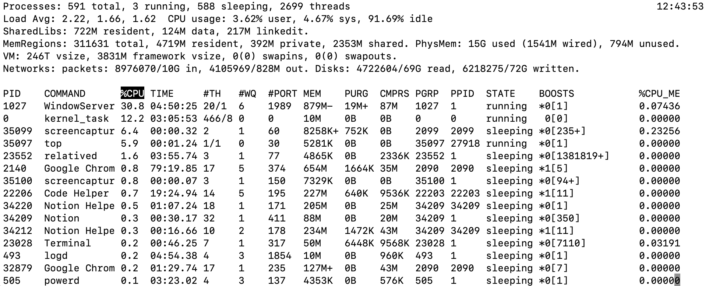
- `$ top` 명령어로 스왑 영역의 크기를 확인할 수 있다.

### 0.2. Memory allocation

OS가 비어있는 메모리 공간에 프로세스를 연속적으로 배치하는 방법은 세가지가 있다.

- 최초 적합(first fit) : OS가 빈 공간을 검색하다 적재할 수 있는 공간을 찾으면 바로 프로세스를 배치하는 방식

- 최적 적합(best fit) : OS가 빈 메모리 공간을 모두 검색한 후, 프로세스가 적재될 수 있는 공간 중 가장 작은 공간에 프로세스를 배치하는 방식

- 최악 적합(worst fit) : OS가 빈 메모리 공간을 모두 검색한 후, 프로세스가 적재될 수 있는 공간 중 가장 큰 공간에 프로세스를 배치하는 방식

각각의 방법은 장단점이 있으나, 프로세스를 **연속적**으로 배치한다는 측면에서 공통적으로 외부 단편화 문제가 발생한다.

### 0.3. External fragmentation

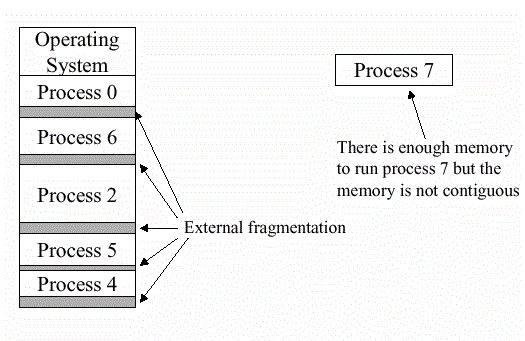
*https://stackoverflow.com/questions/1200694/internal-and-external-fragmentation*

외부 단편화란 메모리 공간에 프로세스를 할당하기 어려울 만큼 작은 메모리 공간들이 남아 메모리가 낭비되는 현상이다.

#### Compaction (Disk defragmentation)
메모리 내에 적재된 프로세스들을 재배치해 비어있는 다수의 작은 메모리 공간을 하나의 큰 빈 공간으로 만드는 것을 압축이라고 한다. 그러나 압축의 비용은 적지 않다.
- 압축을 하는 동안 시스템은 중지되어야 한다.
- 메모리 재배치는 많은 오버헤드를 일으킨다.

## 1. Virtual Memory and Paging

$$
\begin{aligned}
& \text{Problem with Contiguous Allocation} \\
& \begin{cases}
    \text{External fragmentation} \\
    \text{Cannot execute processes bigger than physical memory}
\end{cases}
\end{aligned}
$$

가상 메모리(Virtual Memory)는 프로세스 연속 할당의 문제점을 해결하는 방법으로, 실행하고자 하는 프로그램의 **일부**만 메모리에 적재하여 물리 메모리 크기보다 더 큰 프로세스를 실행하는 기술이다.

가상 메모리 관리 기법에는 Paging과 Segmentation이 있는데, 현대 대부분의 OS가 사용하는 Paging 기법을 살펴보고자 한다.

### 1.1. Paging

페이징(Paging)은 메모리와 프로세스를 일정 단위로 나누어 메모리에 불연속적으로 할당하는 방법이다.
- 프로세스의 논리 주소 공간을 나누는 단위를 page라고 한다.
- 메모리의 물리 주소 공간을 나누는 단위를 frame이라고 하며, page와 동일한 크기이다.
- 즉 페이징이란 page와 frame으로 프로세스와 메모리를 나눈뒤, 페이지를 프레임에 할당하는 작업이다.

페이징에서도 스와핑을 사용할 수 있다. 차이점은 프로세스 전체가 아닌 페이지를 스왑 인/아웃 하는 것이다. 이것을 페이지 인/아웃 이라고 한다.

$$
\text{memory} \xrightleftharpoons[\text{page in}]{\text{page out}} \text{swap space}
$$

#### Internal fragmentation

내부 단편화란 페이징을 통해 프로세스를 페이지 크기로 나눈 후 페이지 크기보다 작은 나머지 프로세스로 인해 빈 메모리 공간이 발생하는 현상이다.

페이지의 크기를 줄이면 내부 단편화의 크기를 줄일 수 있지만, 반대로 페이지 테이블의 크기가 커져 공간이 낭비된다. 따라서 페이지 크기를 적절히 설정해야 한다.

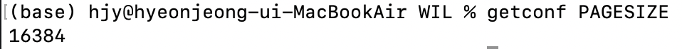

- `$ getconf PAGESIZE` 로 페이지 크기를 확인할 수 있다.

### 1.2. Page Table

페이징은 프로세스를 나누어서 불연속적으로 메모리에 할당하므로 CPU가 프로세스를 실행하기 위해 프로세스의 흩어진 페이지를 연속적으로 재구성할 필요가 있다. 

페이지 테이블은 페이지 번호를 통해 연속적인(continguous) 페이지가 위치한 프레임의 주소를 저장한다. 즉 프로세스마다 페이지 테이블이 있어 연속적인 논리 주소 공간의 페이지를 불연속적인 물리주소로 매핑한다.

$$
\text{logical address (continguous)}
\xrightarrow{\text{Page Table}} 
\text{physical address (noncontinguous)}
$$

- 페이지 테이블은 메모리에 적재되어 있고, PCB에 기록된다. 
- CPU에 **PTBR**; Page Table Base Register가 있어 각 프로세스의 페이지 테이블이 적재된 메모리 주소를 담고 있다. 
    - 따라서 프로세스 context change가 일어날 때 PTBR 값도 같이 변경된다.

그러나 페이지 테이블이 메모리에 있어 CPU는 테이블의 주소와 테이블 값을 얻기 위해 두번 메모리를 참조하게 된다. 이 문제를 완화하기 위해 MMU 내에 **TLB**; Translation Lookaside Buffer라는 페이지 테이블 캐시를 두고있다.

*https://dailyheumsi.tistory.com/138*

CPU가 요청하는 논리 주소에 대한 페이지 번호가 
- TLB에 있는 경우는 TLB hit이라고 하고, 
- TLB에 없어 메모리를 두번 참조해야 하는 경우는 TLB miss라고 한다.

### 1.3. Address Translation

$$
\begin{aligned}
& \text{Address for Reference} \\
& \begin{cases}
    \text{Number of page or frame} \\
    \text{Offset from the first address of a page or a frame}
\end{cases}
\end{aligned}
$$

페이지 시스템에서는 모든 논리 주소가 page number 또는 frame number 와 offset으로 이루어져 있다. Page Table은 page number를 frame number로 변환한다.

$$
\begin{aligned}
    & \text{logical address} \\
    & \begin{cases}
        \text{page number} \\
        \text{offset}
    \end{cases}
\end{aligned}
\xrightarrow{\text{Page Table}} 
\begin{aligned}
    & \text{physical address} \\ 
    & \begin{cases}
        \text{frame number} \\
        \text{offset}
    \end{cases}
\end{aligned}
$$

- 이때 offset은 논리 주소와 물리 주소에서 동일하다.

### 1.4. PTE; Page Table Entry

$$
\begin{aligned}
& \text{Page Table} \\
& \begin{cases}
    \text{page number} \\
    \text{frame number} \\
    \text{valid bit} \\
    \text{reference bit} \\
    \text{modified bit} \\
    \text{protection bit} \\
    \text{...}
\end{cases}
\end{aligned}
$$

페이지 테이블은 page number와 frame number 이외에도 다양한 정보를 포함하고 있다.

#### Valid bit
Valid bit은 페이지의 접근 가능 여부를 저장한다.
- 즉, 페이지가 메모리에 있는지(`1`), swap out 되어 보조기억장치에 있는지(`0`) 알려준다.
- **Page fault**란 가상 메모리 주소로 메모리를 참조할 때 valid bit이 `0`인 페이지, 즉 메모리에 적재되어 있지 않은 페이지를 참조할 때 발생하는 event (exception)이다. 
    - CPU는 인터럽트를 처리하듯이 page fault를 처리한다.
        1. CPU의 기존 작업 내역 백업
        2. page fault 처리 루틴 실행
        3. 메모리에 원하는 페이지를 가져온 뒤 valid bit을 1로 변경
        4. 기존 작업 재개 

#### Reference bit
Reference bit은 CPU가 페이지에 읽거나 쓴 기록을 저장한다.
- 페이지가 메모리에 적재된 후 `0`으로 초기화 되며, CPU가 읽거나 쓴 페이지는 reference bit이 `1`이 된다.

#### Modified bit (dirty bit)
Modified bit은 페이지에 데이터가 쓰인(write) 기록을 저장한다.
- 페이지가 메모리에 적재된 후 `0`으로 초기화 되며,m CPU가 쓴 페이지는 modified bit이 `1`이 된다.
- CPU가 쓰기 작업을 수행한 페이지는 보조기억장치에 저장된 페이지와 내용이 달라진다. 따라서 수정된 페이지가 swap out 되면 변경된 값을 보조기억장치에 기록하는 작업이 필요한데, 이 추가 작업의 여부를 알려주는 것이 modified bit이다.

#### Protection bit
Protection bit은 페이지의 쓰기 권한을 저장한다.
- 코드 영역처럼 읽기 전용 공간에 쓰기를 시도하면 OS가 막아주는 장치로, Memory Protection이라고 한다.
- R(Read), W(Write), X(eXecute)로 나누어 구현하기도 한다.
    - 예를 들어 protection bit이 `100`인 경우 해당 페이지는 읽기만 가능하고, protection bit이 `111`인 경우 읽기, 쓰기, 실행이 가능하다.

#### [참고] 프로세스간 페이지 공유 - Copy on write

페이징 시스템에서 프로세스 생성 시간을 줄이고 메모리 공간을 절약하는 방법이 있다. 원칙적으로 프로세스 사이에는 정보를 공유하지 않지만, 부모 프로세스가 자식 프로세스를 생성할 때 페이지를 공유하게 할 수 있다. 즉 fork에서 메모리 영역을 복제하지 않고 자식 프로세스가 부모 프로세스와 같은 프레임 영역을 가리키게 하고, 자식 프로세스가 쓰기 작업을 할 때 해당 페이지만 복제하여 메모리 공간을 새로 할당하는 방법이다.

#### [참고] Hierarchical paging (multilevel page table)

페이지 테이블을 참조하는 것도 문제가 되었지만, 테이블의 크기도 작지 않기 때문에 테이블의 entry를 메모리에 나누어 저장할 수 있다. 이것을 Hierarchical paging이라고 한다.

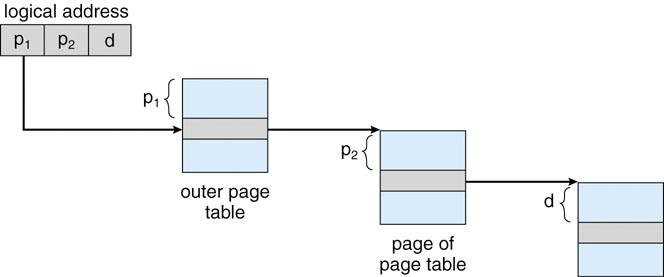
*https://baked-corn.tistory.com/17*

- Outer page table은 여러개로 나누어진 page table의 상단 주소를 저장한다.
- 참조를 위해 Outer page table은 항상 메모리에 유지한다.
- 이를 통해 page table의 일부는 보조기억 장치에 저장해 두고, 참조가 필요할 때 메모리에 적재하여 메모리 공간을 절약한다.
- Hierarchical paging을 사용하면 이에 따라 논리 주소를 변형해야 한다.
    $$
    \begin{aligned}
    & \text{logical address} \\
    & \begin{cases}
        \text{Outer page number P1} \\
        \text{Inner page number P2} \\
        \text{Inner inner page number P3} \\
        \text{...} \\
        \text{offset}
    \end{cases}
    \end{aligned}
    $$
- Page fault가 발생할시 메모리 참조 횟수가 많아지므로 계층이 많은 것이 반드시 좋은 것은 아니다.

## 2. Page Replacement and Frame allocation

### 2.1. Demand paging
Demand paging은 프로세스를 메모리에 적재할 때 실행에 요구되는 페이지만 적재하는 기법이다. 

CPU가 페이지에 접근하는 명령어를 실행하면,
- 해당 페이지가 메모리에 있는 경우 (valid bit : 1), 
    - CPU는 해당 메모리가 적재된 프레임에 접근한다.
- 해당 페이지가 메모리에 없는 경우 (valid bit : 0), 
    - Page fault가 발생한다. 
    - CPU가 처리하는 Page fault 처리 루틴은 요청된 페이지를 메모리에 적재하고 valid bit을 1로 설정한다.
    - CPU는 다시 페이지에 접근하는 명령어를 시행한다.

Demand paging 시스템이 안정적으로 동작하기 위해서는 **페이지 교체**와 **프레임 할당** 두가지 문제를 해결해야 한다. 

$$
\begin{aligned}
& \text{Conditions for safe Demand Paging system} \\
& \begin{cases}
    \text{Page Replacement} \\
    \text{Frame Allocation}
\end{cases}
\end{aligned}
$$

### 2.2. Page Replacement Algorithms

페이지 교체 알고리즘은 교체할 페이지를 결정하는 방법이다.

- 좋은 페이지 교체 알고리즘은 Page fault를 적게 일으키는 알고리즘이다. 
- 페이지 교체 알고리즘에 따라 컴퓨터의 성능은 저하 될 수도 있고, 성능이 저하되는 것을 방지할 수도 있다.
- 따라서 페이지 교체 알고리즘의 성능은 Page fault의 수로 결정한다.
- Page reference string은 CPU가 참조하는 페이지들 중 연속된 페이지를 제외한 페이지열이다. Page reference string을 통해 Page fault의 수를 셀 수 있다.

#### FIFO Page Replacement Algorithm
이름 그대로 메모리에 적재된 순서가 빠른 페이지부터 교체하는 알고리즘이다. 

사용 가능한 프레임이 세개일 때, 페이지 참조열이 아래와 같다고 하자.

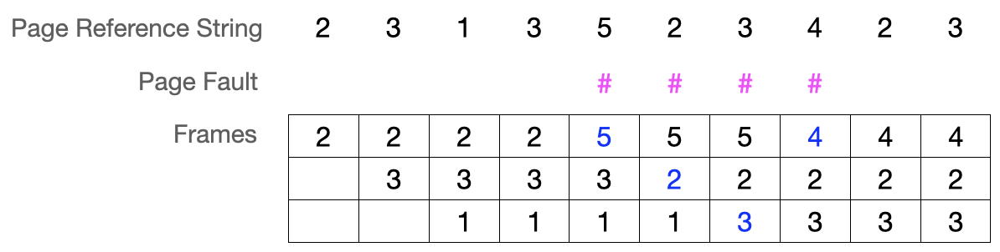

- 이때 Page fault(#)는 네번 발생한다.
- 첫번째 Page fault는 5번 페이지를 적재하기 위해 (2, 3, 1) 중 가장 먼저 적재된 2번 페이지를 삭제하고, 
- 두번째 Page fault는 2번 페이지를 적재하기 위해 (5, 3, 1) 중 가장 먼저 적재된 3번 페이지를 제거했다. 

#### Second Chance Page Replacement Algorithm
FIFO 알고리즘의 변형으로, 페이지의 reference bit을 활용해 최근에 참조되지 않은 페이지 부터 교체하는 알고리즘이다.
- Reference bit이 1인 페이지는 비트를 0으로 만든 뒤, 적재 시간을 비트 교체시간으로 설정한다.

각 프레임에 적재된 페이지의 reference bit이 주황색으로 표시되어있다.

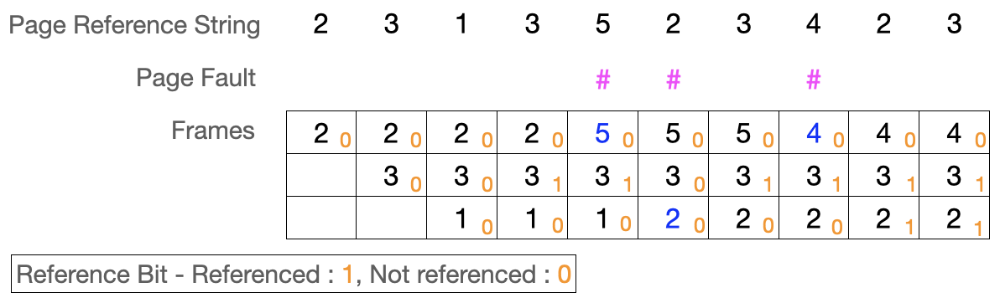

- Page fault(#)는 세번 발생한다.
- 첫번째 Page fault는 5번 페이지를 적재하기 위해 (2, 3, 1) 중 가장 먼저 적재된 2번 페이지를 교체한다. 
- 두번째 Page fault는 2번 페이지를 적재하기 위해 (5, 3, 1) 중 가장 먼저 적재된 3번 페이지를 찾았다. 
    - 그러나 3번 페이지의 reference bit는 1이므로, 이를 0으로 바꾸고 적재 시간을 현재 시점으로 기록한다. 
    - 다음으로 가장 오래동안 메모리에 머무른 페이지는 1번 페이지이므로 1번 페이지를 교체한다.

#### LIFO Page Replacement Algorithm
FIFO 알고리즘과 반대로, 메모리에 적재된 순서가 늦을수은 페이지부터 교체하는 알고리즘이다.

위의 예시에 LIFO 알고리즘을 적용해보자.

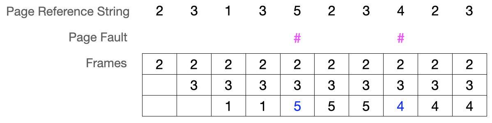

- Page fault(#)는 두번 발생한다.
- 첫번째 Page fault는 5번 페이지를 적재하기 위해 (2, 3, 1) 중 가장 나중에 적재된 1번 페이지를 교체한다. 
- 두번째 Page fault는 4번 페이지를 적재하기 위해 (2, 3, 5) 중 가장 나중에 적재된 5번 페이지를 교체한다.

#### Optimal Page Replacement Algorithm
앞으로 CPU에 의해 참조될 횟수가 가장 낮은 페이지부터 교체하는 알고리즘이다.  
- CPU가 참조할 페이지를 예측해야하는 만큼 실제 구현은 거의 불가능하다.
- 다른 교체 알고리즘의 이론적 성능을 평가하는 목적으로 사용된다.

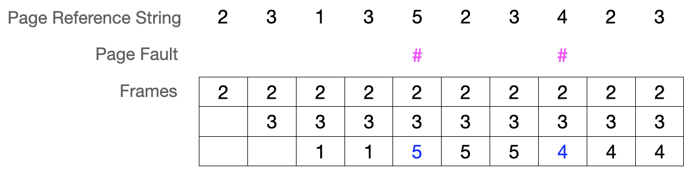

- Page fault(#)는 두번 발생한다.
- 첫번째 Page fault는 5번 페이지를 적재하기 위해 (2, 3, 1) 중 미래에 참조하는 횟수가 가장 적은 1번 페이지를 교체한다. 
- 두번째 Page fault는 4번 페이지를 적재하기 위해 (2, 3, 5) 중 이후에 참조하지 않는 5번 페이지를 교체한다.

#### LRU; Least Recently Used Page Replacement Algorithm
Optimal 페이지 교체 알고리즘의 대안으로, 과거에 CPU에 의해 참조된 횟수가 가장 낮은 페이지부터 교체하는 알고리즘이다. 
- 최근에 사용되지 않은 페이지는 앞으로도 사용되지 않을 것이라는 가정에 기반한다.

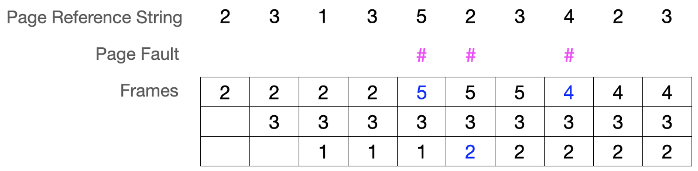

- Page fault(#)는 세번 발생한다.
- 첫번째 Page fault는 5번 페이지를 적재하기 위해 (2, 3, 1) 중 가장  참조 횟수가 적었던 페이지 중 먼저 적재한 2번 페이지를 교체한다. 
- 두번째 Page fault는 2번 페이지를 적재하기 위해 (5, 3, 1) 중 가장  참조 횟수가 적었던 페이지 중 먼저 적재한 1번 페이지를 교체한다. 

### 2.3. Frame allocation

**Thrashing**은 빈번한 페이지 교체로 인해 프로세스가 실행되는 시간보다 페이지 교체에 더 많은 시간을 소요하는 문제이다. 즉 page fault로 인해 페이지 교체가 자주 일어나면 보조기억장치에서 페이지를 가져오는데 드는 시간이 걸리고, 그동안 프로세스는 실행되지 않으므로 CPU는 대기하게 되어 프로세스 실행 속도가 감소한다.

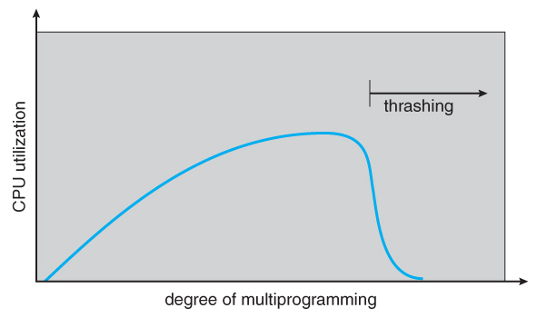
*https://truemind5.blogspot.com/2017/05/16-1.html*

- degree of multiprogramming은 메모리에서 동시에 실행되는 프로세스 수를 의미한다.
- 위 그래프는 동시 실행 프로세스 수와 비례하여 CPU 이용률이 증가하는 것이 아님을 보여주고 있다.
- 특정 부분 이상으로 동시 실행 프로세스 수를 늘리면:
    - 각 프로세스가 사용가능한 프로세스가 사용할 수 있는 프레임 수가 적어지고, 
    - 이는 페이지 폴트를 빈번히 발생시킨다. 
    - 이에 따라 CPU 이용률이 떨어져 전체 성능이 저하된다.

$$
\text{More Processes} \rightarrow
\text{Short of Frames} \rightarrow
\text{Page fault} \rightarrow
\text{Page Replacement} \rightarrow
\text{Low CPU Utilization} 
$$

따라서 OS는 각 프로세스가 무리없이 실행되기 위한 최소 프레임 수를 파악하고 할당할 수 있어야 한다. 

OS는 대략 다음과 같은 프레임 할당 전략을 취한다.

$$
\begin{aligned}
& \text{Frame Allocation}
& \begin{cases}
    \begin{aligned}
    & \text{Static allocation}
    & \begin{cases}
        \text{equal allocation} \\
        \text{proportional allocation}
    \end{cases}
    \end{aligned} \\
    \begin{aligned}
    & \text{Dynamic allocation}
    & \begin{cases}
        \text{Working set model} \\
        \text{PFF; Page-Fault Frequency}
    \end{cases}
    \end{aligned}
\end{cases}
\end{aligned}
$$

정적 할당 방식은 프로세스의 실행 과정과 관계없이 프레임을 할당하는 방식이다.

#### Equal allocation
모든 프로세스에 동일한 프레임 수를 할당한다.
- 구현은 간단하지만 프로세스의 특성을 전혀 반영하지 않아 비효율적이다.

#### Proportional allocation
프로세스 크기에 비례하여 프레임 수를 할당한다.
- 일괄적인 할당보다 낫지만, 전체 프로세스가 요구하는 메모리가 꼭 실행시에 참조할 페이지 수와 비례하지는 않는다.

동적 할당 방식은 프로세스의 실행 과정에 기반해 프레임을 할당하는 방식이다.

#### Working Set model
프로세스가 시간 단위당 참조한 페이지 개수와 동일한 프레임 수를 할당하는 방식이다.
- CPU는 이전에 참조했던 메모리와 가까운 구역을 다시 참조한다는 참조 지역성 원리에 근거하고 있다.
- Working Set은 실행 중인 프로세스가 시간 단위당 참조한 페이지 집합을 의미한다.

#### PFF; Page-Fault Frequency
프로세스의 page fault 발생 횟수에 따라 프레임 수를 할당하는 방식이다.

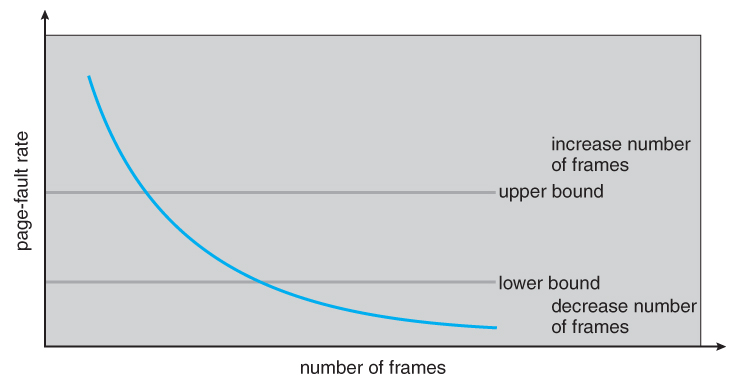

- Page fault 발생 횟수(PFF)가 크면 해당 페이지에 할당된 프레임 수는 적은 것이고, PFF가 적으면 할당된 프레임 수가 많다고 가정한다.
- 따라서 한 프로세스에 대해 PFF에 상한선과 하한선을 정해서 상한선 보다 높은 경우 할당된 프레임 수를 늘리고, 하한선보다 낮은 경우 프레임 수를 감소하는 전략이다.

