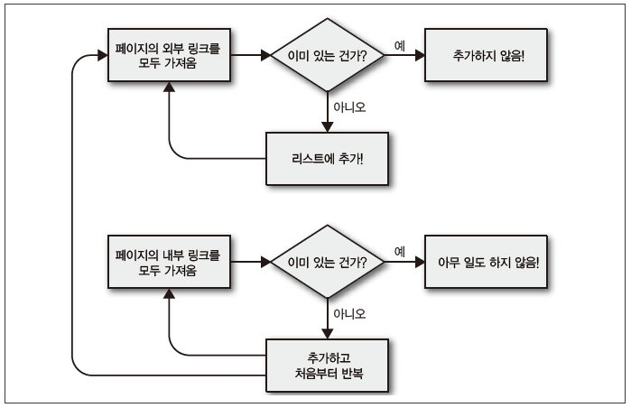

# Basic Crawler

> 사전학습 : [BeautifulSoup](https://github.com/nearnear/WIL/blob/main/4.%20Python/beautifulsoup.md)

웹 크롤링은 재귀적으로 페이지에서 URL을 찾아 다시 페이지를 불러오는 작업을 반복한다. 스크레이퍼는 모든 데이터가 페이지 하나에 들어 있는 경우에는 잘 동작하지만, 크롤러를 사용할 때는 대역폭에 주의를 기울여 타깃 서버의 부하를 줄일 방법을 강구해야 한다.

## 1. 단일 도메인 탐색하기

Wikipedia의 HTML 텍스트를 가져오는 프로그램을 작성해 보자. 

* 위키백과 데이터를 사용하는 대규모 프로젝트를 계획하는 경우, 위키백과 API(https://www.mediawiki.org/wiki/API:Main_page)를 통해 얻을 수 있는 데이터인지 확인하자. 위키 API를 통해 크롤링보다 효율적으로 데이터를 얻을 수 있다.

다음은 특정 위키백과 페이지에 들어있는 링크 목록을 가져오는 코드이다.
```python
from urllib.request import urlopen
from urllib.error import HTTPError, URLError
from bs4 import BeautifulSoup
import datetime
import random
import re

# Get different random seed everytime program starts
random.seed(datetime.datetime.now())

def getLinks(articleUrl):
    """
    Inputs:
        articleUrl : Url in 'wiki/...' form
    Outputs:
        List of all URLs in a page of form 'wiki/{articleUrl}' 
    """
    # Get HTML text
    try:
        html = urlopen(f'https://en.wikipedia.org/{articleUrl}')
    except HTTPError as e:
        print(e)
    except URLError as e:
        print('The server could not be found!')
    else:
        print('Got HTML successfully.')

    # Parse HTML text and create bs
    bs = BeautifulSoup(html.read(). 'html.parser')

    # Among tags that contain 'div' and 'id', 
    # return list of URLs that matchs regular expression pattern.
    return bs.find('div', {'id':'bodyContent'}).findAll('a', href=re.compile('^(wiki/)((?!:).)*$'))

# Get search keyword
print('Type keyword to search URL links recursively in wiki.')
target = str(input())

# Get every URL on a page and pick one random URL to print the page.
# Repeat while there are no URLs in the searched page.
links = getLinks('wiki/{target}')
while len(links) > 0: 
    newArticle = links[random.randint(0, len(links)-1)].attrs['href']
    print(newArticle)
    links = getLinks(newArticle)
```


## 2. 전체 사이트 크롤링하기

### 스크랩이 가능한 웹 페이지들
* 표면 웹(Surface Web) : 검색엔진에서 저장하는 부분이다.
* 딥 웹(Deep Web) : 표면 웹의 나머지 부분으로, 인터넷의 90% 정도를 차지한다. 딥웹은 링크되지 않은 페이지나 robots.txt로 차단된 페이지들을 포함하지만, 일부분은 스크랩이 가능하다. 
    - robots.txt 파일은 크롤러 트래픽을 관리하기 위해 사용되며, 사이트에서 접근가능한 URL을 검색엔진 크롤러에 알려준다. 
* 다크 웹(Dark Web) : 딥 웹의 일부분으로, 기존 네트워크 하드웨어 인프라에서 작동하긴 하지만 접근하기 위해 익명 클라이언트 Tor등 특정 프로그램이나 방법을 요구한다. HTTP 위에서 동작하며 보안 채널로 정보를 교환하는 앱 프로토콜을 사용한다. 다크웹을 스크랩하는 데에는 표면 웹을 스크랩하는 것과 다른 방법이 필요하다.
    - Tor(The Onion Router)는 네트워크 우회를 통해 네트워크 익명화를 시행하는 프로그램이다.


### 웹사이트 전체 크롤링이 유용한 경우
- 사이트맵 생성 : 크롤러를 통해 사이트 전체를 이동하면서 내부링크를 수집해 페이지들을 폴더구조와 같이 정리할 수 있다. 이를 통해 웹사이트 설계 비용등을 계산할 수 있다.
- 데이터 수집 : 특정 페이지(예를 들어 블로그 포스트나 뉴스 기사 페이지)에 국한해서 검색 플랫폼의 프로토타입을 생성할 때도 재귀적인 크롤링을 이용할 수 있다.


### 전체 사이트 크롤링에서 중복 피하기

페이지당 내부 링크가 10개씩 있고 사이트가 다섯 단계로 구성되어있다고 하자. 페이지를 철저히 탐색하기 위해서는 최소 $105$ 페이지에서 $10^5$ 페이지를 탐색해 한다. 그렇지만 실제로 내부 링크 중 중복이 많기 때문에 $10^5$ 페이지를 탐색해야하는 경우는 거의 없다. 

즉 전체 사이트를 크롤링하는 프로그램은 중복 방문을 하지 않는 것이 중요하다. 같은 페이지를 두 번 크롤링하지 않기 위해서는 발견하는 내부 링크를 일정한 형식을 따르도록 해서 집합(Set)에 보관할 수 있다.

```python
# 웹 페이지 중복을 피하기 위해 집합으로 방문한 링크를 관리한다.
pages = set()
def printLinks(pageUrl, recur_cnt):
    """
    한국어 위키백과 사이트에서 내부링크 탐색을 100번 재귀 실행한다. 
    """
    # 재귀 횟수를 100번으로 제한한다.
    recur_cnt += 1
    if recur_cnt > 100: return

    # 프로그램이 동작하는 동안 집합이 유지되도록 한다.
    global pages
    
    # 한국 위키피디아에서 pageUrl을 검색한다.
    try:
        html = urlopen(f'http://kr.wikipedia.org/{pageUrl}')
    except HTTPError as e:
        print(e)
    except URLError as e:
        print('The server could not be found!')
    else:
        print('Got HTML successfully.')

    bs = BeautifulSoup(html.read(), 'html.parser')

    # 페이지의 모든 'wiki/...' URL을 탐색하여 출력한다. 
    for link in bs.findAll('a', href=re.compile('^('wiki/')')):
        if 'href' in link.attrs:
            if link.attrs['href'] not in pages:
                # 새로운 페이지를 탐색한다.
                newPage = link.attr['href']
                print(newPage)
                pages.add(newPage)
                printLinks(newPage)

# getLinks 함수를 재귀적으로 호출한다.
# Python의 재귀 깊이는 1000회로 제한되어 있으므로, 
# 위키백과 같이 큰 링크 네트워크를 탐색할 때는 재귀 횟수를 제한하도록 한다.
printLinks('', 1)
```

### 전체 사이트에서 데이터 수집하기

단순히 URL을 출력하는 것 외에 페이지의 다양한 데이터를 수집해보자.
```python
pages = set()

def printSummary(pageUrl, recur_cnt):
    """
    한국어 위키백과 사이트에서 내부링크를 탐색하며 페이지 제목과 첫번째 문단, 편집 링크를 출력한다.
    """
    recur_cnt += 1
    if recur_cnt > 100: return

    global pages
    html = urlopen(f'http://kr.wikipedia.org/{pageUrl}')
    bs = BeautifulSoup(html.read(), 'html.parser')

    try: # 다음을 모두 수행하는 경우 항목 페이지이다.
        # 페이지 제목을 출력한다.
        print(bs.h1.get_text())
        # 첫 번째 문단을 출력한다.
        # div#mw-content-text -> p에서 첫번째 문단 태그만 선택한다.
        print(bs.find(id='mw-context-text').findall('p')[0])
        # 편집 링크를 출력한다.
        # li#ca-edit -> span -> a로 탐색한다.
        print(bs.find(id='ca-edit').find('span').find('a').attrs['href'])
    except AttributeError: 
        print('This page is not a content page!')
    
    for link in bs.findAll('a', href=re.compile('^('wiki/')')):
        if 'href' in link.attrs:
            if link.attrs['href'] not in pages:
                newPage = link.attrs['href']
                print('-' * 30 + '\n' + newPage)
                pages.add(newPage)
                getLinks(newPage)

printSummary('')
``` 


## 3. 인터넷 크롤링하기

### 웹 크롤러를 만드는데에 고려할 사항들
- 정해진 사이트 몇 개만 수집하는 것인지, 아니면 있는지도 몰랐던 사이트에 방문하는 크롤러가 필요한 것인지 질문한다.
- 크롤러가 특정 웹사이트에 도달했을 때, 사이트의 정보를 탐색할지 다른 링크를 따라갈지 고려한다.
- 제외할 사이트는 없는지 고려한다. 예를 들어, 언어권이 다른 경우나 특정 컨텐츠를 포함하면 재귀를 종료할만한지 고려한다.
- 방문할 가능성이 있는 웹사이트에 크롤러가 방문하는 것이 합법적인지 고려한다.

### 웹 크롤러 작성하기

웹 크롤러의 코드는 전체 사이트를 탐색하는 코드와 유사하다. 다만 탐색 한계를 명시하고 예외 사항을 처리해야 실무에 활용할 수 있다.



*웹사이트 외부 링크를 모두 탐색하는 크롤러 순서도*

위는 웹 크롤러 논리의 한 예이다. 크게 두 개의 루프가 있다고 할 때, 아래의 루프는 페이지 내의 외부 링크를 탐색하고, 외부 링크가 없는 경우에는 내부 링크를 탐색하여 리스트에 추가한다.

## 참고자료
- 『파이썬으로 웹 크롤러 만들기(Web Scraping with Python)』, 라이언 미첼(Ryan Mitchell)