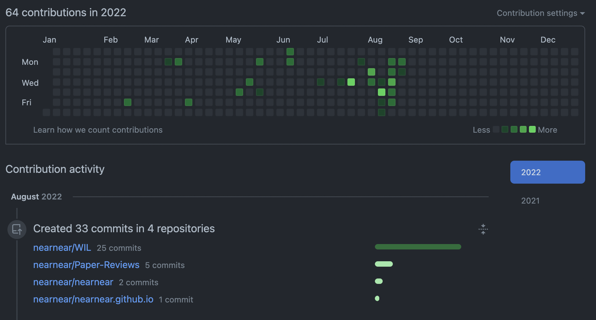

## [문제 해결] git rebase - change commit author


### git config 수정
우선 실행하기 전에, git의 config에서 user.name과 user.email 값이 제대로 설정되어 있는지 확인한다.

```
$ git config --list
```
만약 config 값에 user.name 또는 user.email 중 하나라도 원하는 값으로 설정이 되어있지 않으면 수정하도록 한다.
- user.email이 `github settings > Emails`에 저장된 값과 같아야 그 계정의 commit으로 기록된다.

```
$ git config --global user.name "이름(깃허브 별명)"
$ git config --global user.email "이메일 주소"
```
- `--global` 키워드를 입력하지 않으면 현재 위치한 디렉터리의 git config에만 반영된다.


### git log 확인, rebase 해쉬 코드 불러오기
commit이 진행된 branch로 이동해 git log를 조회한다.
```
$ git log --pretty=format:"%h = %an , %ar : %s" --graph
```
이 중에서 rebase하고자 하는 가장 오래된 커밋의 해쉬코드를 저장한다.

나의 경우, 르포의 생성을 제외하고 모두 author가 다르게 지정되어 있어 두번째 코드부터 rebase해야 했다.
```
* c85847a = 현정, 35 minutes ago : Update class.md
...
* b5a7c63 = 현정, 3 weeks ago : Category Update
* 7d5867b = 현정, 3 weeks ago : Category Update
* 0ea6049 = near, 3 weeks ago : Initial commit
```
두번째 `7d5867b`가 rebase를 시작할 해쉬 코드이다.


### rebase 하기
다음과 같이 rebase를 시작한다.
```
$ git rebase -i -p 해시코드
```
이 명령어는 vi 편집기로 연결된다. 
- rebase할 커밋들의 `pick`을 `edit`으로 모두 변경한다.
- 내용을 수정한 후 `:wq!`로 저장한 후 종료한다.
    - `!`는 강제이므로 생략해도 무방하다.
 
이제부터 반복적인 과정이다.
``` 
git commit --amend --author="이름 <이메일 주소>"
```
이 명령은 커밋 메시지를 편집하는 vi 편집기로 연결된다. 이때, 그냥 종료하지 말고 `:wq`를 통해 저장 후 종료해야 다음 rebase를 진행할 수 있다. 

```
$ git rebase --continue
```
vi 편집기를 나온 후 rebase를 계속 진행하기 위해 위처럼 입력한다.

그 후 다시 author를 수정한 커밋을 진행하고, 다음과 같은 결과가 뜰 때까지 rebase를 한다.

```
(base) % git rebase --continue
Successfully rebased and updated refs/heads/main.
```

### push 하기

```
$ git push origin +현재_브랜치
```
origin에 현재 브랜치를 강제로 push한다.


## 결과



잃어버린 들에도 봄은 오는 것으로.


### 출처
https://wellbell.tistory.com/43 에서 많은 도움을 받았다.
