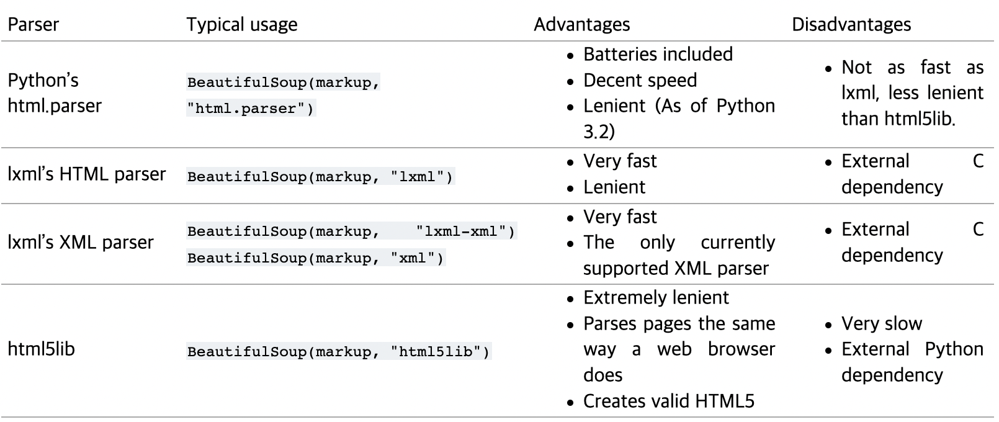

# Python BeautifulSoup

## 기초 HTML 분석

```python
from urllib.request import urlopen
from bs4 import BeautifulSoup

html = urlopen("https://www.pythonscraping.com/pages/page1.html")
bs = BeautifulSoup(html.read(), 'html.parser')
print(bs.tag.subTag) # tag, subTag는 가상의 태그.
```

### `BeautifulSoup()`의 인자들
- 첫번째로 HTML 텍스트를 전달한다.
- 두번째로 BeautifulSoup가 객체를 만들때 쓰는 구문 분석기(parser)를 전달한다.
    
    - `html.parser` : 별도의 C 패키지 설치 없이 사용할 수 있는 분석기
    - `lxml` : 형식을 지키지 않은 HTML 코드를 분석할 때 `html.parser`보다 나은 성능을 보인다.
    - `html5lib` : `lxml`보다 다양한 에러를 수정할 수 있다. 닫히지 않은 태그, 계층 구조가 잘못된 태그를 일일이 수정한다.


### 신뢰할 수 있는 연결
- `urlopen()`에서 등장할 수 있는 에러
    - 페이지를 찾을 수 없거나("404 Page Not Found"), URL 해석에서 에러가 생긴 경우("URLError")
    - 서버를 찾을 수 없는 경우("500 Internal Server Error")
    - `try ... except` 구문을 통해 예외를 처리한다.
    ```python
    from urllib.request import urlopen
    from urlib.error import HTTPError, URLError
    
    try:
        html = urlopen('https://pythonscrapingthisurldoesnotexist.com')
    except HTTPError as e:
        print(e)
    except URLError as e:
        print('The server could not be found!')
    else:
        print('Got HTML successfully.')
    ```

- `bs.tag.subTag`에서 등장할 수 있는 에러
    - BeautifulSoup는 존재하지 않는 태그에 접근을 시도하면 None 객체를 반환한다. 이때 None 객체에 대해 태그에 접근하려고 하면 AttributeError가 일어난다.
    - 두 개의 태그의 존재 유무를 명시적으로 체크한다.
    ```python
    try:
        badContent = bs.tag.subTag
    except AttributeError as e: # tag1이 존재하지 않는 경우
        print('tag was not found.')
    else:
        if badContent == None:
            print('subTag was not found.')
        else:
            print(badContent)
    ```


## 고급 HTML 분석

### 고급 HTML 분석을 사용하지 않는 방법
- 더 나은 HTML 구조를 갖춘 모바일 버전 사이트 찾아보기
- 자바스크립트 파일을 불러와 분석하기
- URL에 원하는 정보가 있는지 찾아보기
- 원하는 정보를 다른 소스에서 가져올 수 있는지 고려하기


### CSS 활용하기
- CSS는 HTML 요소를 구분해 서로 다른 스타일을 적용하므로 웹 스크레이퍼에 도움이 된다.
    ```python
    nameList = bs.findAll('span', {'class':'green'})
    for name in nameList:
        print(name.get_text())
    ```
    위 코드는 `<span class="green"></span>` 태그에 들어있는 텍스트만 선택해서 파이썬 리스트로 추출한다.
    - `get_text()`는 모든 태그를 제거한 유니코드 텍스트 문자열을 반환한다. 일반적으로 문서의 태그 구조를 유지하는 것이 바람직하므로 최종 데이터 출력 또는 저장 직전에 사용해야 한다.

### find()와 findAll() 메서드 인자들

> find(tag, attributes, recursive, text, keywords)

> findAll(tag, attributes, recursive, text, limit, keywords)

- `tag` : 태그 이름인 문자열 또는 태그 이름 리스트를 넘긴다.
    ```python
    bs.findAll({'h1', 'h2', 'h3', 'h4', 'h5'})
    ```
- `attributes` : 속성으로 이루어진 파이썬 딕셔너리를 받고, 그 중 하나에 일치하는 태그를 모두 찾는다.
    ```python
    bs.findAll('span', {'class': {'green', 'red'}})
    ```
- `recursive` : 불리언으로, True이면 매개변수에 일치하는 자식과 자식의 자식을 검색하며 False이면 최상위 태그에 대해서만 검색한다.
- `text` : 태그의 속성이 아니라 텍스트 콘텐츠에서 일치하는 점을 검색한다.
    ```python
    nameList = bs.findAll(text='the prince')
    ```
- `limit` : 페이지의 항목을 처음부터 몇번 탐색할 것인지 지정한다. `find('')`는 `findAll('', limit=1)`과 같다.
- `keyword` : 특정 속성이 포함된 태그를 AND 연산으로 검색한다.
    ```python
    bs.findAll('', {'id':'text', 'class':'green'})
    ```
    - 주어진 조건을 모두 만족하는 태그 목록을 반환한다.


### BeautifulSoup의 객체

1. BeautifulSoup 객체 : 파싱된 문서 전체를 의미한다.
2. Tag 객체 : XML 또는 HTML 태그를 의미한다.
3. NavigableString 객체 : 태그가 아니라 태그 안에 있는 텍스트를 의미한다.
4. Comment 객체 : HTML 주석을 의미한다.

### Tree Navigation

1. 자식(children)과 자손(descendants) 다루기
    - 자식은 부모보다 한 태그 아래에 있고, 자손은 조상보다 하위 단계에 있는 모든 태그이다. BeautifulSoup는 항상 선택된 태그의 자손을 다룬다.
    - 자식만 찾을 때는 `.contents` 또는 `.children`을 사용한다. 전자는 리스트를 반환하며, 후자는 iterator를 반환한다.
        ```python
        for child in bs.find('span', {'class':'green'}).children:
            print(child)
        ```
2. 형제(sibling) 다루기
    - 테이블에서 데이터를 구할 때, 특히 테이블에 타이틀 행이 있는 경우 유용하게 활용할 수 있다. `.next_siblings`은 해당 객체를 제외한 다음 형제만 가져온다. 즉, 타이틀 행을 선택하면 그 타이틀 행을 제외한 모든 테이블 행을 가져온다.
        ```python
        for sibling in bs.find('span', {'class':'green'}).next_siblings:
            print(sybling)
        ```
3. 부모(parents) 다루기
    - 태그의 부모를 검색하기 위해 `.parent` 또는 `.parents`를 활용한다.
        ```python
        print(bs.find('img', {'src':'../img/gifts/img1.jpg'})).parent.previous_sibling.get_text()
        ```


### 정규 표현식 (Regular Expression) 활용하기

정규 표현식은 BeautifulSoup 표현식 어디든 매개변수로 삽입할 수 있다. 

예를 들어 `` 형태의 제품 이미지를 여러개 찾는 것이 목표라고 하자. 이때 `findAll('img')`로 모든 이미지 태그를 가져올 시에 페이지의 불필요하거나 빈 이미지, 숨은 이미지들을 모두 가져오게 된다. 따라서 제품 이미지만 가져오기 위해 위의 제품 이미지 형태를 정규 표현식으로 전달할 수 있다.

```python
images = bs.findAll('img', {'src':re.compile('\.\.\/img\/gifts/img.*\.jpg')})
for image in images:
    print(image['src'])
```

### 람다 표현식
특정 타입의 함수를 findAll 함수의 매개변수로 넘길 수 있다. 이 함수들은 태그 객체를 매개변수로 받고 불리언만 반환해야 한다. BeautifulSoup는 모든 태그 객체를 이 함수에서 평가하고, True로 평가된 태그만 반환한다.

예를 들어 다음 코드는 속성이 두개인 태그만 가져온다.
```python
bs.findAll(lambd tag: len(tag.attrs) == 2)
```

다음 코드는 `text` 기능을 lambda 함수로 표현한 예이다.
```python
bs.findAll(lambda tag: tag.get_text() == 'the prince')
```

