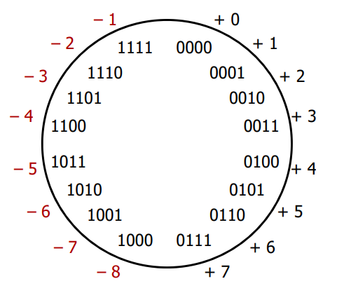
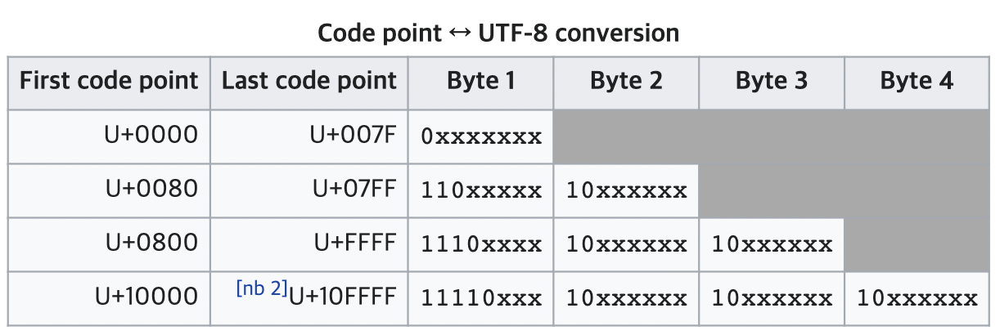

# Bit Operation

## 연산

### Bool Operator

```python
True and False # False
True or False # True
not True # False
not False # True
```

기본 불 연산자는 AND, OR, NOT 이다. 기본 연산을 조합해 XOR을 구성할 수 있다.

```python
(True and not True) or (not True and True) # False or False -> False
(True and not False) or (not True and False) # True or False -> True
(False and not False) or (not False and False) # False or False -> False
```


### Bitwise Operator

```python
True & False # False
True | False # True
True ^ True # False
int(True) # 1
~ True # -2
```

비트 연산자는 불 연산자와 유사하게 동작한다. 단 Bitwise NOT `~`은 2의 보수에서 1을 뺀 값을 반환한다. 즉 십진수로 표현할 때 `NOT x = -x - 1` 로 작용한다.


## 이진법

### Notation in Python

파이썬은 이진수(binary)와 16진수(hexadecimal)을 문자열로 저장하며, 함수를 통해 십진수로 변환할 수 있다.

이진수와 십진수는 `bin(int) -> str`와 `int(str, 2)`로 서로 변환할 수 있다. 
- `bin()`에 float 인자를 전달하면 TypeError가 일어난다.

```python
x = bin(55) 
print(x)         # '0b110111': str
print(int(x, 2)) # 55: int
```

파이썬에서 정수는 불변 객체이므로 진법에 상관없이 id가 같다.

```python
id(0b110111) # 4390021048
id(55)       # 4390021048
```

16진수를 처리하려면 `hex(int) -> str`와 `int(str, 16)` 메서드를 활용한다.

```python
x = hex(55)
print(x)           # '0x37' : str
print(int(x, 16))  # 55 : int
```


### Arithmetic Operation and Shifting

```python
bin(0b0110 + 0b0101)  # '0b1011' # bin(6 + 5) = bin(11)
bin(0b0110 * 0b0101)  # '0b1100' # bin(6 * 5) = bin(30)
bin(0b1101 >> 2)      # '0b11' # bin(13 >> 2) = bin(3)
bin(0b1101 << 2)      # '0b110100' # bin(13 << 2) = bin(52)
```

- 비트 산술 연산은 십진수 연산과 결과가 동일하다. 
- 시프팅 연산자는 `>>`와 `<<`로 비트의 자릿수를 조절한다. 
- 위의 곱셈 0b0110 * 0b0101 은 자릿수에 따라 시프팅한 값을 곱셈하여 더한 것이 된다. 
- 즉 x = 0b0110, y = 0b0101 일때, bin(x * y)는 다음과 같이 이해될 수 있다.
    - 여기서, bin(x * y) = bin(x) * bin(y) 이다.

```python
# production of bits
x = '0b0110'
y = '0b0101'
product = 0
for i, bit in enumerate(y):
    if bit == '1':
        product += int(x << i, 2)
print(bin(product)) # '0b0110' + '0b11000' = '0b11110'
```


### Complement of 1

수 x에 대한 1의 보수는 x에 더해서 1을 만드는 수이다. 따라서 비트에 대한 1의 보수는 모든 자릿수를 반전하는 연산이다.

예를 들어 0b1100의 1의 보수를 구해보자.
- 먼저 NOT 연산으로는 의도한 결과를 얻을 수 없다. 앞서 비트 NOT은 `~x = -x - 1`이라 했으므로 ~0b1100 은 -0b0011 이 아니라 -0b1101 이 된다.

    ```python
    bin(~0b1100) # '-0b1101' # bin(~(12)) = bin(-13)
    ```

- 0b1100을 0b0011로 바꾸기 위해서는 1과 연산해 0을, 0과 연산해 1을 반환해야 한다. 따라서 자릿수 만큼 최대값을 가지는 비트와 XOR 연산을 하면 1의 보수를 구할 수 있다.
    ```python
    MASK = 0b1111
    bin(0b1100 ^ MASK) # '0b0011'
    ```
1의 보수는 자릿수로 모두 1의 값을 가지는 비트 마스크와 XOR 연산을 통해 구할 수 있다. 


### Complement of 2

이진법에서 수 x에 대한 2의 보수는 x의 음수를 의미한다. 컴퓨터는 이진법을 활용하므로 2의 보수를 계산해서 음수를 구한다.

4 비트로 부호가 있는 숫자를 표현하는 경우를 생각해보자. 
- 4 비트의 표현 개수는 $2^4$ 개이고, 부호를 표현하기 위해 맨 앞 비트는 부호 비트(최상위 비트 또는 MSB, Most Significant Bit)로 사용한다. 
- 즉 양수는 0b0xxx, 음수는 0b1xxx로 표현한다. 
    - 따라서 0b0000은 0을,
    - 범위 0b0001 ~ 0b0111는 7개의 양수를, 
    - 범위 0b1000 ~ 0b1111는 8개의 음수를 표현한다. 

    
    - 예를 들어, 7을 0b0111으로 나타낼 때 -7을 나타내는 수는 7에 대한 1의 보수인 0b1000가 아닌 0b1001이 된다.

- 수 x에 대한 보수는 x에 더해서 자릿수를 0b0000을 만드는 수이다.
    - 0b0111 + 0b1001 = 0b0000 이므로 따라서 7에 대한 2의 보수는 0b1001이다.

2의 보수는 1의 보수를 활용해 계산할 수 있다. 최대 자릿수를 넘기는 숫자를 만들기 위해서는 1의 보수에 1을 더하면 된다.

```python
MASK = 0b1111_1111
x = 0b1000_1100
comp_x = (x ^ MASK) + 1
print(bin(comp_x))              # 0b111_0100
print(bin(x + comp_x))          # 0b1_0000_0000 (1)
print(bin((comp_x ^ MASK) + 1)) # 0b1000_1100   (2)
```
- (1) : x와 더해서 0b1_0000_0000이 되므로 8 비트 표현에서 comp_x가 x의 보수임을 확인할 수 있다. 
- (2) : 같은 연산으로 x의 보수를 x로 변환할 수 있다.


## 활용하기

### Hamming Distance

해밍 거리란 두 정수 또는 두 문자열의 차이를 계산하는 방법이다. 
- 예를 들어 `'felixes'`와 `'felicis'`의 해밍 거리는 문자가 다른 자리의 개수인 2이고 `0b101_1101`과 `0b100_1001`의 차이는 다른 위치의 비트 개수인 2다. 
- 즉 해밍거리는 비트의 XOR 연산을 거친 결과에서 1인 비트의 개수와 같다. 

```python
# Hamming distance between two integers
def hammingDistance(x: int, y:int) -> int:
    return bin(x ^ y).count('1')
```

### UTF-8 검증하기

어떤 값이 UTF-8 방식으로 인코딩 되어있는지를 비트 연산을 통해 구할 수 있다. 


UTF-8 인코딩의 특징은 다음과 같다.
- 시작 비트에 따라 전체 바이트 수가 달라진다. 전체 바이트 수는:
    - 0으로 시작할 경우 1 바이트,
    - 110으로 시작할 경우 2 바이트,
    - 1110으로 시작할 경우 3 바이트,
    - 11110으로 시작할 경우 4 바이트이다.
    - 이외에 시작 비트에 따라오는 수는 10으로 시작한다.
- [참고] 0으로 시작하는 바이트는 ASCII 인코딩을 그대로 따른다.
- [참고] 대부분의 중국어, 일본어, 한국어 문자는 3 바이트로 표현된다.

인코딩된 바이트가 정수 리스트로 주어졌을 때, 그 값이 UTF-8으로 인코딩 되어있는지를 판별하는 방법은 다음과 같다.

```python
def valid_utf8(data: list[int]) -> bool:
    
    # (1) 시작하는 비트에 따라오는 수의 조건을 확인한다.
    def check(size):
        for i in range(start + 1, start + size + 1):
            if i > len(data) or (data[i] >> 6) != 0b10:
                return False
        return True

    # (2) 맨 앞의 바이트 부터 시작하는 비트를 확인한다.
    start = 0
    while start < len(data):
        first = data[start]
        if (first >> 3) == 0b11110 and check(3):
            start += 4
        elif (first >> 4) == 0b1110 and check(2):
            start += 3
        elif (first  >> 5) == 0b110 and check(1):
            start += 2
        elif (first >> 7) == 0:
            start += 1
        else:
            return False

    return True
```
- (1) : 해당 바이트에 따라오는 수가 전체 데이터 길이를 넘지 않는지, 또는 0b10으로 시작하는지를 확인한다.
- (2) : 대상 바이트의 앞자리가 특정 수이고 따라오는 수가 주어진 조건을 만족하면 그 다음 바이트를 확인한다. 
    - 예를 들어 대상 바이트가 0b1110으로 시작하고 따라오는 수도 조건을 만족하면, 세 바이트 뒤의 값을 다시 조사한다.
    - 이때 남은 바이트 값 만큼 오른쪽으로 shift해서 동치를 확인할 수 있다.
